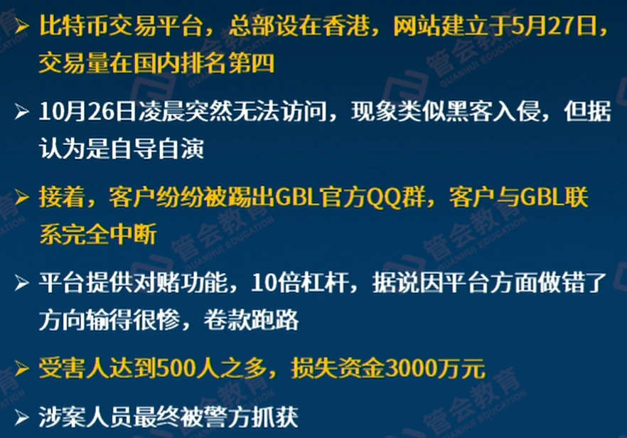
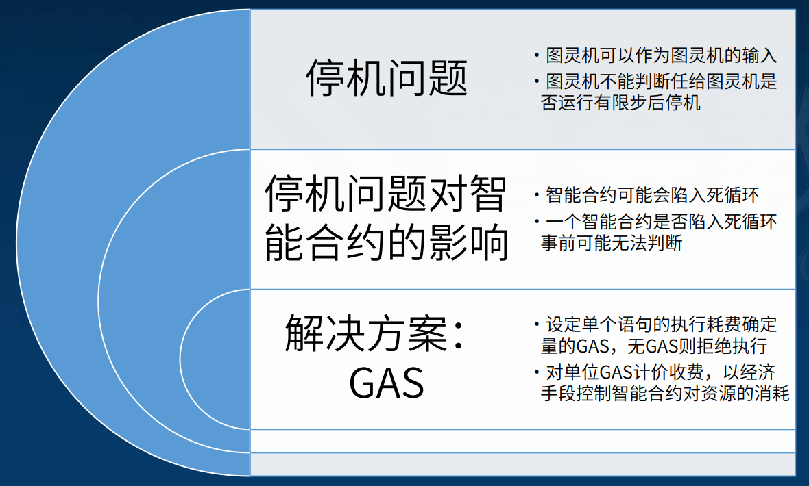
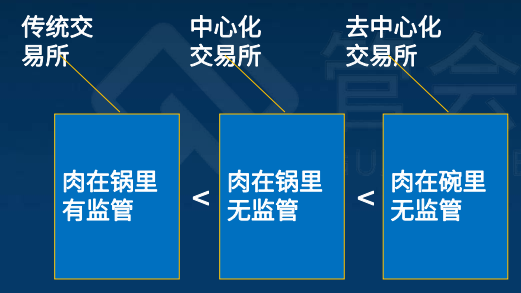
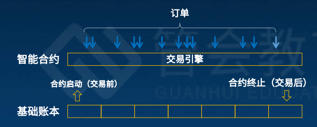
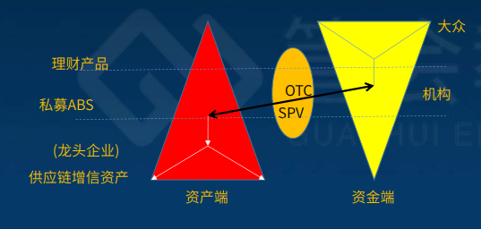
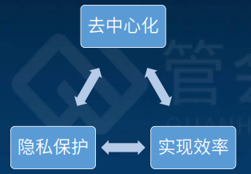
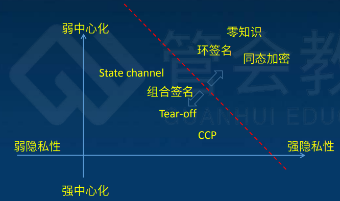

记账：67基础账本，也带一点认账

认账：89群体认账共识机制

可编程：10/11/12

自带商业模式：13/14/15

## 1 导言：数字化时代的信任架构与路径

1 为什么是区块链：

- 数字化迁徙行至半途

- 不靠谱的人与无人化，比如量化投资克服人的情绪

- 信任的无人化

2 区块链名字的演进：

- 账链：侧重典型业务，不是简单的账能概括

- 共识链：侧重核心机制，共识也不足以概括

- 公信链：侧重应用效果，也没那么大本事

- 区块链：侧重技术原理，反而什么都看不出来，叫多了就这样了

3 距离的演进和坍缩：

- 地理的距离：坐商，只能坐着等客户上门

- 物理的距离：行商，交通发达了辐射半径更广了

- 信息的距离：网商，互联网商业的发达

- 心理的距离：知商，把信息融汇贯通变成知识

- 信任的距离：信商，支付/征信/清算/理赔/质押，本质上都是做公证

**距离的坍缩**：科技改变生产力 -> 生产力改变距离 -> 距离改变生产关系

4 **非信任环境中的信任服务基础设施**：即使我们彼此怀疑，但是在这个**信任机器**面前会极大的提升做坏事的成本，从而成为了事实机器

治理：大多数区块链还没有可运营型和隐私保护

价值传递：信息是不守恒的，因为可以无限拷贝，但是价值不能传递，否则没有价值了，所以实现了不可双花和不可透支，比如比特币

这一切的目的都是为了达成共识

5 区块链4大方面后面会逐一介绍：

- 记账

- 认账

- 可编程

- 自带商业模式

6 如何辨别真的在做区块链：

业务简单搬家 ->业务深度重组
不改变信任路径->优化信任路径
不改变权利义务->记账权、监督权、使用权再分配
不改变治理架构->优化治理架构
不改变组织边界->适当扩展组织边界

## 2 （上）密码学基础：历史、对称与哈希加密

1 什么是密码学：

有人说密码学是研究如何隐密地传递信息的学科，还有人说密码学是关于如何在敌人存在的环境中通讯的科学。**总结：密码学是研究仅在受限范围内共享信息的机制的科学**

密码学的场景设定：

2 古代的密码：

- 凯撒密码：字母表顺序错位变换
  
  

- 虎符：甲兵之符，右在皇帝，左在阳陵（虎符要能对的上）
  
  

3 **密码进化过程**

密码观念的进化史：

- 1 密电码：非公开算法（计算能力变强后好破解）

- 2 DES/AES：公开算法、非公开密钥（计算代价会很大）

- 3 RSA/椭圆曲线：公开算法、部分公开密钥（分成公钥和私钥，公钥通信、私钥签名）

计算技术对密码学的影响：手算->手算+查表->机械计算->电子计算->量子计算

案例：密电码 ：用献血和生命保卫的秘密

- 用“人肉”实现数学变换

- 借助外物记忆变换的规则

- 外物的传递/分发/共享有风险

计算时代如何加密？揉面——乱序与扩散

揉面为什么能导致均匀呢?因为在揉面的过程中使用了两个最基本的技术:乱序和扩散。所谓“乱序”就是打乱原来的排列顺序，所谓扩散，就是把当初粘连在一起的面打散，并且把它们挤压到每一个角落。乱序和扩散，是现代数学中的“混沌”现象的精髓在揉面过程中的具体体现。  

4 **对称加密算法**

对称加密算法沿革：

- 突破：DES、S-DES

- 过度：IDEA/RC2/RC5，3DES（2个密钥做3遍DES）

- 成熟：AES

对称加密算法的优点和缺点：

- 优点：速度快、对称（简单）、安全（前提是密钥位数足够多）

- 缺点：分发困难（加密解密如何在分发过程中防止被截获）、两两复杂性（有组合数Cn2的复杂度，O(n2)级别）

5 **哈希（散列）函数**

作用：存证（忠实原文）、浓缩（化大为小）、签名（难以伪造）

补充：

- 但HASH也现在证明不再安全的算法：SHA/SHA1/MD5等

- 尚未攻破的算法：SHA256

举例：类似于数据的指纹

特点：

- 单向性：正过来加密容易，反过来解密很难

- 防碰撞性：输入不同输出相同

- 压缩性：多大都压缩到一样的大小

- 抗差分攻击性：差一点差很多

## 3 （下）密码学基础：非对称加密和数字签名

1 概述：

- 原理: 基于特定数学问题的难解性

- 途径: 利用公私密钥对实现加解密

- 应用: 对称密钥分发、数字签名

- 典型算法: RSA、ECC

2 非对称加密的过程：

- 公钥正向加密：比如意见箱（传递信息）
  
  - 环节1：非对称密钥生成（以RSA为例），**接收者**先用大素数p*q，然后求得e和d得到公钥和私钥，将公钥传递给**发送者**
  
  - 环节2：非对称加密，发送者用**接收者**的公钥加密明文形成密文（大数分解难解性）
  
  - 环节3：非对称解密，然后发给**接收者**，**接收者**用自己的私钥解开

- 公钥逆向使用：签名很难模仿（自证清白）
  
  - 环节1：非对称密钥生成（以RSA为例），**发送者**生成
  
  - 环节2：发送者用自己的私钥加密明文形成密文签名
  
  - 环节3：接受者用发送者的公钥解开原文

3 **大数分解很难**，因为素数p有1000位，素数q有1000位，p*q就有2000位，分解很难

密钥产生过程： 

4 研究大数分解：

- 根据是否利用因子的特殊性质，分为：
  
  - 专用算法: 利用了因子的特殊性质
  
  - 通用算法:对因子的性质没有特殊要求

- 根据 (平均) 计算复杂性，分为
  
  - 指数算法:计算复杂性渐进阶为指数级
  
  - 亚指数算法:计算复杂性渐进阶低于指数级

5 量子算法Shor（随时关注）

- 可在多项式时间内完成大数分解

- 依赖于足够多量子位的量子计算机

- 目前量子计算机距此还有不小距离

- 一旦造出，对非对称加密威胁致命

6 数字签名的验证过程：

7 **公钥的证书体制**：

借助权威上级，从而让公钥和身份绑定了一起！

8 密码学对区块链的意义：非常重大，谈区块链不谈密码学就是耍流氓

- 原理：奠定了坚实的数学基础

- 素材：形成了成熟的算法组件（成熟的密码学都有了包）

- 启发：积累了丰富的协议实践（工程化启发）

9 密码学的相对安全性：密码有保障，但是也是相对的

- 密钥的强度：位数

- 根基的牢固程度：难解性

- 颠覆性技术尚未出现：量子

## 4 分布式系统与点对点网络

**1 区块链3大支柱**：

> 密码学：数据上支持
> 
> 分布式系统：系统上支持
> 
> 点对点网络：通信上支持

**2 分布式系统构成**：多个节点+通信网络

> 两大目标：
> 
> - 要防止自然因素导致的异常
> 
> - 要防止坏人传递虚假信息
> 
> 三大诉求（CAP原则）：
> 
> - 一致性 Consistency：同一时刻，各个节点上的数据是同样的
> 
> - 可用性 Availability：在某些节点故障场景下，仍有节点可提供服务
> 
> - 分区容忍性 Partition Tolerance：某些节点的失联场景下，仍有节点可提供服务（脑裂这状态下依然能提供服务）

**3 拜占庭将军问题**

> **古罗马问题**：若干个将军各率领一支部队，通过通信兵传递命令，约好统一行动。但某些将军已经叛变，他们会故意发布错误的命令，扰乱行动的协同用何种容错机制处理这些看似予盾的命令，可以保证在叛变的将军**人数不超过一定比例的情况下**（如果是两个将军各带一支部队，其中一个是叛徒，那死定了），仍能保证这些部队的行动在整体上是符合预期的?
> 
> **拜占庭容错诉求**：把“将军”看成分布式系统的“节点”，问题变为:在存在不可靠甚至恶意的节点时，用何种容错机制处理这些节点间的数据通信，可以保证在恶意节点不超过一定比例的情况下，仍能保证整个分布式系统的行为在整体上是符合预期的?
> 
> **问题难度**：“坏人”的存在 + ‘在途“的复杂
> 
> **如何解决**（不断发展，有好消息也有坏消息）：
> 
> - CAP不可兼得，但是**最终同步**假设下可解（牺牲一致性让步到**最终一致性**）
> 
> - 但是可解也是有条件的，好人>2/3（发展处PAXOS/PBFT/RAFT算法）
> 
> - 概率假设下好人大于>1/2即可（区块链的POW机制，比2/3更放松一点）

**4 对等网络**

> **定义：**
> 
> - 有中心服务器的网络：所有围绕1个中心
> 
> - 全连接的网络：两两连接
> 
> - <u>对等网络：只跟少数我认识的节点通信，每个是稀疏的，但是总体连接在一起</u>
> 
> **对等网络中共识的传播和达成**：
> 
> - 举例：每个节点都和自己上下左右的节点比较，不断每轮迭代，像波浪一样扩散
> 
> 
> 
> 

**5 分布式系统与对等网络叠加**

> 选择性通信：连接视野有局限
> 
> 阶段性结算：信息等待有底线
> 
> 波浪式传播：状态到达有先有后

**6 分布式与去中心化**

> 分布式是一种技术架构，去中心化是一种治理模式
> 
> **去中心化以分布式为基础，分布式不必然导致去中心化**

## 5 区块链的诞生与发展

**1 比特币之前的探索**

> **探索**：在不守恒不可靠的信息网络中，传递守恒的价值，但是共同的弱点就是依赖于可信的第三方
> 
> 

**2 比特币问世**

> - 2008年，化名作者Nakamoto Satoshi在密码学网站metzdowd.com的电子邮件列表里发表了题为“Bitcoin:APeer-to-PeerElectronic Cash System (比特币:一种点对点的电子现金系统)”的划时代论文
> 
> - 短短9页，确立了比特币独具特色的基本技术架构和运作方式
>   不可不读，论文在网上已有中文译本，作者化名的日语汉字转写为“中本聪

**3 比特币的创新**

> - 协议创新:
>   
>   - 完整提出并实现了现在称为“区块链”的时间不可逆的数据组织方式
>   
>   - 完整提出并论证了“工作量证明” 共识机制，初步解决“双花”问题
>   
>   - 提出了实现在不守恒的信息网络上传输守恒的价值的协议框架集成创新  
> 
> - 集成创新：集成密码学、分布式系统、对等网络的诸多技术成果于一个系统
> 
> - 商业模式创新：提出了自带发行、自带激励的社区化公链运作模式

**4 极端案例**

> 丝绸之路
> 
> GBL交易平台
> 
> 

**5 区块链时代发展**

> **<u>1.0时代</u>**：（币涌现）在比特币带动下，一批具有记账和转账功能的区块链系统纷纷推出
> 
> - 莱特币
> 
> - 比特股 (创始人BM后来又发起EOS)
> 
> - 瑞波币，Ripple，后来专注于汇兑 
> 
> **<u>2.0时代</u>**：
> 
> **公链技术跨越**：秉持“世界计算机”愿景，推动区块链摆脱了单纯的“账本“定位，进入区块链可编程时代（以太坊上可以跑应用）
> 
> - 引入智能合约和虚拟机，扩充区块链的功能，在区块链上表达和实现复杂业务逻辑成为可能
> 
> - 引入GAS，用经济手段调控计算资源成为可能
> 
> - 批量发展Dapp，形成去中心化应用生态成为可能
> 
> - 事实上拉开了与比特币的距离，推动了“区块链”概念确立和传播
> 
> **联盟链组织**：超级账本和R3
> 
> - 超级账本:区块链技术大咖们的联盟（IBM盟主）
> 
> - R3:区块链业务大咖们的联盟
> 
> - **链圈兴起**（与之相对应的是币圈），正规机构开始探索利用区块链开展正规业务
> 
> - 联盟化的得与失
>   
>   - 技术资源共享之得（超级账本）
>   
>   - 互操作之失（R3的机构业务很熟悉之后不需要互操作了）
> 
> **<u>3.0时代</u>**（正在到来）：
> 
> - 大资金、大机构、大流量等纷纷入场
> 
> - 场景日益丰富，实体经济的需求喷发
> 
> - 央行齐发力，法定数字货币呼之欲出
> 
> - 触角伸到现实世界与物联网紧密结合

**6 依托区块链开展正规业务的最初探索**

> 金融机构：高盛、德意志银行、巴克莱、汇丰、摩根大通、VISA、纳斯达克、澳交所
> 咨询机构：德勤、埃森哲、普华永道、麦肯锡
> IT产业：IBM、微软、索尼
> 组织：IOSCO、R3、SWIFT、DAH等

**7 区块链分类**

> - 公链：开源构建、社区化运营；记账权开放，自带激励
> 
> - 许可链：私链和联盟链，需要许可才有记账权
>   
>   - 私链：不开源、独家机构运营；记账权封闭，无激励
>   
>   - 联盟链：一般不开源，或联盟范围内开源；联盟化运营，记账权仅限联盟成员，无激励

**8 区块链业态**

> 总业态分为：
> 
> - 币圈：平台、社区、代币，缺一不可，包括激励机制
> 
> - 链圈：平台，可以不要币和社区，发放平台许可
> 
> 链圈生态：
> 
> - 一强多弱，盟主太强了，小弟不重要，会有很多伪需求（一家独大）
> 
> - 多强型，大哥太多，臣妾搞不定
> 
> - 多弱型，大家都不强，没有给其他人建设区块链的能力（可以用BaaS开区块链，但是又回到了中心化了，因为有一个中心服务商，和初衷可能相违背，初衷不是最终的结果）

## 6 （上）基础账本：时间不可逆的数据组织

**1 时间的不可逆**

> 物理：熵、耗散、墨水
> 
> 社会：交易记录、学历、病例
> 
> 信息：区块链

**2 区块链的记账地位**

> - 存证、定序是最基础的技术能力，要求有时间不可逆
> 
> - 区块链四大看点：**记账（最重要）**、认账、可编程、自带商业模式
> 
> - 区块链改变：将原本多边记账转化为统一总账，综合了下面2者的优点
>   
>   - 多边记账：缺点在于过于复杂，需要两两对账
>   
>   - 统一总账：缺点在于如果篡改就失去了依据，其他人无法辨别
> 
> 

**3 统一总账**

> **统一总账的利与弊**：
> 
> - 好处：
>   
>   - 简明：逻辑清晰，关系明确
>   
>   - 高效：无需对账，省时省力
>   
>   - 节约：一套系统，多方共享
> 
> - 弊端：
>   
>   - 信任：谁来记账，谁保证记账的准确性
>   
>   - 安全：谁运行系统，谁保证系统不出错
>   
>   - 许可：谁该看什么数据，谁不该看什么数据
> 
>   统一总账的两种不同思路：
> 
> - 集中式
>   
>   - 大家把账委托同一方记
>   
>   - 大家都信任超级记账者
>   
>   - 超级记账者无需自证
> 
> - 分布式
>   
>   - 大家都来记同一本账
>   
>   - 大家都信任数学、算法
>   
>   - 大家彼此监督检验

**4 分布式账本与区块链**

> 有很多区块链不是分布式账本，但是大多数分布式账本都是区块链
> 
> 

**5 记账的原理**

> 存证+定序：过去、现在、未来
> 
> 
> 
> **①代表过去的特征数据**：上一个区块的哈希，得到它就得到了全部历史的指纹，把区块接过来相当于就把历史全部链接过来
> 
> 
> 
> **②代表现在的特征数据**：Merkel哈希树根，将交易不断打包聚合到根部哈希，如果交易上有一个数值不同或者顺序不同，那么根的结果就是完全不一样的（还是有碰撞的可能，但是概率是非常低的，让其有意义并且能够获利的概率就更低了）
> 
> 
> 
> **③代表未来的特征数据**：随机配数（不是事前决定的，是数据算好打包的时候现场计算，满足一定的约束条件），如果要伪造，必须重新生成区块，算出特解
> 
> 
> 
> **区块之间的勾稽关系**：过去+现在+未来三合一
> 
> 

**6 区块链防篡改原理**

> 基于刚才的记账过程：
> 
> - 数据汇集：单条数据打包成为区块，反映在代表过去、现在、未来的三个特征数据之中，犹如一个个瞬间汇入历史的长河
> 
> - 哈希勾稽：区块之间通过哈希勾稽关系，紧密地融为一体，任何一个区块都浓缩了之前的历史，无论单独修改一条具体的数据，还是单独修改一个具体的区块，都无法简单地满足哈希勾关系
> 
> - 时间不可逆：这些勾稽起来的区块，组成一个时间不可逆的整体，有力地防止了局部性的篡改、抵赖、伪造和撤销，存证与定序相伴而行

**7 工作量证明**

> - 随机数：为了防止一个区块链被整体篡改，每一个区块都要加入一个随机数，使得最后对整个区块做散列的时候，其(二进制）值出现的0的个数是给定那么多个，<u>这相当于要在已知函数值的情况下给出函数自变量值的一个特解</u>
> 
> - 指数级难度：业内公认，在目前一些散列函数求特解只能通过暴力试算的手段进行如果求出，必然花费相当的工作量，函数值中出现的0越多，花费的工作量就越以指数级增加
> 
> - 篡改成本：用随机数增强了的区块链，每个区块都包含了这种与交易数据“混搭”的特解随机数，如果要整体篡改一个区块链，必须至少花费重新形成这个区块链所需的工作量；如果要篡改一个区块链上面一个特定区块之后所有的区块，就必须至少花费重新形成这些区块所需的工作量（想法：这个随机数会公布吗？）

**8 从数据组织角度看付出和所得**

>  付出：额外算力、额外存储
> 
> 所得：数据防伪、数据定序、数据存证

**9 对账本应当做广义的理解**

> 有价值内涵的量是狭义的账本
> 
> 任意事实的记录是广义的账本
> 
> 记账就是用数据记录历史
> 
> 区块链是对历史负责的应有之义

## 7 （下）基础账本：价值的流通与守恒

**1 区块链和价值互联网**

> 区块链和互联网的阶段：
> 
> - 价值：应用，现在区块链在互联网协议的阶段
> 
> - 信息：应用、WWW、TCP/IP
> 
> 价值互联网：传递->连接->协议->应用->泛在
> 
> 信息互联网和价值互联网区别：
> 
> - 信息不守恒 VS 价值守恒（信息共享总量增加，价值无法共享）
> 
> - 可撤销/篡改 VS 时间不可逆
> 
> - 可编程 VS 可编程性在路上

**2 节点：传递价值中的基础组成**

> **节点的定义**：如比特币区块链的节点，是一台连接到比特币区块链，具有一定计算能力 (简称“算力”)的计算机，构成比特币技术体系的一个“节点“
> 
> **节点可以做的事情**：
> 
> - 参与发行 (即“挖矿”）
> 
> - 参与交易(即“转账”)
> 
> - 参与结算 (即“维护公共账本”)

**3 价值的传递过程**

> **举例：比特币UTXO交易**
> 
> - 交易前：收到了若干张支票，是可支配的，面额是不等的
> 
> - 交易之后：被消费了多少，就要产生总量多少，前后总额必须相等
> 
> 
> 
> **举例：以太坊，账户余额交易**
> 
> 

**4 从记账到认账：让其他人也认可**

> **价值流通的基本约束条件**：需要有很多人在算和验证
> 
> - 等式约束:转出价值+剩余价值=原有价值
> 
> - 不等式约束:原有价值>转出价值
> 
> - 守恒约束:一方的转出价值必须等于对手方的转入价值

5 **发行是特殊的交易**：整个区块链系统有了价值增量

> - 发行是没有转出方、只有转入方的交易
> 
> - 发行产生于如下环节
>   
>   - 区块链内生的激励
>   
>   - 外部可信来源的价值输入

**6 身份认定：**

> **核心**：**价值转移主体的身份通过“地址”来标识**
> <u>**1.0时代举例**</u>：在比特币公链中，“地址”是公钥的哈希，可验证公钥，但不可反推出公钥，这是一种有限的抗量子设计（哈希函数反算对量子计算比较难，量子对非对称加密有效果）
> 
> - （花钱必须验证，不一定抗量子）价值转出方必须私钥签名，以证明发起价值转移的身份适当性；然后必须出示公钥，以供别人验证发起价值转移的身份适当性
> 
> - （收钱无需验证，是安全的，抗量子的）价值转入方无需出示公钥，仅凭地址即可接受转入的价值
> 
> **UTXO型价值转移**：往别人的保险箱里扔支票
> 
> 
> 
> **<u>2.0时代举例</u>**：以太坊智能合约
> 
> 智能合约发起价值转移一般无需签名和验签（转出的时候）
> 
> - 自动运行的需要
> 
> - 保障私钥安全的需要
> 
> - 代码即法，后果自负的需要
> 
> - 由自动运行主体的非功利性决定
> 
> - 可能会成为安全隐患（转出的技术保证还是比较弱的）
> 
> **基础账本是最安全的**：
> 
> - 交易所的安全性不等于基础账本的安全性（现在比特币被盗往往发生在交易所，这是个中心化的，比放在基础账本中安全性差了很多）
> 
> - 智能合约的安全性不等于基础账本的安全性
> 
> - 目前为止主流公链的基础账本未发生安全事故
> 
> - **区块链中基础账本的安全性具有最高等级**

**7 从区块链到价值互联网还有多远**

> 必须解决三个问题：（以下是必要条件）
> 
> - 隐私问题：不能像比特币一样都是透明的，账户是匿名的不知道谁给谁转账，但是转多少都是知道的，为这些地址提供越来越可猜测的线索
> 
> - 性能问题：比特币和以太坊的性能不可能大规模应用的
> 
> - 跨链问题：很多公链都是自成一派，如果都是价值孤岛也没有了意义

## 8 （上）共识机制 POW/POS/DPOS

介绍三种共识机制

1 什么是共识机制

> **定义**：在区块链中，依靠群体参与见证，以某种事先确定的规则对群体见证的内容进行综合，从而得到被所有参与者认可的共识结论的机制，称为共识机制
> 
> **群体的范围**：
> 
> - **在公链中**是随时间变化的，入群、退群、硬件的临时开关机、软件的运行故障以及私钥的突发状况等，都会影响有能力参与共识的节点范围
> 
> - **在私链和联盟链中**总体是固定的，但也有不可控因素造成少许变化
> 
> **共识机制的意义:：**
> 
> - 一个区块链形成一本其内容有机统一，难以篡改的“大账”，靠各个节点分布式维护
> 
> - **维护的过程**既是区块链各节点之间争相按自己的意图纳入新交易记录（记账）的过程，同时也是各节点对区块链内记录信息的有效性（认账）的验证过程
> 
> - 共识机制是依靠和激发群体力量筛选诚实的账本并把它固化下来形成不可更改的“历史”的机制
> 
> **共识机制的分类：**
> 
> - 基于投票的：PBFT/PAXOS/RAFT
> 
> - 基于随机性：ALGORAND
> 
> - 基于证明的：POW/POS/DPOS（本章重点）

2 基于证明的共识机制

> 定义：基于证明的共识机制，顾名思义，是以**提交某种“证明”的方式来参与共识的**
> 
> 基于证明的共识机制包括两部分内容：
> 
> - 一是检验所提供的证明的**正当性**
> 
> - 二是在确认证明正当性的情况下所**触发的“认账”动作**
> 
> 目前比较有代表性的基于证明的共识机制包括：
> 
> - 工作量证明（POW）机制
> 
> - 权益证明（POS）机制
> 
> - 代理的权益证明机制（DPOS）

3 POW机制：

> - **多数决定原则**：假定多数人是诚实记账的。如果多数人坚持把自己认为的真实账本记录下来，那么就可以在全局保留一份多数人期待的诚实账本。但是，对等网络是点对点通信的，没有“全网投票”这种机制可以用，所以得改变多数决定原则的形态
> 
> - **最新时间戳+最长链优先原则**：
>   
>   - 最新时间戳优先：每个人收到的区块顺序有先有后，其中可以连续满足区块间勾稽条件的区块组成的链就是诚实记账的人当前认可的链。但是考虑到网络通信条件，会出现一些数据区块“在途”的情况，于是各节点所认可的链在局部可能会发生<u>短时间的分歧，即“分叉”</u>。
>   
>   - 最长链优先：随着时间的推移，该来的总会来，一个诚实记账者看到的，终究会传播到所有诚实记账者那里。<u>在<strong>合理的时延</strong>设定下，局部的分歧会趋于一致，诚实的账目终究会被“持久化”</u>，成为以很高概率不可更改的记录。
>   
>   
> 
> **新交易广播**：确定新产生的交易后，就会向全网进行广播
> 
> **数学验算**：谁先算出来，其他人就会验算。成员不固定，贡献不确定；靠竞争性提供或有激励；本轮其他竞争未遂成员行使监督职能；后续轮次仍有机会。
> 
> **POW见证什么**：
> 
> - 区块能否接上，是否是最长的
> 
> - 一个转账是否满足等式约束、不等式约束
> 
> - 不能搞反了历史
> 
> - 转账的签名和检验HASH密码学有效性
> 
> 
> 
> **POW的抗攻击性**：
> 
> - 理论上，<u>只要诚实记账者超过半数（51%）</u>，即可把诚实记账的结果保留下来
> 
> - 实际上，记账不是以“人”为单位，而是以“节点”为单位的
> 
> - 节点的算力也不相等，具有更高算力的节点与其他节点相比，具有事实上更高的概率把自己想要的账目写进账本。
> 
> - 所以，对POW共识机制的有效攻击方式就是“51%算力攻击（目前主流的公链上还没有发生过成功的攻击）

4 POS（Proof of stake）权益证明机制：

> - **思路**：在账本上存储了更多价值的用户，更期望自己的价值不被不诚实的记账者所侵吞和毁掉，在行为上就更倾向于诚实记账。
> 
> - **做法**：锁定足量的价值，用以证明自己的“诚意”，来抵押相应的记账权份额。**不同的记账权份额对应着不同的寻找随机数的难度**。份额越高难度越低，难度越低先于其他人找到时间戳领先的区块的概率越高，这就间接实现了按身价分配记账权份额的效果。
> 
> - 优点：
>   
>   - POS把价值因素引进记账权分配，在设计上考虑更为综合，既有技术因素（向算力高者倾斜），也有业务因素（向份额大者倾斜）。
>   
>   - POS把减少随机数计算难度作为奖励的方向，在用经济手段鼓励诚实记账的同时，也在客观上减少了总算力消耗，有利于节能环保。
> 
> - 缺点：
>   
>   - 记账节点众多，对算力的消耗仍没有本质上的减少。
>   
>   - 考虑到黑客的存在，记账的实际执行人和份额的名义拥有人之间不仅可能身份不相同，甚至可能利益也不相同，所以以保全利益为出发点的奖励机制可能奖不到对的人身上。黑客完全可能以“崽卖爷田不心疼”的心态来粗放对待可操纵的份额。在自身有反向对冲的利益（比如通过基于该项数字资产的衍生品做空获利）驱动下，黑客也完全可能利用可操纵份额进行恶意砸盘，在另一端获取利益。所以，**如果反黑客能力不到位，应慎用POS**

5 DPOS 代理的权益证明机制：

> - 介绍：DPOS机制是POS机制的一个局部改进，综合份额和算力
> 
> - 做法：考虑到数字资产份额高的主体和记账本身的技术能力（效率和精准）高的主体不一定重合，可以考虑份额拥有者将锁定的份额汇聚到若干个“超级节点”上，**由这些“超级节点”代替份额拥有者行使记账权**。超级节点的实际控制人是份额拥有者的受托代理。这样超级节点的数目大幅减少，但所代表的价值份额可能非常巨大，有可能做到提升效率和诚实记账两不误
> 
> 
> 
> - 优点：①进一步提高效率可以期待；②依托超级节点可以产生更有趣的商业模式
> 
> - 缺点：随着记账权和算力的集中，风险也在集中，少数超级节点在抵御大规模拒绝服务攻击和网络封锁方面表现出脆弱性，<u>同质化的超級节点更是在同一个严重漏洞面前面临全军覆没的境地</u>（参照360揭示EOS区块链公链的风险事件）

6 共识机制的评价：

## 9 （下）共识机制 PBFT

1 PBFT定义

> PBFT的英文全称是Practical Byzantine Fault Tolerance，中文翻译是“实用拜占庭容错”（算法/机制），于1999年提出
> PBFT属于BFT共识算法族，是一种基于投票的共识机制
> PBFT在实用中有很多变体，我们只介绍基础的PBFT
> PBFT应用有特定的预设场景和前提条件
> PBFT能够达到比较强的拜占庭容错能力，算法复杂度为多项式级别

2 PBFT场景设定

> - 成员固定假设：所有节点已经加入就不能退出
> 
> - 最终同步假设：所有“在途”的信息，经过一段固定时间的等待，最终会被收到
> 
> - “坏人”假设：每个节点都有成为“恶意”节点的可能，不应无条件地信任任何一个节点，甚至恶意节点之间还可以“共谋”
> 
> - 透明性假设：节点之间传递的信息，其他节点都有办法“嗅探”到，但不能截断或篡改，也不能验证信息的完整性

3 节点状态：

> - 每个节点看成同一个“服务”的若干“副本”，服务有“状态”，服务的准确状态要复制到每个副本，每个副本都要对所经历的状态序列达成共识
> 
> - **节点状态的变化被刻画为一个“状态机”模型**，每个节点都是一个状态机，所有节点从同一个状态开始执行，如果下一个请求是一样的，则大家达到的状态也是一样的（确定性而不是概率性的）
> 
> - 这样就把对消息的诚实响应问题，转化为对请求内容和请求序号的匹配性的认同问题
> 
> - 除了服务节点之外，另外有一个客户端C，可以和节点通信，但不在“节点”之列
> 
> 这是一种节点状态的迁移模型：
> 
> 

4 消息状态：

> - 节点间达成共识需要经历几个不同的协同阶段，每个节点进入特定阶段，都会触发“消息状态”发生改变。
> 
> - 在PBFT中，消息状态包括：
>   • Request：请求阶段
>   • Pre-prepare：预准备阶段
>   • Prepare: 准备阶段
>   • Commit：确认阶段
>   • Reply：回复阶段
> 
> 这是一个消息状态的迁移模型：
> 
> 

5 共识过程：

> 节点数量：3N+1，我们以3+1为例
> 
> - 请求分发：主节点和非主节点，主节点是主持人，不排除是坏人，但是所有人都要完成相关动作。首先C客户向N0这个Leader主节点发送了请求，然后N0就要分发给其他节点
> 
> - 意见交换：这个时候就要达成共识，需要两两通信，这个时候假如有节点是坏人，比如3号节点，它就不参与讨论（主节点配号的意见）
> 
> - 意见确认：每个节点收到2/3多数意见，则确认，允许节点不遵从这个规则，最后客户端还会经过一次选择
> 
> - 意见采纳：最后客户节点收到了2/3的的多数意见，则采纳
> 
> 
> 
> 重点问题：
> 
> - 1 1/3的问题（严重）：坏人不能多于1/3，容易形成共谋
> 
> - 2 主节点问题（没事）：不排除leader也可能是坏人，但是没关系，只要好人多于2/3，leader的错误信息也无法误导。但是leader如果不可用，则按实现准备好的预案，如果Leader超时不响应，则客户端C会发请求给另外的备份节点。备份节点发起“视图转换”请求，由各节点进行裁决，如2/3多数通过，则按实现确定的规则指定下一个leader
> 
> - 3 某节点跑的太快：别人很慢它很快，别人不好判断，容易引起无效通信和计算，对共识机制是一种浪费，所以可以限制一个上下限，把上下限的都挡掉，虽然他们发表了意见但是不允许采纳（专业点就是说可发起checkpoint请求，将大于此序号的请求视为不稳定的，如checkpoint请求获得2/3多数通过，则不稳定的请求会被忽略）

6 场景和改进

> **适用场景：**
> 
> - 有记账权的成员相对固定
> 
> - 节点数相对较少（最好不超过2位数），否则会面临“两两通信”带来的性能压力
> 
> - 根据上面的约束，可以推知，**PBFT不适合公链，适合私链或联盟链等需要准入许可**的场景
> 
> **优化改进：**
> 
> - 有各种对PBFT的优化改进版本，来应对节点动态进出、两两通信开销过大等需求
> 
> - 基本上，每种改进都是加进了特别的前提条件，没有绝对的优劣之分
> 
> - 有些改进的正确性、安全性尚待接受更严格的检验和测试

7 共识机制演进的新趋势

> - 从多到少，如DPOS
> 
> - 从链到图，如DAG。之前的勾稽关系是逐步支持的，是一个链状，有时候要把很久远的历史翻过来支持，代价就比较高，能否变成图，比如找到2个同时支持就可以往后走
> 
> - 从确定到随机，Algorand，如果潜在和真实的记账节点都很少，就会很容易被攻击，比如刚才的DPOS。要想不被攻击，就要有很多迷惑人的潜在节点，不让外面马上获知谁是真实的记账节点，就无法实现圈定你的攻击目标

## 10 智能合约概论

1 为什么要有智能合约：解决价值趴在账本上的问题

> 智能合约->可编程（四大看点之一）
> 
> 基础账本的不足：价值只趴在账本上是不够的
> 
> - 平时不动，转账才动（在数字化世界里有点浪费，只是一个转账）
> 
> - 不包含“业务逻辑”（所以不能做出响应）
> 
> - 不能对外界变化做出实时响应
> 
> **数字化世界不应满足于对现实世界的简单模仿**：账本是死的，价值是活的
> 
> **可编程：让价值飞一会儿**。让账本的价值进入合约，就是充钱，然后智能合约会有外部事件不断进入，一旦有适当条件触发合约的终止，最后合约会把价值**再分配**的比例，再写回基础账本
> 
> 

2 什么是智能合约

> - 智能合约（英文Smart Contract）是基于基础账本的、包含价值和信任状态为内容的程序代码，它可以在外部消息的作用下，按照既定的业务逻辑实现价值的再分配
> 
> - 基础账本提供基础的用户和价值数据，也提供最基础的信任状态存证和定序，它是智能合约的出发点和落脚点
> 
> - 智能合约通过程序代码操控价值和信任状态，使区块链得以执行复杂的业务逻辑，为区块链在各行各业的应用打开了想象空间（所有的应用无非就是**外部信息+业务逻辑的互动**）
> 
> - 智能合约的理论概念的提出早于区块链，但是实际落地在有了区块链后

3 智能合约的三要素

> - 基础账本：智能合约离不开基础账本，因为基础账本提供账户、价值和存证的基础支撑
> 
> - 编程语言：但是智能合约也要在其之上，编程语言提供程序代码的开发书写工具
> 
> - 虚拟机：虚拟机提供程序代码的运行时（Run time）环境
> 
> 案例：遗嘱执行，过于简单的案例，智能合约一直静默
> 
> 
> 
> 可以增加更多选择，比如按照固定比例分（变动余额才不让智能合约静默）、浮动比例分（关爱老人打卡，每次打卡都能改变浮动比例）
> 
> 

4 智能合约的外部信息源如何可信

> 比如刚才的死亡通知书、子女打卡这些外部信息源，触发智能合约
> 
> **问题**：智能合约的可信外部信息源对于忠实执行智能合约非常关键，输入数据是错的，一切皆错；对输入数据做手脚，有可能导致价值再分配的结果不同，有作恶的动机。所以，保证外部信息源的可信，是智能合约提供可信服务的应有之义
> 
> **输入如何可信**：经过“标准采集接口+特殊共识处理” 的外部信息源，称为“**预言机**（Oracle）”，股票市场数据、天气数据、航班数据、物联网设备数据甚至游戏数据都有可能成为被采集对象，用这种方法不一定能百分百保证可信，但是相对可信
> 
> **输出如何可信**：**虚拟机**将对智能合约的执行状态和结果进行**跟踪和留痕**；然后不同节点采集到的**留痕数据和基础账本的余额变动数据一起提交给共识机制**，只有达成共识的状态才会通过区块链不可篡改地记录下来；经过共识确认的执行状态和结果（所以不仅基础账本有共识的问题，智能合约也有共识问题）

5 智能合约的促进作用

> **有了智能合约，区块链从此不同：**
> 
> - 智能合约**赋予价值和信任状态“可编程”**的能力，使千差万别的业务逻辑走进区块链，使区块链能够对接各行各业的应用，赋能各行各业
> 
> - 智能合约把基础账本的价值转移功能拓展为价值全生命周期按需服务的功能
> 
> - 彼此互不信任又都不信任第三方的两个实体，通过智能合约，可以直接开展数字化的业务，而不必担心对方不遵守约定对己方造成伤害
> 
> **智能合约如何助力商业模式和治理模式改进：**
> 
> - 只要外部数据源可信，规则会被强制执行，不必担心不执行、执行不到位和执行走样等问题（比如分红）
> 
> - 只要外部数据源到位，规则会被立即执行（比如延误险理赔）
> 
> - **<u>“强制”和“立即”</u>**，会改变人们的行为模式、合作模式
> 
> - 商业模式和治理模式的改进可以从这里入手（数字化社团）

6 智能合约的代码

> **Code is Law（代码即法）**
> 
> - 智能合约的代码均为公开的
> 
> - 智能合约的外部消息和执行结果都是边达成共识边执行的
> 
> - 智能合约的参与者对上述两点都是知情的
> 
> - 因此，智能合约代码代表了参与者对代码所反映的业务逻辑规则的共同理解和认同，参（yuan）与（du）即（fu）赞（shu）同，上述原则被凝练为三个英文单词“Code is law”
> 
> **针对“Code is law”原则的不同观点**（白硕老师也认为不妥）
> 
> - 代码本身不具有法律效力
> 
> - 对代码的理解因水平而异，不排除编程者的理解就是错的但错误隐藏很深，以至于众多参与者都无法识别
> 
> - **正常的逻辑是**：程序代码是按照**需求规范**开发出来的，需求规范不合理，写规范的人负责；程序代码不合理，写程序代码的人负责；参与者对需求规范的理解有误，参与者负责，**跳过了需求规范直奔程序代码，结果是无人负责**
> 
> 历史上的事件：“The dao”基金份额被盗事件回顾
> 
> - 2016年6月，以太坊公链上发生“The DAO”基金份额被盗事件。黑客利用相应智能合约代码的漏洞，转出了大量份额，获取不当得利，**该漏洞隐藏很深，事件爆发前无人知晓**。事件爆发后，围绕黑客所得应不应追回，以太坊社区爆发激烈争论，最终导致以太坊社区分裂，账本分叉，主张黑客所得不应追回的人，依据就是Code is law。

## 11 智能合约的设计

主要是场景的设计，不是写代码，举几个例子

（想法：以下场景不需要区块链也可以运行，用了就是想引入共识机制，但是如果信息源输入就有问题呢？毕竟这些场景不是标准化的，所以这个信息源采集如何提高公信力？还有好处就是利用智能合约数字化了行为到支付的过程，这个其实不用区块链也OK，只是智能合约的范畴）

1 案例一、环保众筹

> 
> 
> 一个项目有人给钱，有人落实。最终评估的点就是指标，而这需要物联网设备采集获得指标，**需要有标准的共识机制进行采集**，然后输入进智能合约，智能合约会计算，比对和规定指标的比例，然后实施的好决定支付或者实施效果不行就返还余款。

2 案例二：航空延误险

> 
> 
> 信息采集起飞降落，这些信息捕捉到了，就知道是否在我们承诺的范围触发理赔，这个信息是公开的，是有据可查的

3 案例三：集会

> 
> 
> 产品宣传，集结必要的人群作为受众听产品发布会，起到做广告的效果。那么人来了没有？希望的人来了吗？之前只能目测。利用区块链让人来签到。委托方能够评判集会的实施者是否达到了要求。只要定好标准接口，让采集有可信性。

4 文件下载

> 
> 
> 社区自服务，每个人点节目。只是服务员会比较远，然后服务员什么都接就很累。家庭ABD都有碎片内容，资源请求方式家庭C，最后家庭C支付了内容共享和带宽共享的费用。

5 车位共享

> 
> 
> 闲散车位共享，和4都类似交易所挂单一样

6 总结：合约设计要点

> - 场景完整
> 
> - 外部信息源可信
> 
> - 角色利益关系详尽，利益相关方stakeholder都要在，表达各自诉求的信息源也在里面，这些信息源一定要可解释、可计算
> 
> - 逻辑简明
> 
> - 合法合规

## 12 智能合约的图灵完备性

1 图灵机

> 图灵介绍：
> 
> - 二战期间参与英军密码工作
> 
> - 提出通用计算模型——“图灵机”，成为衡量可计算性和计算复杂性的标准理论模型
> 
> - 提出强人工智能判别标准——图灵测试
> 
> - 以他的名字命名的“图灵奖”，成为计算机科学界的最高荣誉
> 
> 图灵机是什么：
> 
> - 理论模型，带子上有格子，可以往里面写和读取字符，下面是一个读写头，其可以沿着带子移动，在带子不同地方写东西。下面是一个状态机，里面有有限个状态，根据字符和当前的状态决定现在的动作。动作分为3个：移动、写字符、下一个状态是什么。
> 
> - 学术界认同其是：
>   
>   - 通用可编程模型
>   
>   - 数字计算机基础
>   
>   - 能行可计算函数
> 
> 
> 
> 图灵机怎么动起来：当前状态+当前所读->当前所写/下一个状态/下一个位置
> 
> 白硕老师能理能文：
> 
> 

2 图灵完备性和局限性

> **完备性**
> 
> - 图灵完备性是对于一个系统或装置的计算能力的一种**评价标准**，意思是该系统或装置理论上的计算能力和图灵机这个理论模型的能力是等价的。
> 
> - 因为超出图灵机的计算能力意味着超出现在所有电子数字计算机的计算能力的理论上界，所以“图灵完备”的另一层意思是“到顶了”
> 
> **局限性**
> 
> - 图灵机是用有限符号表示的算法，因此对所有图灵机可以进行编码
> 
> - 以任意图灵机T的编码为输入，以0-1判断为输出（如果T的执行是永不停机则输出0，如果T的执行一定停机则输出1）这个问题称为停机问题
> 
> - 一个“以子之矛攻子之盾”的问题是：**图灵机的停机问题可以用一台图灵机来判定吗**？答案是N（因为不知道啥时候下一秒会不会结束）

3 智能合约的问题解决

> **问题：智能合约的数学难题**
> 
> - 一个“永不停机的”智能合约程序一旦投入运行，就意味着它将无限制地占用虚拟机的计算资源
> 
> - 在一个多道智能合约共享计算资源的虚拟机上，一旦出现永不停机的智能合约程序，势必影响其他智能合约的运行，这对其他智能合约将造成不公平
> 
> - 根据图灵机不可判定性定理，事先无法用一个计算机程序去判定一个提交到区块链上待运行的智能合约是否会陷入“永不停机”的状况
> 
> - 不解决，绕开它！
> 
> **方法1：燃料——用经济手段解决数学难题**
> 
> - 以太坊面对这个数学难题时，独辟蹊径，用经济手段予以解决
> 
> - 以太坊引入“燃料（GAS）”，它是需要花费币去买的，而且价格是需要与矿工讨价还价定下来的
> 
> - **执行单条语句花费一定量的GAS**，反复执行某些语句停不下来的智能合约，就必须花费无限量的GAS
> 
> - 实际上，所有合约里面用于运行损耗的GAS都是有限的，因此当GAS耗尽，合约就必然停住不动了
> 
> - 写合约用合约的人都会竭力避免“永不停机”的状况，以免造成不可控的损失，更遑论恶意地制造“永不停机”的局面，未害人先害己了
> 
> 
> 
> **方法2：燃料+侧链解决方案**
> 
> 侧链是主链的附属，跑的时候是主链转部分过来，但是共识是独立达成是侧链自己。这样的好处是主链用的人很多的，智能合约也很多，就很忙；而侧链是单独达成共识的，但是没钱，需要从主链赚钱过来。这样就把合约直接部署在侧链上，用主链转过来的“燃料”达成了共识（其实和DPOS有点像）。**但是替代不了燃料本身**。
> 
> 
> 
> **思考：“世界计算机”的得与失**
> 
> - 得：可信的共识。在一条支持智能合约的公链上，所有虚拟机都在跑同样一些程序，通过共识机制互相校验，即使某些虚拟机出错了，宕机了，结果还是可信的——这就是可信的“世界计算机”理想
> 
> - 失：可信性固然能达成，但是损失的是**过于冗余的算力开销和过于巨大的效率损耗**。
> 
> - 反思：价值转移需要那样做，但是程序呢？程序运行状态和结果的见证，也许和价值转移的见证有很大不同，不应该用同一种方式来达成共识？

4 智能合约的开发流程优化：形式化验证

> 流程变化：
> 
> - **传统流程**：开发->测试->部署上线->改错。但问题在于最后错了再改已经影响价值分配了。
> 
> - **智能化流程**：开发->测试-><u>形式化验证-</u>>部署上线。
> 
> 形式化验证：提供了更高的可信性（事前的可行性）
> 
> - 提供一种在程序部署之前就能分析其正确性、安全性、合规性的工具
> 
> - 在编写代码之时就把要验证的正确性断言、安全性断言穿插其中
> 
> 但是实现形式化验证也需要更高的开发水平：
> 
> - 定理证明
> 
> - 程序逻辑
> 
> - 模型检验
> 
> - 程序设计方法论
> 
> - 测试理论
> 
> - 代码走查与检测工具

## 13 激励机制与模型

四大看点之四：自带商业模型

**1 案例一：比特币激励机制**

> ①**挖矿奖励**：
> 
> - 率先把一个最新区块挂接到原有区块链中的人，可获得挖矿奖励，这奖励是平台内生的，是社区对勤勉记账有所贡献的人的“打赏”
> 
> - 通过奖励，激发矿工记账积极性，在竞相追求更高命中率、提高记账质量的同时，也在客观上推动了挖矿技术的进步
> 
> - **挖矿奖赏是比特币增量的唯一来源**
> 
> - 平台内生币是纯交换价值，交换的标的物在平台外
> 
> ②**减产安排**
> 
> - 比特币每产出210000个区块的时候，就要安排减产，即每个块的奖励面值减半
> 
> - 最初的每个块的面值是50枚比特币
> 
> - 按照等比级数公式可以算出比特币的总上限为 210000\*50\*(1+1/2+...) = **21000000**
> 
> **③出块速率安排**
> 
> - 比特币的“出块”指产出一个区块，出块速率即每产出一个区块需要花费的时间
> 
> - 随着挖矿技术不断进步，对于同样难度的挖矿任务，产出一个区块的时间在不断缩短
> 
> - 为了稳定预期，每当挖矿技术的进步导致出块速率增大时，系统就会自动调整挖矿任务的难度，使得出块速率始终稳定在一个恒定值附近
> 
> - 按照社区共识，比特币的稳定出块速率控制在**10分钟左右**
> 
> - 计算出比特币的半衰期 = 210000 \* 10 / (365 \* 24 \* 60) = 4年
> 
> - 由于比特币小数点最多到8位，所以比特币停产大概在2140年
> 
> **④外部激励**
> 
> - 当内生的激励越来越微弱时，需考虑外部激励，否则记账会失去动力
> 
> - 以手续费方式作为外部激励，是激励机制的另一种选择
> 
> - 可能的路径是：纯挖矿->挖矿为主手续费为辅->挖矿为辅手续费为主->纯手续费

**2 案例二：以太坊的激励机制**

> **和比特币不同：有智能合约**
> 
> - 对于记账的打赏，类似比特币
> 
> - 有特色的是对于开发的打赏
> 
> - 矿工付出算力，产出交换价值
> 
> - 码农付出智力，产出使用价值
> 
> - 码农开发出来的应用（智能合约），可以直接对接现实世界的服务，有明确的使用价值（交换价值、使用价值都在链上，标的物越来越多的在平台之内）
> 
> - 在后续推出的POS机制中，不仅有奖也有罚
> 
> - **打赏工农（矿工+码农）：** 下图
> 
> - 双锚 ：<u>算力+智力=数字经济体</u>
> 
> 

**3 案例三：EOS激励机制**

> - EOS“宪法”，确定治理和激励框架，玩的更大一点
> 
> - DPOS超级节点，面向社区开放招商
> 
> - 投入超級节点，除享受优先记账权外，还享有其他收益分享权
> 
> - 超级节点上的计算资源、存储资源等“生产资料”，都可以拿来“出租”使用权，获得收益

4 总结和风险 

> **数字经济体的风险：** 有的公司已经认识到了，所以开始做尽调，没有法律赋予的强制披露义务，所以这里有巨大的隐患
> 
> - 认知风险，项目开始前，白皮书发布给公众看，有技术蒙汗药
> 
> - 过程风险，项目执行中，真金白银打钱开发，是否真正在开发应用？
> 
> - 交付风险，项目执行完，最后有没有交付成功应用？
> 
> 区块链不能只有转账，所以这些探索很好，但是还要等法定数字货币！
> 
> - 区块链公链上涌现出来的各种激励和博弈机制，是非常难能可贵的尝试，是对区块链技术体系在激励机制方面展现出来的广阔可能性的勇敢探索。
> 
> - 发源于公链上的这些探索，还都很“稚嫩”，处在成长期，又处在法定数字货币的缺位期，**尚不堪“大任”**
> 
> - 但是对于未来“价值互联网”来说，原生于社区的激励机制与传统的激励机制一定会找到合适的结合点，在法定数字货币“上位”之时，起到应有的作用

## 14 虚拟货币

1 虚拟货币基本情况：

> **三大特点**：
> 
> - 加密/匿名
> 
> - 私人/民间：没有持牌正规机构做和承担责任
> 
> - 无主/试图不受监管
> 
> **支付场景**：虚拟货币作为支付手段，可能发生的场所：综合性电子商务网站、商家的电子商务门、第三方支付平台、电子黑市、个体商贩、依托公链的数字化社区
> 
> **历史和现状**：
> 
> - 虚拟货币作为支付手段，曾经有过一段不可思议的尝试期，比如两万个比特币买披萨饼的事例就出现在这段时期
> 
> - 虚拟货币也广泛被用于黑市交易，毒品、军火、违禁品走私等都曾经榜上有名
>   在区块链界，虚拟货币用于支付会议费等，已经是业界很多国际性会议的惯例
> 
> - **虚拟货币带来的点对点体验，因中国移动支付太过发达，并未成为亮点**。
> 
> - 虚拟货币作为支付手段，在中国被禁止
> 
> **当前三大难题：**
> 
> - 合法性难题。虚拟货币作为支付手段，首先遇到合法性难题，不同法律管辖权的国家和地区，对于虚拟货币作为支付手段，其合法性有不同的法律界定，有的合法，有的不受法律保护但不违法，有的违法。
> 
> - 流通性难题。虚拟货币没有强制的法偿性，在现实世界里能花出去的场合有限，在数字生态里有赖于数字经济体的全面繁荣。
> 
> - 波动性难题。虚拟货币币值普遍不稳定，过度炒作使其波动过大，难以成为支付的优先选择。

2 虚拟货币直接作为汇兑手段

> 
> 
> **可能场所**：虚拟货币交易所（交易平台）
> 
> **历史和现状**：
> 
> - 虚拟货币和法定（传统）货币之间的转换，从虚拟货币诞生之日起就有这个需求。种种交易场所和交易平台应需而生。后来在中国被禁止。
> 
> - 从技术角度看，这些早期的交易场所和交易平台都不是基于区块链的，有巨大的安全风险。
> 
> - 从业务和法律角度看，这些早期的交易场所和交易平台完全游离于监管之外，角色定位混乱，有巨大的资金风险和法律风险。
> 
> - 很多早期的交易场所和交易平台都消失了，存续的不多

3 虚拟货币作为传统货币汇兑的中间计价单位（只是作为技术手段）

> 
> 
> **可能场所**：专注传统货币汇兑业务的区块链公司
> 
> **历史和现状**：
> 
> - 跨境汇兑是传统金融收到较多诟病的一个领域。主要槽点在于效率低、手续费高、流程冗长。
> 
> - 以Ripple和Circle为代表的区块链汇兑解决方案，将区块链作为中间平台，将区块链内生虚拟货币作为传统货币之间国际汇兑的中间结算单位，在提高了汇兑效率的同时，一定程度上回归了区块链的技术本质，淡化了炒作因素。这些地方值得赞赏。
> 
> - 以SWIFT为代表的传统跨境汇兑服务机构也在寻求效率方面的突破。
> 
> 优缺点评价：
> 
> - 优点：**国际汇兑服务是区块链在虚拟货币方面的一项有存在价值的应用。** 虚拟货币在这方面的大胆实践，对于传统国际汇兑业务有很大触动，预计这方面会有很大改观。区块链解决方案能否持续进步也是一个考验。
> 
> - 缺点：国际汇兑业务涉及到国际通行的反洗钱、反恐怖融资等业务和特定国家才有的外汇管制等措施，**需要实名制配合，这与虚拟货币的传统匿名做法是不兼容的**

4 虚拟货币作为资产计价手段

> 
> 
> **可能的场所**：非公众公司（自己做不对外）、私募股权市场、众筹、ICO（在中国属于非法）
> 
> **历史和现状**：
> 
> - 资产的簿记本身，利用区块链技术来做，是正常的技术应用。在很多公司的股份名册还没有充分数字化的大背景下，采用区块链是资产数字化的应有之义。
> 
> - 数字货币作为资产数字化的产物，**其股权属性一旦确立，是要接受相应的监管**的。这就是所谓的STO。在股权众筹和STO有法可依的国家和地区，区块链和数字货币也可以作为股权众筹的计价和流通工具，同时依法接受监管
> 
> **评价**：好技术，但是流动起来就要纳入监管
> 
> - 虚拟货币用于资产计价和资产数字化，具有很强的法律政策属性。静态簿记是合法的，一旦流动起来就要被纳入监管。
> 
> - 区块链技术可以通过虚拟货币承载价值的流动，保证流动中的价值守恒，但是对于资产的质量，资本市场固有的信息不对称现象，一旦失去强制信息披露的义务，一定会加剧放大。在逐利本性驱动下，关于资产的诸多不实信息会满天飞，使投资者无所适从甚至遭受巨大伤害

5 总评

> 意义：
> 
> - 从全球范围看，当法定数字货币尚未推出、移动支付的点对点体验尚不普惠的情况下，虚拟货币或许是特定国家和地区一个暂时性、阶段性的补充。
> 
> - 即使法定数字货币推出了，如果不支持智能合约或者类似的可编程机制，那么可编程的诉求也只有在支持可编程的公链下才能得到满足，这为这些公链上跑的数字货币争取了更长时间的存续理由。
> 
> - **从长远看，虚拟货币的正常功能都会被法定数字货币或稳定币取代，剩下的非正常功能必然走向边缘**
> 
> 监管：
> 
> - 虚拟货币是民间“自金融”的产物，伴随区块链技术的进步有过一段“野蛮生长期”
>   ，但这毕竟不是常态。**虚拟货币一定要回归法律的监管之下，才能有出路**。
> 
> - 虚拟货币的匿名性和跨境流动性给监管带来了新的问题，但这不是不需要监管的理由。相反，监管必须与时俱进，不能放任也不能轰出国门了事。要有强有力的跨境协同监管和长臂管辖原则。
> 
> - **虚拟货币与公链生态相互促进，对区块链技术进步有贡献**，要实事求是评价这些技术贡献，为我所用

## 15 矿机与钱包

区块链四大看点之外的插件和配套设施

1 挖矿

> **定义和意义**
> 
> - 在虚拟货币公链上以获得激励为目的的竞争性记账行为，称为“挖矿”
>   。以此类行为为生的人，称为“矿工”。
> 
> - 挖矿的机制设计使矿工主观为自己寻求激励，客观为社区勤勉记账。
> 
> - 挖矿的机制设计使矿工不断追求挖矿行当（业）的技术进步。
> 
> **技术进步**：软插件->专用硬件（矿机）->协作平台（矿池）
> 
> **插件本质**：相对独立、只看结果、不开源
> 
> **采用专用硬件的好处**：
> 
> - 专注性：提出无用功能所占资源
> 
> - 针对性：向特定算法硬件实现要潜力
> 
> - 并行性：发挥硬件的针并行的优势
> 
> **专用硬件引发军备竞赛**：
> 
> - 几个数量级的优势
> 
> - 性能和经济利益赤裸裸挂钩
> 
> - “军备竞赛”在所难免
> 
> - 新兴产业还是不务正业？
> 
> - 专注还是多元化？
> 
> **矿场：集约化的算力中心**
> 
> - 最好恒温恒湿节能：坑口电、小水电、高纬度电、政策电
> 
> **矿池：高性能机群进军**
> 
> - 集约化运维
> 
> - 技术协同：以数量搏概率（挖同一个矿）
> 
> - 商业协同：以利益为纽带
> 
> - **与初衷背道而驰的回归中心化**
> 
> **评述**：
> 
> - **性价比是硬道理**
> 
> - 比特币减产已到中盘，挖矿难度日益上升，矿机矿池还能火多久，后续怎么办？
> 
> - 挖矿激励与手续费激励并重
> 
> - 政策因素：扶植还是取缔，这是一个问题
>   
>   - 把超級算力留在境内是福是祸（虚拟货币的话语权和定价权）
>   
>   - 把专用芯片技术带上去是喜是忧

2 数字钱包

> **定义和功能**：
> 
> - 数字钱包是虚拟货币价值流通的出发点和落脚点，它有三大核心功能：
>   
>   - 存储功能：存储经私钥解密后自身可支配的虚拟货币凭证（如UTXO）
>   
>   - 查询功能：对自身可支配数字资产按数量、种类、地址等口径进行查询
>   
>   - 支配功能：代表用户对其名下的虚拟货币行使支配权
> 
> - 在虚拟货币技术体系中，钱包是最贴近最终用户的最私密的存在
> 
> - 从虚拟货币发源的数字钱包技术，对商圈币、稳定币、法定数字货币也有促进作
> 
> **数字钱包和真实钱包的比较**：
> 
> 
> 
> 数字钱包的分类：
> 
> - 热钱包：如网页钱包、移动钱包
>   
>   - 热钱包又称在线钱包，指通过电脑浏览器或移动端设备可直接访问区块链或交易平台的App。
>   
>   - 热钱包访问区块链，可直接在线执行解密、签名等需要用到私钥的操作，就是说私钥必须直接存储在热钱包之中，有暴露于黑客视野中的危险。
>   
>   - 热钱包访问交易所，可直接在线支配用户存于交易所大账上的虚拟货币，但无需使用私钥，一般采用单因素或双因素认证即可拥有权限。
>   
>   - **热钱包优点是操作方便，缺点是安全风险较高**（比如钓鱼网站）
> 
> - 冷钱包：如纸媒钱包、离线电子钱包
>   
>   - 冷钱包又称离线钱包，顾名思义，最根本的特点就是不联网。
>   
>   - 前提：网络不可信、系统不可信、存储不可信、单个人不可信、可信的人可能出意外。
>   
>   - 做法：
>     
>     - 私钥离线存储
>     
>     - 用来收取价值的地址只使用一次然后作废
>     
>     - 用来支出价值的交易和签名离线生成，通过扫描二维码等手段仅读取支出交易数据到线上设备，不暴露其他隐秘信息
>   
>   - **冷钱包的优点是安全，缺点是不方便**
>   
>   - 向冷钱包打钱：
>   
>   
>   
>   - 向冷钱包取钱：
>   
>   
> 
> 技术评述：
> 
> - 真刀真枪的实践换来安全性的点滴进步
> 
> - 安全和方便仍然难以两全，总有取舍
> 
> - 个人小额情况，<u>可使用热钱包</u>
> 
> - 机构大额情况，<u>必须使用冷钱包</u>，还要有制度配套
> 
> - 虚拟货币的前期探索和预演，为法定数字正规军入场积累了经验和教训

3 小结

> - 矿机和钱包，是虚拟货币配套于区块链公链的重要设施
> 
> - 矿机一方面在通过技术进步挑战单机性能极限，另一方面也在通过协同和选址等挑战挖矿的性价比极限
> 
> - 钱包技术关涉到资金安全，虚拟货币进行了有益的尝试，为日后商圈币、稳定币、法定数字货币的数字钱包积累了经验和教训
> 
> - 随着虚拟货币野蛮生长期的逐渐结束，矿机和钱包技术将迎来新的发展阶段

## 16 商圈币与积分

1 什么是商圈币

> 商圈币和之前法定货币、虚拟货币不同，但都有交集
> 
> 定义：绑定法币、限定范围流通
> 
> - 无独立“汇率/币值”
> 
> - 可用作中间记账单位——结算币
> 
> - 类似“结算备付金”
> 
> - 与真实资产挂钩
> 
> 示例：Q币、饭票、健身卡、购物卡
> 
> 商圈币和法币的转换：（商圈币私下比如转健身卡）
> 
> 

2 商圈币的实质：预购

> - **商圈币的实质是消费权、使用权的凭证**
> 
> - 一次性预购，多批次消费
> 
> - **预购后的余额可以记账方式伴随消费行为进行扣缴**
> 
> - 预购之后的资金是否真的处于“备付”状态，有很多可疑之处，货币创造、挪用和跑路并不少见
> 
> - **通过区块链技术把商圈币数字化，可以使发行总量透明，防止货币创造**
> 
> - 当然区块链技术也可以使“黄牛”数字化，使私下转让和公开交易之间的界线更加模糊
> 
> - **使用权类的“通证”（Utility Token），归入此类**

3 商圈币的区块链通证化尝试（法偿性问题）

> - 商圈币的数字货币形态，是一种通证
> 
> - 通过预购，通证取得与法定货币关联的价值支撑，在指定范围（地点、消费内容、时间都可能有所限制）内，扣缴通证的操作与货币支付的体验类似，商家不得拒绝
> 
> - **但通证没有法偿性**，因此在指定范围外，通证不具备消费对价的功能，因此在可流通性方面通过制度安排必然弱于法定货币
> 
> - 商圈币扩大可流通性的合法途径是做大商圈（含联盟化），去虚拟货币交易所交易，在中国不是合法途径

4 积分

>  举例：如折扣券、指定范围的消费凭证、点卡
> 
> 积分的产生：

5 积分实质：对消费行为的奖励

> - 积分始于对消费行为的奖励
> 
> - 积分的表现形式是让利、折扣返点、指定范围的消费等
> 
> - 积分更多是“姿态大于实质”，商家对于积分的兑现并不过分热衷，甚至刻意制造阻力
> 
> - 因此，**积分的消费体验略弱于基于预购的商圈币**
> 
> - 积分的可流通性也必然弱于基于预购的商圈币

6 积分的区块链通证化尝试（利益冲突在）

> - 利用区块链技术，把积分做成通证，是很多区块链公司早期试水区块链落地的首选场景，但落地结果多半未能如愿
> 
> - 积分的转让和互通，是促进积分流动的重要环节，也是最能够发挥区块链价值流通能力的环节，所以凡是通证化的积分，区块链技术提供方都希望积分可转让、可互通
> 
> - 但是商家的态度未必如区块链技术提供方所期待的那么积极，原因如前所述
> 
> - 不同商家的**积分互通**，本质上是相互的客户导流，如果客户资源不对等、不互补，后果就是**客户流失**，这也是商家非常担心出现的局面

7 通证经济评述：

> - 在使用区块链技术把商圈币和积分“数字货币”化方面，人们最常听到的一个词儿就是“通证经济”，而且每每被告知这是一个“新物种”
> 
> - 资产（包括实物资产）使用/消费权和所有权、收益权在凭据上的分离，当区块链技术出现以后，使用权确实有了新的承载方式，这是一个严肃的问题，值得尝试、探讨、逐步完善
> 
> - 但是技术走在了法律前面，法律对很多所谓“新物种”的界定必然有一个滞后期，这也为很多浑水摸鱼者制造了机会

8 边界的探讨

> - ①商业和金融的边界：是商业属性金融打法，还是金融向商业领域扩张
> 
> - ②法律管辖权的边界：在跨境电商和商圈币/积分通证化的大背景下，相应的法律管辖权如何界定
> 
> - ③民间与持牌机构的边界：如果商圈币/积分的通证化是金融领域向商业领域的泛金融化扩张，那么这一块扩张出来的领地是应该由持牌金融机构运营，还是由民间商业机构来运营
> 
> 国际上的借鉴：德国、日本

9 小结

> - 商圈币起源于预购，积分起源于优惠
> 
> - 二者都限定流通范围，都禁止公开交易
> 
> - 二者都可通过区块链实现通证化，流通性是挑战
> 
> - 通证化是一个新课题，需要严肃对待
> 
> - 过度强调“新物种”而规避监管是不对的

## 17 稳定币

1 什么是稳定币

> 与货币资产或等值的实物资产汇率挂钩的数字货币，称为稳定币 **稳定币的分类**
> 
> - 按挂钩方式分：货币资产抵押型、实物资产抵押型、算法盯市型
> 
> - 按杠杆率分：无杠杆型、加杠杆型
> 
> - 按流通方式分：商圈型、自由汇兑型
> 
> - 稳定币的实例：USDT、LIBRA
> 
> 稳定币的地位

2 USDT

> 由区块链公司Tether发行
> 
> - 技术体系主要承袭自比特币
> 
> - 与美元1:1承兑，所有与法币对接的环节都有KYC实名认证
> 
> - 号称有货币资产1:1的保证金储备，但公众无法通过银行验证
> 
> - 运作权掌握在公司手中，不是虚拟货币那种去中心化的社区运作模式
> 
> 评价：
> 
> - **优点**：法定货币对接虚拟货币的“桥头堡”，使二者之间转换更加顺畅，对于法定货币端的合规性有比较周全的考虑
> 
> - **缺点**：运作不够透明，储备是否充足，是否经得起加杠杆的诱惑，局外人不得而知
> 
> - 总结：适合作为法币与虚拟货币之间的**过渡工具**使用，不适合长期持有，也没有C端流量托底，不适合作为商圈的支付工具

3 Libra

> 由以脸书（Facebook）为盟主的包含社交媒体、金融机构、电商和其他机构在内的联盟发起
> 
> - 初期确定与包括美元等在内的一篮子法定货币挂钩，依托脸书的27亿全球用户，跨境发行，与法定货币自由兑换，在脸书商圈内流通
> 
> - 计划2020年推出，推出前与各央行反复沟通博弈，据传一篮子法定货币方案并不被认可，有可能退回到仅与美元挂钩
> 
> - 鉴于美元的全球化地位，LIBRA很大可能成为美元霸权的工具
> 
> **Libra的五大诉求**：招招击中痛点
> 
> - 无国界：反洗钱，铸币权
> 
> - 点对点：移动支付，基础设施（我们国家移动支付发达，诱惑力不大）
> 
> - 可编程：嵌入第三方业务逻辑，开放金融
> 
> - 零手续费：对现有汇兑体系与秩序的冲击（冲击SWIFT）
> 
> - 低波动：用来花，不是用来炒
> 
> **普惠诉求下的杀招**：很多国家基础设施不足
> 
> - 买不起手机vs建不起基础设施
> 
> - 弱势央行vs强势央行
> 
> - HAT的海外布局（华为阿里腾讯，LIBRA会对我们是挑战）
> 
> **LIBRA的技术特点**：
> 
> - 实现上参考了以太坊的设计，支持智能合约，推出了合约语言MOVE，对价值守恒和价值传输在合约的编译环节就通过类型检查给予特别的保证，强制价值类型只能移动不能复制，从而防止因编程环节的疏漏和故意造成财产损失
> 
> - 在共识机制方面采用了同属于BFT家族的Hotstuff共识算法的变体，称为LibraBFT
> 
> - 在准入机制方面采取了**通常联盟链的**许可措施，据说之后要改为非许
> 
> **几点存疑**：
> 
> - 27亿用户向Libra的转化率
> 
> - 各国央行对“无国界”的防范
> 
> - 技术上“许可”转向“非许可”的难度
> 
> - 中国因素：全球唯一有能力应对者
> 
> **发展前景**：
> 
> - 1 发展前景一：成功跨境（目前看来可能性很小
> 
> - 2 发展前景二：受挫于国境（美元流通区
> 
> - 3 发展前景三：强势法币抱团蹂躏弱势法币
> 
> **Libra: 对我国金融科技的影响**
> 
> - 点对点：在中国以外的世界补移动支付的课，冲击HAT的国际业务
> 
> - 可编程：弯道超车，面向大用户群实现基于Libra的复杂业务逻辑
> 
> - 零手续费：实现对现有国际汇兑秩序的低成本绕行和替代
> 
> - 低波动：算法盯市，一篮子真实资产储备为后盾，不适合炒适合花
> 
> 中国：三种可能的选择
> 
> - 境外业务建立在Libra之上
> 
> - 缩回国内与Libra不往来
> 
> - 建立可与Libra抗衡的自主体系
>   
>   - 鼓励域外作战、探讨对接与标准化、做大境内生态、治理同步跟进
>   
>   - 做大境内生态的根本在于法定数字货币的推出
>     
>     - 中国的法定数字货币技术积累雄厚
>     
>     - 中国的法定数字货币开发进展顺利
>     
>     - 中国的法定数字货币应用体量庞大
>     
>     - 中国的法定数字货币会全面体现和落实监管诉求
>     
>     - 中国的法定数字货币以合适的形态出海符合人民币国际化战略

## 18 法定数字货币

**1 什么是法定数字货币**

> 定义：
> 
> - 发行主体：央行（所以叫Central Bank Digital Currency, CBDC）
> 
> - 特点：法偿性（任何时间任何地点不得拒收）
> 
> - 监管诉求：反洗钱、反恐怖融资、强化外汇管制、强化税收、实名制
> 
> - 货币政策工具
> 
> - 用户诉求：隐私权、支配权
> 
> **法定数字货币的基本诉求**：
> 
> - 铸币权&货币政策执行工具
>   
>   - 发行（必须控制在央行，商业银行作为二级主体，分级分层分解发行权利
>   
>   - 流通（可以有更多的参与方）
> 
> - 外汇管制
>   
>   - 跨链：边界治理，对所有非人民币的治理
>   
>   - 交易所：市场定价
> 
> - 反洗钱&税收
>   
>   - 可阻截、可处置（要能管起来）、看穿式（其他没权限的要做好隐私保护） 
>   
>   - => **要有超级权限与实名制**
> 
> - 兼顾商业银行利益
>   
>   - 多级发行：中央银行->商业银行->（机构）->用户
> 
> - 隐私保护
>   
>   - 回归中心化
>   
>   

2 **中国的法定数字货币：DC/EP**

> **基本情况**：央行主导、法定效力、线上流通
> 
> - 三年低调，一日见光
> 
> - 分层、分步
> 
> - 监管优先（KYC/反洗钱）：一旦推出，影响深远：控制假币，反洗钱，外汇管
>   制，执行货币政策，助力人民币国际化和一带一路倡议。保障银行工作人员生命安全
> 
> **当前进度**：时间呼之欲出，方案**数字现金**（不是区块链，但是借用了很多技术）
> 
> - **定位：数字现金**，不是另一种货币，而是法定货币的另一种形式
> 
> 
> 
> **DC/EP和LIBRA比较**
> 
> 

3 后数字法币时代的区块链技术

> 公链
> 
> - “中国公链”将会起步
> 
> - 内置收取DC/EP手续费
> 
> - 联盟化的“区块链运营商”
> 
> 银行
> 
> - 用DC/EP对接区块链应用
> 
> - 用DC/EP跑更多银行应用
> 
> - DC/EP与传统账户体系互转
> 
> 企业
> 
> - 大规模部署DC/EP机具
> 
> - 区块链应用对接DC/EP
> 
> - 纯存证类业务用DC/EP计费
> 
> 个人
> 
> - DC/EP 钱包
> 
> - 数字ATM
> 
> - 凭证衍生业务
> 
> 科研
> 
> - 跨链、性能、隐私 => 形式化验证
> 
> 外围
> 
> - 标准 测评
> 
> - 教育 培训
> 
> - 咨询 技术审

## 19 数字资产交易：中心化模式

1 资产交易的中心化模式

> **资产交易的资产**：权益+货币=交易所
> 
> - 股权、债权、 期货期权合约、基金份额、理财产品等
> 
> - 地契、房契、贵金属、农产品等大宗资产凭证
> 
> - 艺术品、数字版权
> 
> - 各类“积分
> 
> **资产交易涉及的机构**：交易所、证券公司、结算机构
> 
> **交易阶段划分**：
> 
> - 交易前，交易日初始化
> 
> - 交易中，场内实时交易
> 
> - 交易后，清算结算跨日准备
> 
> **永恒追求**：高吞吐率、高可用性、低时延、不作恶

2 订单交叉和交易机制

> **订单交叉**：交易的根本动力
> 
> - 最低卖价和最高买价中有交叉
> 
> - 在最低卖价高于最高买价时，订单簿处于静止、稳定、平衡的状态
> 
> **交易机制分类**
> 
> - 订单驱动：
>   
>   - 连续竞价（增量解决交叉）
>     
>     - 原则1：有利于交易发起方的价位成交！
>     
>     - 原则2：价格优先，时间优先
>       
>       - 以下案例中新进买单400@8.33，先吃时间最早的90和250，然后剩下40和1040
>       
>       - 如果为3000@8.33，会吃完所有还剩下840@8.33挂在盘口，盘口价格提升（上推）
>   
>   - 集合竞价（批量解决交叉）
>     
>     - 原则：最大成交、最小剩余原则
>     - 案例详细分析集合竞价成交原理：https://zhuanlan.zhihu.com/p/336395178
> 
> - 报价驱动：OTC（不必然解决交叉）
>   
>   - 确定意向报价，两阶段，A发布意向，B确认意向
>   
>   - 可变意向报价，三阶段，A发布意向，B修改意向，A确认意向
>   
>   - 询价，A发布空白意向，B填报意向，A确认意向

3 资产交易的区块链实现（推荐场内）

> - 场内：对于高吞吐率、低时延的要求苛刻，不适合目前的区块链实现
> 
> - 场外：离散、性能不敏感、交易即结算，**适合区块链实现**
> 
> - 交易后多边对账，花费大量人力物力，可通过区块链大大优化

## 20 数字资产交易：去中心化模式

1 数字资产交易所

> **三种交易所**：
> 
> - 传统：传统受监管的交易所，技术强、有牌照、运作合规（强项在数字资产的衍生品）
> 
> - 中心化：数字化资产交易平台、机构
>   
>   - 技术角度：效率尚可，安全隐患很大；粗线条的传统交易所
>   
>   - 业务角度：诸多角色合于一身；存在巨大道德风险（裁判员+运动员）
>   
>   - 法律角度：监管缺位；难于自证清白
> 
> - 去中心化：联盟化社区，在监管到位之前诞生了去中心化交易所
>   
>   - 理念：动人
>   
>   - 安全：和托管链同级别（规则强执行可能比中心化的还好）
>   
>   - 效率：遭遇瓶颈
>   
>   - 模式：不明晰
> 
> **一个比喻**：

2 去中心化交易所发展和挑战

> 发展契机：
> 
> - 中心化交易所危机
> 
> - 监管协同达成不易
> 
> - 可公开审计的自律
> 
> 最大挑战：效率问题
> 
> - 链内加速：潜力有限
>   
>   - 利用智能合约
>     
>     
> 
> - 链外执行：不可审计
>   
>   - 利用中心化系统
>     
>     
> 
> - 清结算剥离：正确的半步（先让托管链自证清白）
>   
>   - 设立单独的托管链
>   
>   - 清结算在托管链上完成
>   
>   - 通过跨链机制与其他链上的资产互通
>   
>   - 交易引擎仍是中心化的（这是下半步要做的）

3 去中心化的优化

> 他山之石：电子商务、传统交易所、成功的公链
> 
> 撮合即挖矿：
> 
> - 交易引擎插件化
> 
> - 验证易，实施难
> 
> - 鼓励交易技术的进步
> 
> - 建立良性的激励机制

## 21 供应链金融

1 小微企业的生存问题

> - 周转难、借贷难
>   
>   - 正规借贷门槛高
>   
>   - 民间借贷利息高
>   
>   - 供应链末端信用无法穿透
> 
> - 上市难、融资难
>   
>   - 资产端越往下越不透明；资金端越往下才越敢投资高难度的投资
>     
>     问题：纯粹从规模出发，就把小微公司完全砍掉了

2 采购供应链：信用如何穿透末梢

> 现状：离龙头较远的企业难以融资
> 
> **区块链解决方案**：
> 
> - IOU（欠条）：物流和资金流中间的时间差，怎么证明？可以做IOU欠条
>   
>   
>   
>   - 承兑：最终偿付、贴现、交易证明
>   
>   - 拆分支付：一下游对多上游、价值守恒、贴现率浮动
>   
>   - 质押融资：应收账款证明、未来现金流证明、公司基本面证明、企业信誉证明
> 
> - 构建生态：很多是区块链的伪需求（不用也可以做），但是做到位还是有价值的
> 
> 除供应链外的其他类型：银行主导型、核心企业主导型、行业联盟主导型

3 采购供应链的衍生服务

>  资产证券化
> 
> 评级：充分、及时、客观、挂钩（做成打包资产了，就可以评级了，也可以定利率了）

4 信用交易与供应链金融

- 仓单倒换

- 仓单质押

- 订单质押

- 票据保理

- 订单质押解决方案
  
  

5 小结

> - 供应链金融是依托供应链结构的增信机制
> 
> - 基于区块链的采购供应链金融提供了应收账款信息的穿透机制
> 
> - 基于区块链的采购供应链金融提供了一种基于供应链债务的虚拟价值流转机制
> 
> - 提高了供应链信息的透明度、可信度和及时性
> 
> - 可扩展出一系列衍生服

## 22 信用证与R3

1 信用证定义：

> - 信用证是交易双方借助各自的开户银行对货款兑付的一种信用担保凭证
> 
> - 交易双方对对手方能否实现货款兑付都没有充分的信任
> 
> - 银行对于交易标的的交付，**不看实物，以单据为凭**
> 
> - 伪造单据可骗取巨大利益
> 
> - 单据的辨识真伪花费大量人力物力，形成效率瓶颈
> 
> - 场景设定：

2 区块链+信用证

> **信用证的技术抽象**
> 
> - 要件绑定合约
> 
> - 合约检验要件
> 
> - 要件有效放行
> 
> **链上信用证业务的实质**
> 
> - 单据的全面数字化
>   
>   - 单据电子化、信息化优化的只是“计算”
>   
>   - 单据数字化赋予单据以“流程”内涵
>   
>   - 借助了区块链超强的信用背书能力
> 
> - 单据的防伪
>   
>   - 纸质单据的面值和造假成本极不匹配
>   
>   - 为鉴别纸质单据投入的成本极不匹配
>   
>   - 哑铃状的“罩门”（标的面值高、鉴别成本高、造价成本低）
>   
>   - 大量鉴伪专家的投入
> 
> - 业务的直通
>   
>   - 凭证放款：要件检验完毕即可共识放款
>   
>   - 凭证提货：业务凭证数字化具有非凡意义
>   
>   - 码随货走：区块链与物联网可深度结合
> 
> **信用证类区块链项目落地不易**：夹在大哥之间，需要强有力方去推
> 
> **为信用证类业务量身打造的参考架构**：
> 
> - 不需要很复杂，比如图灵完备，只需要把单据流转做好就行
> 
> 

3 R3 Corda：非常贴合金融需要的平台

> 基本情况：
> 
> - 受区块链启发（Blockchain inspired），不是区块链、胜似区块链
> 
> - 交易即合约（单据驱动的公证过程）
> 
> - 最懂金融，合约设计最具金融色彩
> 
> - **合规的考虑**，吸取以太坊的教训，合约的自然语言文本作为合约的不可分割组成部分，经哈希嵌入，争议时以文本为准
> 
> 先驱还是先烈：
> 
> - R3在发布了Corda白皮书之后陷入沉寂
> 
> - 多家金融大咖退群，似有学到窍门之后单干之意
> 
> - 技术、业务上不乏闪光点，对金融业务理解深刻
> 
> - 不管联盟前景如何，技术贡献令人起敬

## 23 数据交易

1 数据交易现状

> **数据已经从资源变成资产**
> 
> - 数据积累随着数字化进程而日益规模化
> 
> - 数据存储和处理的技术日新月异
> 
> - 数据驱动的场景日益丰富和综合
> 
> - 以数据为本体的数字化世界呈“孪生”状
> 
> **对数据的无节制滥用令人担忧**
> 
> - 事实上的数据黑产已经形成
> 
> - 数据资源过快积累未及保护
> 
> - 数据泄露丑闻频发
> 
> - 数据的主人权益意识不足
> 
> **数据与价值可以互为对价**：数据不守恒，价值守恒
> 
> **数据交易是否是伪命题**：
> 
> - 数据可复制
> 
> - 授权难掌控
> 
> - 批量vs.按需（最小化派发）

2 数据交易的思路

> **“裸”数据交易的痛点**
> 
> - 扩散：卖出去的数据泼出去水
> 
> - 泄密：不是什么数据都可以卖
> 
> - 权属：有些数据是谁的说不清
> 
> - 孤岛：数据窝在手里增值有限
> 
> **换个思路：卖服务**
> 
> - 卖的是F和G函数的使用权
> 
> - 数据使用权交易
> 
> - 加上区块链存证
> 
> - 数据通过融合后增值

3 数据交易的挑战性课题：隐私、再授权、销毁

4 小结

- 数据是宝贵的资源和资产

- 数据的无节制滥用亟需改变

- 区块链可助力数据交易

- 数据交易持续发展面临挑战

## 24 区块链防伪：存证、溯源与确权

回顾：区块链作为信任基础设施

1 存证的基本情况

> 存证的必要性：从疫情说起
> 
> - 2003年非典疫情中的瞒报
> 
> - 2020年国家卫健委文件遭质疑
> 
> - “**自证清白**”是纵向管理、横向服务的普遍需求
>   
>   垂直管理体系下数据的固化：
> 
> **存证的要点**：签名、哈希、时间戳 => 上链
> 
> **存储的考虑**：都上链开销太大，不上链存在哪？①自己保管，别人无法接触到，需要时自证，对保密性质的原件这样做事必要的；②不用保密，仅仅是体量大，不上链是为了节省存储空间的考量，此时可以把区块链当成存证基础设施，把互联网其他服务用来存储，可以随时比对，下面就是②的存储
> 
> - 上链存储：哈希+签名
> 
> - 链下加密存储：原件
> 
> - 分权管理：秘钥
> 
> **存证的方式**：
> 
> - 封装式：物理的物件，不做任何变化，只在外包装做标签
> 
> - 提取式：出厂的时候提取一次防伪标志，使用最末端再提取一次（有的物件本身可以提取独一无二的仿冒特征，有的物件做不了）
> 
> - 注入式：外部注入防伪标志（比如一幅画在典当机构刷一些数字码，还有比如到饭店点鱼做鱼也需要证明是不是自己点的那条）
> 
> **存证的典型场景**：
> 
> - 文件证明：留痕自证
> 
> - 质检证明：品质背书
> 
> - 原创证明：IP保护
> 
> - 溯源起点：原产地证明
> 
> **存证的问题与挑战**
> 
> - 不存证不等于不存在（除非越来越多人加入生态）
> 
> - 存证的公开性与私密性
> 
> - 密码相关的法律效力问题
> 
> - 原子与比特的边界

**2 溯源**：

> - 流通路径：经过很多环节；每个环节都有不可信因素
> 
> - 证明目标：原产地证明、原厂出产证明；中间商经手证明
> 
> - 证明方式：易于验证；难于伪造
> 
> 溯源链条：源头->中间商（若干道）->零售

**3 数字版权**

> 原始权利登记之后，可以进行：
> 
> - 许可权派发
> 
> - 衍生权利许可
> 
> - 点播与缓存服务
> 
> - 留痕与监视
> 
> 案例：原创证明
> 
> - 本人主张，链上登记
> 
> - 先到先得，时间戳为证
> 
> - 从我做起，好人举手（如果当时没有加入没有先存证）
> 
> **确权**
> 
> - 存在，举证可检验
> 
> - 真实，证据有法律效力
> 
> - 可追责，与责任人的关联不可抵赖
> 
> - 可用，在需要查验时可提供服务

4 小结

> - 数字世界的基础是比特，比特依托于物理载体，但无法干预物理载体
> 
> - 物理世界的基础是原子，原子决定了物的真伪
> 
> - 物理世界的真伪问题，归根结底要用物理手段来解决
> 
> - 区块链是数字世界中的产物，它的防伪功能只是在假定物理手段已经具备并且可以数字化的前提下，加上了一道数字化的保险、
> 
> - 桥归桥，路归路，对区块链存证、溯源、确权，切不要报以超越数字世界的过高期望

## 25 一切皆挖矿：共享资源的社区模式

回顾：算力挖矿

1 启示和求证

> 启示：贡献、检验和激励的良性循环
> 
> - 贡献是可检验的
> 
> - 检验是跟激励绑定的
> 
> - 激励导向可持续的贡献
> 
> 难道只有算力可以这样做吗：存储、带宽、计算都可以，**一切皆挖矿**
> 
> **小心求证：验证与求解的难度不对等**
> 
> - 开锁易，配钥匙难
> 
> - 对答案易，算题难
> 
> - NP完全问题：**验证与求解难度不对等的大家族，一损俱损一荣俱荣

2 其他挖矿案例：

> 存储挖矿：IPFS
> 
> - 自带资源入场
> 
> - 加密存储，加密寻址
> 
> - 高冗余备份
> 
> - 社区化运营
> 
> 带宽挖矿：迅雷模式
> 
> - 网络上传输的路程远、路径多，终端不愿意从源头直接拿数据
> 
> - 从源头角度来说，它也不希望所有的都来找它拿数据，带宽压力太大
> 
> - 传统方法：CDN 内容分发网络，有分布式缓存，必须在掌控之下拼接碎片
>   
>   - 一种做法就是缓存公司做到底，开销比较大
>   
>   - 另一种做法大家随意加入，但是这样会脱离掌控
>   
>   - 最终解决：迅雷生产盒子，可以自动运行，客户买就有初始投资，你就是其中的节点，别人点播用到了你这里的缓存碎片，你就能够获得收益
>   
>   

3 众包模式

> 资源建设：众包模式
> 
> - 贡献，领取并完成任务
> 
> - 验证，确认任务有效完成
> 
> - 激励，核算并发放激励
> 
> 案例1：机器学习：
> 
> - 算力市场模式：共享算力、共建模型、自带数据
> 
> - 数据联邦模式：自带算力、共享模型、聚合数据
> 
> 案例2：共享CPU、内存模式：认购、招租、分享
> 
> 交易引擎共享：
> 
> - 撮合即挖矿
> 
> - 撮合执行与撮合检验分离
> 
> - 竞争性抢单
> 
> - 抢到撮合权分享收益

## 26 区块链+开源数据库≥商业数据库

1 区块链和数据库对比

> 区块链vs.DBMS：关公战秦琼？
> 
> - 看表面：CR vs. CRUD（区块链只有增加和读）
> 
> - 看实质：UTXO vs. 账户-余额
> 
> - 类比：mp3 vs. MIDI（mp3是信号，midi是产生信号的指令）
> 
> 区块链不能当数据库用：（找准定位）
> 
> - “区块链是一个分布式数据库”是一个不准确的命题
> 
> - 区块链可以作为数据库的前置日志
> 
> - 区块链可以作为数据库的终极备份

2 区块链+数据库

> DBMS的情况：
> 
> - 商业DBMS的卖点：高可用同步、原子性事务、回滚
> 
> - 开源DBMS不输于商业DBMS之处：性能、容量、可扩展性、成本
> 
> 开源区块链平台的优势：
> 
> - 低信任环境下达成高信任结果
> 
> - 不可逆转的时间之矢
> 
> - 信任-价值可编程
> 
> 各取所需：
> 
> 场景1：企业级存证与回放：一个区块链对接多个数据库/应用系统
> 
> 
> 
> 场景2：去中心化的中台：从为一个企业服务的中台到一个群落的中台
> 
> - 一个企业有核心问题，构建了中台，其他企业加入他们的生态
> 
> - 永远只是大鱼吃小鱼，就很不好，而大鱼如果是一个群落，就对社会更好
> 
> 

3 小结

> 区块链不能当数据库用
> 开源数据库有性能、容量、可扩展和成本方面的优势
> 区块链有可信、高可用方面的优势
> 区块链和开源数据库的优势叠加，可以逼近甚至超过商业数据库的性价比
> 区块链可以作为企业级的日志和回放基础设施
> 区块链可助力打造去中心化、联盟化的中台

## 27 隐私保护：场景

1 什么是隐私保护

> - **定义：在多方业务往来中，控制己方拥有数据主权的数据使其不为其他方所知晓，同时又不影响业务进行的技术，称为隐私保护技术**
> 
> - 在区块链上，公开透明和隐私保护都是合理的诉求，不能偏废，但在不同的应用场景可以有所偏重
> 
> - 互联网上隐私保护现状之差令人发指
> 
> - 隐私保护是区块链治理的应有之义
> 
> - 近年来，美国的脸书助选丑闻惊动世界，欧盟通过了史上最强的隐私数据保护法案，中国也有相应法律法规推出

2 回顾：非信任环境中的信任基础设施

- 隐私保护在第7层，不是所有的区块链都有，而下面6层都会有

3 场景设定：不同参与方有数据主权的边界

- 合：在边界允许时共享

- 竞：在边界不允许时防范

4 更大视角看隐私保护

- 数据寡头正在形成：只有联盟可以制衡

- 区块链的深化应用：既要见证又不看穿（数据不给你看，还不能看穿）

- 数据共享要求迫切：点对点背靠背征信

- 数据汇聚形成智能：最强大脑遭遇数据主权

5 区块链可以保护隐私吗

> 讨论：
> 
> - 区块链是公开透明的，针对账目，保护了地址隐私
> 
> - 区块链是匿名的，针对地址，保护不了账目隐私
> 
> - (真实情况是账目透明，身份隐匿)
> 
> 账户问题：总有一些线索
> 
> - 一个地址的身份同一性无法掩盖
> 
> - 不同地址之间的关联交易无法掩盖
> 
> - 不同地址之间的趋同交易无法掩盖
> 
> 账目问题：隐私保护VS共识见证
> 
> - 法律法规、个人权利、无关人回避（隐私保护的诉求）
> 
> - 去中心化、集体见证（既然看不见，如果账目不守恒了怎么办）

见证问题的拆解

- ①事件时序的见证：不需要看见内容，只需要看哈希和时间戳
  
  

- ②有效支付的见证（难点）：有加法、大小比较，如果看不见数怎么办
  
  

看似矛盾的需求：既要见证，又不看穿

- 背靠背比对：我的信息是否和你的信息一致（场景：共同用户推荐）

- 背靠背查询：我这条信息你有没有（场景：征信）

- 背靠背打分：差评到底是谁打的（场景：360考评）

- 背靠背聚合：我和你的信息可以在一起做共同的一件事情，但是谁都拿走不了各自

解决办法：**多方安全计算**：安全汇聚、安全关联、安全映射

区块链上做隐私保护的技术发展路径：

- STEP1 提供基本的匿名性服务，如比特币

- STEP2 有限局部隐私保护功能

- STEP3 全面彻底隐私保护功能

## 28 隐私保护：技术原理

1 隐私保护的不可能三角：

2 隐私保护的现状：

- 中心化和隐私保护，二维坐标

3 CCP方案

- 中央监管方能见证A和B链条

- A链不能见证B链

- 

状态通道方案（以太坊）

Tear-off方案（R3）

## 29 隐私保护：应用案例

交易后业务处理场景

供应链溯源场景

## 34 区块链产业与投资前景分析

 1区块链产业特点：

> - 以技术为驱动
> 
> - 以信任为标的
> 
> - 以极客为载体
> 
> - 以价值为激励

2 证明信任服务可信的方式

> - 技术攻防，比如公链，黑客都可以去尝试攻破（就是要底层不可靠的基础上做好的应用，公链就是放开给你攻）
> 
> - 业务博弈，金融怪咖找出业务漏洞
> 
> - 标准测试，代表性测试用例
> 
> - 代码开源，白箱去查找漏洞

3 现状：

> - 信息不对称严重：技术蒙汗药
>   
>   - 吹牛皮，人有多大胆，链有多大产
>   
>   - 蹭热点，有了好文案，什么都是链
>   
>   - 炒冷饭，新瓶装旧酒，有链啥都有
> 
> - 技术迭代周期短、速度快
>   
>   - 新概念层出不穷、新打法目不暇接、新团队雨后春笋
> 
> - 政策性强，监管不确定性大
>   
>   - 涉及部门多、领域交叉多、未来变数多（如DC/EP）
> 
> - 许多职能缺位
>   
>   - 统一的行业协会、统一的标准组织、权威的测评认证、尽责的市场调查

4 新浪潮来势凶猛，卷入各方力量

> 币圈改革：割韭菜、资金盘，不改不行
> 
> 链圈改革：只做存证、法定货币，社区机制调动不起来也不行，所以得在稳定币的基础上进行改革
> 
> 

5 区块链应用和创新迎来新机遇

> 形势：中央政治局10.24学习会，习总书记重要讲话
> 基础：丰富的场景，优秀的人才
> 竞争：出海，创新

6 投资决策考量

> 聚焦的场景
> 落地能力
> 稳定的团队
> 稳健合规

## 35 区块链落地方法论

要想落地，需要发挥区块链的比较优势，做一些精心的设计，不然用区块链可有可无

- 比较优势：多方参与、自证清白、增量业务 需重新定义信任路径的场景和生态

- 比较劣势：过于冗余的资源消耗、对已有可信资源的利用不足

1 记账权的中心化不妨碍监督权的去中心化

> 不好：如果记账权和监督权重合，广大使用者（使用权）对背后有无区块链是无感的
> 
> 
> 
> 希望是改进，而不是搬家
> 
> 自证的层次：晒哈希->晒关系->晒账本->晒源码

2 发行的中心化不妨碍流通的去中心化

> 区块链可以不做发行，直接进行流通，流通有独立的生存空间
> 
> 
> 
> 重武器和轻武器：
> 
> - 重武器：零知识证明，同态加密
> 
> - 轻型化：超级看穿账户？超级处置账户？
> 
> - 轻武器：大小额双链架构；冰山钱包

3 账本的中心化不妨碍合约的去中心化

> 将中间的2个都运行于虚拟机，上面是账本还是智能合约都可以
> 
> 

## 36 区块链技术发展前景展望

1 Gartner：数字化与治理

- 数字化平台：区块链只是辅助手段

- 区块链完备：把治理模式带到中等水平

- 增强区块链：治理和数字化水平都到了更高的水平

2 价值互联网：传递、连接、协议、应用、泛在

3 去中心化自治组织 DAO：

- “去中心化自治组织”（Decentralized Autonomous Organizations）浮出水面（比如投资一些基金，然后获得收益，但是现状并不好）

- “一言不合就分叉”损害了DAO的理想形象

- 把治理的质量寄托在程序代码的质量身上，多少有些讽刺

- DAO的道路注定不会很顺利

4 数字经济体

- 理想：随着数字化向深度和广度的扩张，交换价值和使用价值在同一个数字经济体内生产，而且在同一个数字经济体内交换——体内循环，良性发展。

- 现实：山头林立，每个山头的发行和流通封闭，限制了流通，也限制了生产。

- 最大的变数：法定数字货币和超級稳定币的推出，对民间小规模的“数字经济体”可能会造成冲击和分流作用

5 与其他新兴技术的对接

- 与物联网的对接

- 与人工智能的对接

- 与大数据的对接

- 与云计算的对接

- 与5G的对接

- 与智能制造的对接

- 与智慧城市的对接

- 与“开放银行”的对接

- …

6 可以期待的变化

- 法定数字货币+合法稳定币在全社会广泛使用
  
  - 带动整个金融界和整个社会拥抱之
  
  - “开放银行”与区块链合流

- 企业经营和社会治理的形态和性质发生较大变化
  
  - 吸取共享经济、众筹和DAO的合理成分进一步发展

- 存证、转账和各类第三方智能合约大行其道
  
  - 公链山头林立的局面大为改观，跨链互通成为家常便饭

- “通证”成为基于使用权的商业/金融服务的一个新形态
  
  - 商圈币、积分、法定数字货币收支凭据等将衍生出新业务

- 数字化的深度和广度上都有区块链的影子
