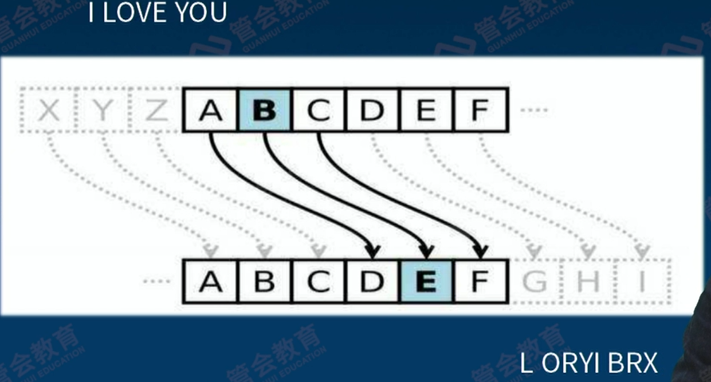

记账：67基础账本，也带一点认账

认账：89群体认账共识机制

可编程

## 1 导言：数字化时代的信任架构与路径

1 为什么是区块链：

- 数字化迁徙行至半途

- 不靠谱的人与无人化，比如量化投资克服人的情绪

- 信任的无人化

2 区块链名字的演进：

- 账链：侧重典型业务，不是简单的账能概括

- 共识链：侧重核心机制，共识也不足以概括

- 公信链：侧重应用效果，也没那么大本事

- 区块链：侧重技术原理，反而什么都看不出来，叫多了就这样了

3 距离的演进和坍缩：

- 地理的距离：坐商，只能坐着等客户上门

- 物理的距离：行商，交通发达了辐射半径更广了

- 信息的距离：网商，互联网商业的发达

- 心理的距离：知商，把信息融汇贯通变成知识

- 信任的距离：信商，支付/征信/清算/理赔/质押，本质上都是做公证

**距离的坍缩**：科技改变生产力 -> 生产力改变距离 -> 距离改变生产关系

4 **非信任环境中的信任服务基础设施**：即使我们彼此怀疑，但是在这个**信任机器**面前会极大的提升做坏事的成本，从而成为了事实机器

治理：大多数区块链还没有可运营型和隐私保护

价值传递：信息是不守恒的，因为可以无限拷贝，但是价值不能传递，否则没有价值了，所以实现了不可双花和不可透支，比如比特币

这一切的目的都是为了达成共识

5 区块链4大方面后面会逐一介绍：

- 记账

- 认账

- 可编程

- 自带商业模式

6 如何辨别真的在做区块链：

业务简单搬家 ->业务深度重组
不改变信任路径->优化信任路径
不改变权利义务->记账权、监督权、使用权再分配
不改变治理架构->优化治理架构
不改变组织边界->适当扩展组织边界

## 2 （上）密码学基础：历史、对称与哈希加密

1 什么是密码学：

有人说密码学是研究如何隐密地传递信息的学科，还有人说密码学是关于如何在敌人存在的环境中通讯的科学。**总结：密码学是研究仅在受限范围内共享信息的机制的科学**

密码学的场景设定：

2 古代的密码：

- 凯撒密码：字母表顺序错位变换
  
  

- 虎符：甲兵之符，右在皇帝，左在阳陵（虎符要能对的上）
  
  

3 **密码进化过程**

密码观念的进化史：

- 1 密电码：非公开算法（计算能力变强后好破解）

- 2 DES/AES：公开算法、非公开密钥（计算代价会很大）

- 3 RSA/椭圆曲线：公开算法、部分公开密钥（分成公钥和私钥，公钥通信、私钥签名）

计算技术对密码学的影响：手算->手算+查表->机械计算->电子计算->量子计算

案例：密电码 ：用献血和生命保卫的秘密

- 用“人肉”实现数学变换

- 借助外物记忆变换的规则

- 外物的传递/分发/共享有风险

计算时代如何加密？揉面——乱序与扩散

揉面为什么能导致均匀呢?因为在揉面的过程中使用了两个最基本的技术:乱序和扩散。所谓“乱序”就是打乱原来的排列顺序，所谓扩散，就是把当初粘连在一起的面打散，并且把它们挤压到每一个角落。乱序和扩散，是现代数学中的“混沌”现象的精髓在揉面过程中的具体体现。  

4 **对称加密算法**

对称加密算法沿革：

- 突破：DES、S-DES

- 过度：IDEA/RC2/RC5，3DES（2个密钥做3遍DES）

- 成熟：AES

对称加密算法的优点和缺点：

- 优点：速度快、对称（简单）、安全（前提是密钥位数足够多）

- 缺点：分发困难（加密解密如何在分发过程中防止被截获）、两两复杂性（有组合数Cn2的复杂度，O(n2)级别）

5 **哈希（散列）函数**

作用：存证（忠实原文）、浓缩（化大为小）、签名（难以伪造）

补充：

- 但HASH也现在证明不再安全的算法：SHA/SHA1/MD5等

- 尚未攻破的算法：SHA256

举例：类似于数据的指纹

特点：

- 单向性：正过来加密容易，反过来解密很难

- 防碰撞性：输入不同输出相同

- 压缩性：多大都压缩到一样的大小

- 抗差分攻击性：差一点差很多

## 3 （下）密码学基础：非对称加密和数字签名

1 概述：

- 原理: 基于特定数学问题的难解性

- 途径: 利用公私密钥对实现加解密

- 应用: 对称密钥分发、数字签名

- 典型算法: RSA、ECC

2 非对称加密的过程：

- 公钥正向加密：比如意见箱（传递信息）
  
  - 环节1：非对称密钥生成（以RSA为例），**接收者**先用大素数p*q，然后求得e和d得到公钥和私钥，将公钥传递给**发送者**
  
  - 环节2：非对称加密，发送者用**接收者**的公钥加密明文形成密文（大数分解难解性）
  
  - 环节3：非对称解密，然后发给**接收者**，**接收者**用自己的私钥解开

- 公钥逆向使用：签名很难模仿（自证清白）
  
  - 环节1：非对称密钥生成（以RSA为例），**发送者**生成
  
  - 环节2：发送者用自己的私钥加密明文形成密文签名
  
  - 环节3：接受者用发送者的公钥解开原文

3 **大数分解很难**，因为素数p有1000位，素数q有1000位，p*q就有2000位，分解很难

密钥产生过程： 

4 研究大数分解：

- 根据是否利用因子的特殊性质，分为：
  
  - 专用算法: 利用了因子的特殊性质
  
  - 通用算法:对因子的性质没有特殊要求

- 根据 (平均) 计算复杂性，分为
  
  - 指数算法:计算复杂性渐进阶为指数级
  
  - 亚指数算法:计算复杂性渐进阶低于指数级

5 量子算法Shor（随时关注）

- 可在多项式时间内完成大数分解

- 依赖于足够多量子位的量子计算机

- 目前量子计算机距此还有不小距离

- 一旦造出，对非对称加密威胁致命

6 数字签名的验证过程：

7 **公钥的证书体制**：

借助权威上级，从而让公钥和身份绑定了一起！

8 密码学对区块链的意义：非常重大，谈区块链不谈密码学就是耍流氓

- 原理：奠定了坚实的数学基础

- 素材：形成了成熟的算法组件（成熟的密码学都有了包）

- 启发：积累了丰富的协议实践（工程化启发）

9 密码学的相对安全性：密码有保障，但是也是相对的

- 密钥的强度：位数

- 根基的牢固程度：难解性

- 颠覆性技术尚未出现：量子

## 4 分布式系统与点对点网络

**1 区块链3大支柱**：

> 密码学：数据上支持
> 
> 分布式系统：系统上支持
> 
> 点对点网络：通信上支持

**2 分布式系统构成**：多个节点+通信网络

> 两大目标：
> 
> - 要防止自然因素导致的异常
> 
> - 要防止坏人传递虚假信息
> 
> 三大诉求（CAP原则）：
> 
> - 一致性 Consistency：同一时刻，各个节点上的数据是同样的
> 
> - 可用性 Availability：在某些节点故障场景下，仍有节点可提供服务
> 
> - 分区容忍性 Partition Tolerance：某些节点的失联场景下，仍有节点可提供服务（脑裂这状态下依然能提供服务）

**3 拜占庭将军问题**

> **古罗马问题**：若干个将军各率领一支部队，通过通信兵传递命令，约好统一行动。但某些将军已经叛变，他们会故意发布错误的命令，扰乱行动的协同用何种容错机制处理这些看似予盾的命令，可以保证在叛变的将军**人数不超过一定比例的情况下**（如果是两个将军各带一支部队，其中一个是叛徒，那死定了），仍能保证这些部队的行动在整体上是符合预期的?
> 
> **拜占庭容错诉求**：把“将军”看成分布式系统的“节点”，问题变为:在存在不可靠甚至恶意的节点时，用何种容错机制处理这些节点间的数据通信，可以保证在恶意节点不超过一定比例的情况下，仍能保证整个分布式系统的行为在整体上是符合预期的?
> 
> **问题难度**：“坏人”的存在 + ‘在途“的复杂
> 
> **如何解决**（不断发展，有好消息也有坏消息）：
> 
> - CAP不可兼得，但是**最终同步**假设下可解（牺牲一致性让步到**最终一致性**）
> 
> - 但是可解也是有条件的，好人>2/3（发展处PAXOS/PBFT/RAFT算法）
> 
> - 概率假设下好人大于>1/2即可（区块链的POW机制，比2/3更放松一点）

**4 对等网络**

> **定义：**
> 
> - 有中心服务器的网络：所有围绕1个中心
> 
> - 全连接的网络：两两连接
> 
> - <u>对等网络：只跟少数我认识的节点通信，每个是稀疏的，但是总体连接在一起</u>
> 
> **对等网络中共识的传播和达成**：
> 
> - 举例：每个节点都和自己上下左右的节点比较，不断每轮迭代，像波浪一样扩散
> 
> 
> 
> 

**5 分布式系统与对等网络叠加**

> 选择性通信：连接视野有局限
> 
> 阶段性结算：信息等待有底线
> 
> 波浪式传播：状态到达有先有后

**6 分布式与去中心化**

> 分布式是一种技术架构，去中心化是一种治理模式
> 
> **去中心化以分布式为基础，分布式不必然导致去中心化**

## 5 区块链的诞生与发展

**1 比特币之前的探索**

> **探索**：在不守恒不可靠的信息网络中，传递守恒的价值，但是共同的弱点就是依赖于可信的第三方
> 
> 

**2 比特币问世**

> - 2008年，化名作者Nakamoto Satoshi在密码学网站metzdowd.com的电子邮件列表里发表了题为“Bitcoin:APeer-to-PeerElectronic Cash System (比特币:一种点对点的电子现金系统)”的划时代论文
> 
> - 短短9页，确立了比特币独具特色的基本技术架构和运作方式
>   不可不读，论文在网上已有中文译本，作者化名的日语汉字转写为“中本聪

**3 比特币的创新**

> - 协议创新:
>   
>   - 完整提出并实现了现在称为“区块链”的时间不可逆的数据组织方式
>   
>   - 完整提出并论证了“工作量证明” 共识机制，初步解决“双花”问题
>   
>   - 提出了实现在不守恒的信息网络上传输守恒的价值的协议框架集成创新  
> 
> - 集成创新：集成密码学、分布式系统、对等网络的诸多技术成果于一个系统
> 
> - 商业模式创新：提出了自带发行、自带激励的社区化公链运作模式

**4 极端案例**

> 丝绸之路
> 
> GBL交易平台
> 
> 

**5 区块链时代发展**

> **<u>1.0时代</u>**：（币涌现）在比特币带动下，一批具有记账和转账功能的区块链系统纷纷推出
> 
> - 莱特币
> 
> - 比特股 (创始人BM后来又发起EOS)
> 
> - 瑞波币，Ripple，后来专注于汇兑 
> 
> **<u>2.0时代</u>**：
> 
> **公链技术跨越**：秉持“世界计算机”愿景，推动区块链摆脱了单纯的“账本“定位，进入区块链可编程时代（以太坊上可以跑应用）
> 
> - 引入智能合约和虚拟机，扩充区块链的功能，在区块链上表达和实现复杂业务逻辑成为可能
> 
> - 引入GAS，用经济手段调控计算资源成为可能
> 
> - 批量发展Dapp，形成去中心化应用生态成为可能
> 
> - 事实上拉开了与比特币的距离，推动了“区块链”概念确立和传播
> 
> **联盟链组织**：超级账本和R3
> 
> - 超级账本:区块链技术大咖们的联盟（IBM盟主）
> 
> - R3:区块链业务大咖们的联盟
> 
> - **链圈兴起**（与之相对应的是币圈），正规机构开始探索利用区块链开展正规业务
> 
> - 联盟化的得与失
>   
>   - 技术资源共享之得（超级账本）
>   
>   - 互操作之失（R3的机构业务很熟悉之后不需要互操作了）
> 
> **<u>3.0时代</u>**（正在到来）：
> 
> - 大资金、大机构、大流量等纷纷入场
> 
> - 场景日益丰富，实体经济的需求喷发
> 
> - 央行齐发力，法定数字货币呼之欲出
> 
> - 触角伸到现实世界与物联网紧密结合

**6 依托区块链开展正规业务的最初探索**

> 金融机构：高盛、德意志银行、巴克莱、汇丰、摩根大通、VISA、纳斯达克、澳交所
> 咨询机构：德勤、埃森哲、普华永道、麦肯锡
> IT产业：IBM、微软、索尼
> 组织：IOSCO、R3、SWIFT、DAH等

**7 区块链分类**

> - 公链：开源构建、社区化运营；记账权开放，自带激励
> 
> - 许可链：私链和联盟链，需要许可才有记账权
>   
>   - 私链：不开源、独家机构运营；记账权封闭，无激励
>   
>   - 联盟链：一般不开源，或联盟范围内开源；联盟化运营，记账权仅限联盟成员，无激励

**8 区块链业态**

> 总业态分为：
> 
> - 币圈：平台、社区、代币，缺一不可，包括激励机制
> 
> - 链圈：平台，可以不要币和社区，发放平台许可
> 
> 链圈生态：
> 
> - 一强多弱，盟主太强了，小弟不重要，会有很多伪需求（一家独大）
> 
> - 多强型，大哥太多，臣妾搞不定
> 
> - 多弱型，大家都不强，没有给其他人建设区块链的能力（可以用BaaS开区块链，但是又回到了中心化了，因为有一个中心服务商，和初衷可能相违背，初衷不是最终的结果）

## 6 （上）基础账本：时间不可逆的数据组织

**1 时间的不可逆**

> 物理：熵、耗散、墨水
> 
> 社会：交易记录、学历、病例
> 
> 信息：区块链

**2 区块链的记账地位**

> - 存证、定序是最基础的技术能力，要求有时间不可逆
> 
> - 区块链四大看点：**记账（最重要）**、认账、可编程、自带商业模式
> 
> - 区块链改变：将原本多边记账转化为统一总账，综合了下面2者的优点
>   
>   - 多边记账：缺点在于过于复杂，需要两两对账
>   
>   - 统一总账：缺点在于如果篡改就失去了依据，其他人无法辨别
> 
> 

**3 统一总账**

> **统一总账的利与弊**：
> 
> - 好处：
>   
>   - 简明：逻辑清晰，关系明确
>   
>   - 高效：无需对账，省时省力
>   
>   - 节约：一套系统，多方共享
> 
> - 弊端：
>   
>   - 信任：谁来记账，谁保证记账的准确性
>   
>   - 安全：谁运行系统，谁保证系统不出错
>   
>   - 许可：谁该看什么数据，谁不该看什么数据
> 
>   统一总账的两种不同思路：
> 
> - 集中式
>   
>   - 大家把账委托同一方记
>   
>   - 大家都信任超级记账者
>   
>   - 超级记账者无需自证
> 
> - 分布式
>   
>   - 大家都来记同一本账
>   
>   - 大家都信任数学、算法
>   
>   - 大家彼此监督检验

**4 分布式账本与区块链**

> 有很多区块链不是分布式账本，但是大多数分布式账本都是区块链
> 
> 

**5 记账的原理**

> 存证+定序：过去、现在、未来
> 
> 
> 
> **①代表过去的特征数据**：上一个区块的哈希，得到它就得到了全部历史的指纹，把区块接过来相当于就把历史全部链接过来
> 
> 
> 
> **②代表现在的特征数据**：Merkel哈希树根，将交易不断打包聚合到根部哈希，如果交易上有一个数值不同或者顺序不同，那么根的结果就是完全不一样的（还是有碰撞的可能，但是概率是非常低的，让其有意义并且能够获利的概率就更低了）
> 
> 
> 
> **③代表未来的特征数据**：随机配数（不是事前决定的，是数据算好打包的时候现场计算，满足一定的约束条件），如果要伪造，必须重新生成区块，算出特解
> 
> 
> 
> **区块之间的勾稽关系**：过去+现在+未来三合一
> 
> 

**6 区块链防篡改原理**

> 基于刚才的记账过程：
> 
> - 数据汇集：单条数据打包成为区块，反映在代表过去、现在、未来的三个特征数据之中，犹如一个个瞬间汇入历史的长河
> 
> - 哈希勾稽：区块之间通过哈希勾稽关系，紧密地融为一体，任何一个区块都浓缩了之前的历史，无论单独修改一条具体的数据，还是单独修改一个具体的区块，都无法简单地满足哈希勾关系
> 
> - 时间不可逆：这些勾稽起来的区块，组成一个时间不可逆的整体，有力地防止了局部性的篡改、抵赖、伪造和撤销，存证与定序相伴而行

**7 工作量证明**

> - 随机数：为了防止一个区块链被整体篡改，每一个区块都要加入一个随机数，使得最后对整个区块做散列的时候，其(二进制）值出现的0的个数是给定那么多个，<u>这相当于要在已知函数值的情况下给出函数自变量值的一个特解</u>
> 
> - 指数级难度：业内公认，在目前一些散列函数求特解只能通过暴力试算的手段进行如果求出，必然花费相当的工作量，函数值中出现的0越多，花费的工作量就越以指数级增加
> 
> - 篡改成本：用随机数增强了的区块链，每个区块都包含了这种与交易数据“混搭”的特解随机数，如果要整体篡改一个区块链，必须至少花费重新形成这个区块链所需的工作量；如果要篡改一个区块链上面一个特定区块之后所有的区块，就必须至少花费重新形成这些区块所需的工作量（想法：这个随机数会公布吗？）

**8 从数据组织角度看付出和所得**

>  付出：额外算力、额外存储
> 
> 所得：数据防伪、数据定序、数据存证

**9 对账本应当做广义的理解**

> 有价值内涵的量是狭义的账本
> 
> 任意事实的记录是广义的账本
> 
> 记账就是用数据记录历史
> 
> 区块链是对历史负责的应有之义

## 7 （下）基础账本：价值的流通与守恒

**1 区块链和价值互联网**

> 区块链和互联网的阶段：
> 
> - 价值：应用，现在区块链在互联网协议的阶段
> 
> - 信息：应用、WWW、TCP/IP
> 
> 价值互联网：传递->连接->协议->应用->泛在
> 
> 信息互联网和价值互联网区别：
> 
> - 信息不守恒 VS 价值守恒（信息共享总量增加，价值无法共享）
> 
> - 可撤销/篡改 VS 时间不可逆
> 
> - 可编程 VS 可编程性在路上

**2 节点：传递价值中的基础组成**

> **节点的定义**：如比特币区块链的节点，是一台连接到比特币区块链，具有一定计算能力 (简称“算力”)的计算机，构成比特币技术体系的一个“节点“
> 
> **节点可以做的事情**：
> 
> - 参与发行 (即“挖矿”）
> 
> - 参与交易(即“转账”)
> 
> - 参与结算 (即“维护公共账本”)

**3 价值的传递过程**

> **举例：比特币UTXO交易**
> 
> - 交易前：收到了若干张支票，是可支配的，面额是不等的
> 
> - 交易之后：被消费了多少，就要产生总量多少，前后总额必须相等
> 
> 
> 
> **举例：以太坊，账户余额交易**
> 
> 

**4 从记账到认账：让其他人也认可**

> **价值流通的基本约束条件**：需要有很多人在算和验证
> 
> - 等式约束:转出价值+剩余价值=原有价值
> 
> - 不等式约束:原有价值>转出价值
> 
> - 守恒约束:一方的转出价值必须等于对手方的转入价值

5 **发行是特殊的交易**：整个区块链系统有了价值增量

> - 发行是没有转出方、只有转入方的交易
> 
> - 发行产生于如下环节
>   
>   - 区块链内生的激励
>   
>   - 外部可信来源的价值输入

**6 身份认定：**

> **核心**：**价值转移主体的身份通过“地址”来标识**
> <u>**1.0时代举例**</u>：在比特币公链中，“地址”是公钥的哈希，可验证公钥，但不可反推出公钥，这是一种有限的抗量子设计（哈希函数反算对量子计算比较难，量子对非对称加密有效果）
> 
> - （花钱必须验证，不一定抗量子）价值转出方必须私钥签名，以证明发起价值转移的身份适当性；然后必须出示公钥，以供别人验证发起价值转移的身份适当性
> 
> - （收钱无需验证，是安全的，抗量子的）价值转入方无需出示公钥，仅凭地址即可接受转入的价值
> 
> **UTXO型价值转移**：往别人的保险箱里扔支票
> 
> 
> 
> **<u>2.0时代举例</u>**：以太坊智能合约
> 
> 智能合约发起价值转移一般无需签名和验签（转出的时候）
> 
> - 自动运行的需要
> 
> - 保障私钥安全的需要
> 
> - 代码即法，后果自负的需要
> 
> - 由自动运行主体的非功利性决定
> 
> - 可能会成为安全隐患（转出的技术保证还是比较弱的）
> 
> **基础账本是最安全的**：
> 
> - 交易所的安全性不等于基础账本的安全性（现在比特币被盗往往发生在交易所，这是个中心化的，比放在基础账本中安全性差了很多）
> 
> - 智能合约的安全性不等于基础账本的安全性
> 
> - 目前为止主流公链的基础账本未发生安全事故
> 
> - **区块链中基础账本的安全性具有最高等级**

**7 从区块链到价值互联网还有多远**

> 必须解决三个问题：（以下是必要条件）
> 
> - 隐私问题：不能像比特币一样都是透明的，账户是匿名的不知道谁给谁转账，但是转多少都是知道的，为这些地址提供越来越可猜测的线索
> 
> - 性能问题：比特币和以太坊的性能不可能大规模应用的
> 
> - 跨链问题：很多公链都是自成一派，如果都是价值孤岛也没有了意义

## 8 （上）共识机制 POW/POS/DPOS

介绍三种共识机制

1 什么是共识机制

> **定义**：在区块链中，依靠群体参与见证，以某种事先确定的规则对群体见证的内容进行综合，从而得到被所有参与者认可的共识结论的机制，称为共识机制
> 
> **群体的范围**：
> 
> - **在公链中**是随时间变化的，入群、退群、硬件的临时开关机、软件的运行故障以及私钥的突发状况等，都会影响有能力参与共识的节点范围
> 
> - **在私链和联盟链中**总体是固定的，但也有不可控因素造成少许变化
> 
> **共识机制的意义:：**
> 
> - 一个区块链形成一本其内容有机统一，难以篡改的“大账”，靠各个节点分布式维护
> 
> - **维护的过程**既是区块链各节点之间争相按自己的意图纳入新交易记录（记账）的过程，同时也是各节点对区块链内记录信息的有效性（认账）的验证过程
> 
> - 共识机制是依靠和激发群体力量筛选诚实的账本并把它固化下来形成不可更改的“历史”的机制
> 
> **共识机制的分类：**
> 
> - 基于投票的：PBFT/PAXOS/RAFT
> 
> - 基于随机性：ALGORAND
> 
> - 基于证明的：POW/POS/DPOS（本章重点）

2 基于证明的共识机制

> 定义：基于证明的共识机制，顾名思义，是以**提交某种“证明”的方式来参与共识的**
> 
> 基于证明的共识机制包括两部分内容：
> 
> - 一是检验所提供的证明的**正当性**
> 
> - 二是在确认证明正当性的情况下所**触发的“认账”动作**
> 
> 目前比较有代表性的基于证明的共识机制包括：
> 
> - 工作量证明（POW）机制
> 
> - 权益证明（POS）机制
> 
> - 代理的权益证明机制（DPOS）

3 POW机制：

> - **多数决定原则**：假定多数人是诚实记账的。如果多数人坚持把自己认为的真实账本记录下来，那么就可以在全局保留一份多数人期待的诚实账本。但是，对等网络是点对点通信的，没有“全网投票”这种机制可以用，所以得改变多数决定原则的形态
> 
> - **最新时间戳+最长链优先原则**：
>   
>   - 最新时间戳优先：每个人收到的区块顺序有先有后，其中可以连续满足区块间勾稽条件的区块组成的链就是诚实记账的人当前认可的链。但是考虑到网络通信条件，会出现一些数据区块“在途”的情况，于是各节点所认可的链在局部可能会发生<u>短时间的分歧，即“分叉”</u>。
>   
>   - 最长链优先：随着时间的推移，该来的总会来，一个诚实记账者看到的，终究会传播到所有诚实记账者那里。<u>在<strong>合理的时延</strong>设定下，局部的分歧会趋于一致，诚实的账目终究会被“持久化”</u>，成为以很高概率不可更改的记录。
>   
>   
> 
> **新交易广播**：确定新产生的交易后，就会向全网进行广播
> 
> **数学验算**：谁先算出来，其他人就会验算。成员不固定，贡献不确定；靠竞争性提供或有激励；本轮其他竞争未遂成员行使监督职能；后续轮次仍有机会。
> 
> **POW见证什么**：
> 
> - 区块能否接上，是否是最长的
> 
> - 一个转账是否满足等式约束、不等式约束
> 
> - 不能搞反了历史
> 
> - 转账的签名和检验HASH密码学有效性
> 
> 
> 
> **POW的抗攻击性**：
> 
> - 理论上，<u>只要诚实记账者超过半数（51%）</u>，即可把诚实记账的结果保留下来
> 
> - 实际上，记账不是以“人”为单位，而是以“节点”为单位的
> 
> - 节点的算力也不相等，具有更高算力的节点与其他节点相比，具有事实上更高的概率把自己想要的账目写进账本。
> 
> - 所以，对POW共识机制的有效攻击方式就是“51%算力攻击（目前主流的公链上还没有发生过成功的攻击）

4 POS 权益证明机制：

> - **思路**：在账本上存储了更多价值的用户，更期望自己的价值不被不诚实的记账者所侵吞和毁掉，在行为上就更倾向于诚实记账。
> 
> - **做法**：锁定足量的价值，用以证明自己的“诚意”，来抵押相应的记账权份额。**不同的记账权份额对应着不同的寻找随机数的难度**。份额越高难度越低，难度越低先于其他人找到时间戳领先的区块的概率越高，这就间接实现了按身价分配记账权份额的效果。
> 
> - 优点：
>   
>   - POS把价值因素引进记账权分配，在设计上考虑更为综合，既有技术因素（向算力高者倾斜），也有业务因素（向份额大者倾斜）。
>   
>   - POS把减少随机数计算难度作为奖励的方向，在用经济手段鼓励诚实记账的同时，也在客观上减少了总算力消耗，有利于节能环保。
> 
> - 缺点：
>   
>   - 记账节点众多，对算力的消耗仍没有本质上的减少。
>   
>   - 考虑到黑客的存在，记账的实际执行人和份额的名义拥有人之间不仅可能身份不相同，甚至可能利益也不相同，所以以保全利益为出发点的奖励机制可能奖不到对的人身上。黑客完全可能以“崽卖爷田不心疼”的心态来粗放对待可操纵的份额。在自身有反向对冲的利益（比如通过基于该项数字资产的衍生品做空获利）驱动下，黑客也完全可能利用可操纵份额进行恶意砸盘，在另一端获取利益。所以，**如果反黑客能力不到位，应慎用POS**

5 DPOS 代理的权益证明机制：

> - 介绍：DPOS机制是POS机制的一个局部改进，综合份额和算力
> 
> - 做法：考虑到数字资产份额高的主体和记账本身的技术能力（效率和精准）高的主体不一定重合，可以考虑份额拥有者将锁定的份额汇聚到若干个“超级节点”上，**由这些“超级节点”代替份额拥有者行使记账权**。超级节点的实际控制人是份额拥有者的受托代理。这样超级节点的数目大幅减少，但所代表的价值份额可能非常巨大，有可能做到提升效率和诚实记账两不误
> 
> 
> 
> - 优点：①进一步提高效率可以期待；②依托超级节点可以产生更有趣的商业模式
> 
> - 缺点：随着记账权和算力的集中，风险也在集中，少数超级节点在抵御大规模拒绝服务攻击和网络封锁方面表现出脆弱性，<u>同质化的超級节点更是在同一个严重漏洞面前面临全军覆没的境地</u>（参照360揭示EOS区块链公链的风险事件）

6 共识机制的评价：

## 9 （下）共识机制 PBFT

1 PBFT定义

> PBFT的英文全称是Practical Byzantine Fault Tolerance，中文翻译是“实用拜占庭容错”（算法/机制），于1999年提出
> PBFT属于BFT共识算法族，是一种基于投票的共识机制
> PBFT在实用中有很多变体，我们只介绍基础的PBFT
> PBFT应用有特定的预设场景和前提条件
> PBFT能够达到比较强的拜占庭容错能力，算法复杂度为多项式级别

2 PBFT场景设定

> - 成员固定假设：所有节点已经加入就不能退出
> 
> - 最终同步假设：所有“在途”的信息，经过一段固定时间的等待，最终会被收到
> 
> - “坏人”假设：每个节点都有成为“恶意”节点的可能，不应无条件地信任任何一个节点，甚至恶意节点之间还可以“共谋”
> 
> - 透明性假设：节点之间传递的信息，其他节点都有办法“嗅探”到，但不能截断或篡改，也不能验证信息的完整性

3 节点状态：

> - 每个节点看成同一个“服务”的若干“副本”，服务有“状态”，服务的准确状态要复制到每个副本，每个副本都要对所经历的状态序列达成共识
> 
> - **节点状态的变化被刻画为一个“状态机”模型**，每个节点都是一个状态机，所有节点从同一个状态开始执行，如果下一个请求是一样的，则大家达到的状态也是一样的（确定性而不是概率性的）
> 
> - 这样就把对消息的诚实响应问题，转化为对请求内容和请求序号的匹配性的认同问题
> 
> - 除了服务节点之外，另外有一个客户端C，可以和节点通信，但不在“节点”之列
> 
> 这是一种节点状态的迁移模型：
> 
> 

4 消息状态：

> - 节点间达成共识需要经历几个不同的协同阶段，每个节点进入特定阶段，都会触发“消息状态”发生改变。
> 
> - 在PBFT中，消息状态包括：
>   • Request：请求阶段
>   • Pre-prepare：预准备阶段
>   • Prepare: 准备阶段
>   • Commit：确认阶段
>   • Reply：回复阶段
> 
> 这是一个消息状态的迁移模型：
> 
> 

5 共识过程：

> 节点数量：3N+1，我们以3+1为例
> 
> - 请求分发：主节点和非主节点，主节点是主持人，不排除是坏人，但是所有人都要完成相关动作。首先C客户向N0这个Leader主节点发送了请求，然后N0就要分发给其他节点
> 
> - 意见交换：这个时候就要达成共识，需要两两通信，这个时候假如有节点是坏人，比如3号节点，它就不参与讨论（主节点配号的意见）
> 
> - 意见确认：每个节点收到2/3多数意见，则确认，允许节点不遵从这个规则，最后客户端还会经过一次选择
> 
> - 意见采纳：最后客户节点收到了2/3的的多数意见，则采纳
> 
> 
> 
> 重点问题：
> 
> - 1 1/3的问题（严重）：坏人不能多于1/3，容易形成共谋
> 
> - 2 主节点问题（没事）：不排除leader也可能是坏人，但是没关系，只要好人多于2/3，leader的错误信息也无法误导。但是leader如果不可用，则按实现准备好的预案，如果Leader超时不响应，则客户端C会发请求给另外的备份节点。备份节点发起“视图转换”请求，由各节点进行裁决，如2/3多数通过，则按实现确定的规则指定下一个leader
> 
> - 3 某节点跑的太快：别人很慢它很快，别人不好判断，容易引起无效通信和计算，对共识机制是一种浪费，所以可以限制一个上下限，把上下限的都挡掉，虽然他们发表了意见但是不允许采纳（专业点就是说可发起checkpoint请求，将大于此序号的请求视为不稳定的，如checkpoint请求获得2/3多数通过，则不稳定的请求会被忽略）

6 场景和改进

> **适用场景：**
> 
> - 有记账权的成员相对固定
> 
> - 节点数相对较少（最好不超过2位数），否则会面临“两两通信”带来的性能压力
> 
> - 根据上面的约束，可以推知，**PBFT不适合公链，适合私链或联盟链等需要准入许可**的场景
> 
> **优化改进：**
> 
> - 有各种对PBFT的优化改进版本，来应对节点动态进出、两两通信开销过大等需求
> 
> - 基本上，每种改进都是加进了特别的前提条件，没有绝对的优劣之分
> 
> - 有些改进的正确性、安全性尚待接受更严格的检验和测试

7 共识机制演进的新趋势

> - 从多到少，如DPOS
> 
> - 从链到图，如DAG。之前的勾稽关系是逐步支持的，是一个链状，有时候要把很久远的历史翻过来支持，代价就比较高，能否变成图，比如找到2个同时支持就可以往后走
> 
> - 从确定到随机，Algorand，如果潜在和真实的记账节点都很少，就会很容易被攻击，比如刚才的DPOS。要想不被攻击，就要有很多迷惑人的潜在节点，不让外面马上获知谁是真实的记账节点，就无法实现圈定你的攻击目标

## 10 智能合约概论

1 为什么要有智能合约：解决价值趴在账本上的问题

> 智能合约->可编程（四大看点之一）
> 
> 基础账本的不足：价值只趴在账本上是不够的
> 
> - 平时不动，转账才动（在数字化世界里有点浪费，只是一个转账）
> 
> - 不包含“业务逻辑”（所以不能做出响应）
> 
> - 不能对外界变化做出实时响应
> 
> **数字化世界不应满足于对现实世界的简单模仿**：账本是死的，价值是活的
> 
> **可编程：让价值飞一会儿**。让账本的价值进入合约，就是充钱，然后智能合约会有外部事件不断进入，一旦有适当条件触发合约的终止，最后合约会把价值**再分配**的比例，再写回基础账本
> 
> 

2 什么是智能合约

> - 智能合约（英文Smart Contract）是基于基础账本的、包含价值和信任状态为内容的程序代码，它可以在外部消息的作用下，按照既定的业务逻辑实现价值的再分配
> 
> - 基础账本提供基础的用户和价值数据，也提供最基础的信任状态存证和定序，它是智能合约的出发点和落脚点
> 
> - 智能合约通过程序代码操控价值和信任状态，使区块链得以执行复杂的业务逻辑，为区块链在各行各业的应用打开了想象空间（所有的应用无非就是**外部信息+业务逻辑的互动**）
> 
> - 智能合约的理论概念的提出早于区块链，但是实际落地在有了区块链后

3 智能合约的三要素

> - 基础账本：智能合约离不开基础账本，因为基础账本提供账户、价值和存证的基础支撑
> 
> - 编程语言：但是智能合约也要在其之上，编程语言提供程序代码的开发书写工具
> 
> - 虚拟机：虚拟机提供程序代码的运行时（Run time）环境
> 
> 案例：遗嘱执行，过于简单的案例，智能合约一直静默
> 
> 
> 
> 可以增加更多选择，比如按照固定比例分（变动余额才不让智能合约静默）、浮动比例分（关爱老人打卡，每次打卡都能改变浮动比例）
> 
> 

4 智能合约的外部信息源如何可信

> 比如刚才的死亡通知书、子女打卡这些外部信息源，触发智能合约
> 
> **问题**：智能合约的可信外部信息源对于忠实执行智能合约非常关键，输入数据是错的，一切皆错；对输入数据做手脚，有可能导致价值再分配的结果不同，有作恶的动机。所以，保证外部信息源的可信，是智能合约提供可信服务的应有之义
> 
> **输入如何可信**：经过“标准采集接口+特殊共识处理” 的外部信息源，称为“预言机（Oracle）”，股票市场数据、天气数据、航班数据、物联网设备数据甚至游戏数据都有可能成为被采集对象，用这种方法不一定能百分百保证可信，但是相对可信
> 
> **输出如何可信**：**虚拟机**将对智能合约的执行状态和结果进行**跟踪和留痕**；然后不同节点采集到的**留痕数据和基础账本的余额变动数据一起提交给共识机制**，只有达成共识的状态才会通过区块链不可篡改地记录下来；经过共识确认的执行状态和结果（所以不仅基础账本有共识的问题，智能合约也有共识问题）

5 智能合约的促进作用

> **有了智能合约，区块链从此不同：**
> 
> - 智能合约**赋予价值和信任状态“可编程”**的能力，使千差万别的业务逻辑走进区块链，使区块链能够对接各行各业的应用，赋能各行各业
> 
> - 智能合约把基础账本的价值转移功能拓展为价值全生命周期按需服务的功能
> 
> - 彼此互不信任又都不信任第三方的两个实体，通过智能合约，可以直接开展数字化的业务，而不必担心对方不遵守约定对己方造成伤害
> 
> **智能合约如何助力商业模式和治理模式改进：**
> 
> - 只要外部数据源可信，规则会被强制执行，不必担心不执行、执行不到位和执行走样等问题（比如分红）
> 
> - 只要外部数据源到位，规则会被立即执行（比如延误险理赔）
> 
> - **<u>“强制”和“立即”</u>**，会改变人们的行为模式、合作模式
> 
> - 商业模式和治理模式的改进可以从这里入手（数字化社团）

6 智能合约的代码

> **Code is Law（代码即法）**
> 
> - 智能合约的代码均为公开的
> 
> - 智能合约的外部消息和执行结果都是边达成共识边执行的
> 
> - 智能合约的参与者对上述两点都是知情的
> 
> - 因此，智能合约代码代表了参与者对代码所反映的业务逻辑规则的共同理解和认同，参（yuan）与（du）即（fu）赞（shu）同，上述原则被凝练为三个英文单词“Code is law”
> 
> **针对“Code is law”原则的不同观点**（白硕老师也认为不妥）
> 
> - 代码本身不具有法律效力
> 
> - 对代码的理解因水平而异，不排除编程者的理解就是错的但错误隐藏很深，以至于众多参与者都无法识别
> 
> - **正常的逻辑是**：程序代码是按照需求规范开发出来的，需求规范不合理，写规范的人负责；程序代码不合理，写程序代码的人负责；参与者对需求规范的理解有误，参与者负责，**跳过了需求规范直奔程序代码，结果是无人负责**
> 
> 历史上的事件：“The dao”基金份额被盗事件回顾
> 
> - 2016年6月，以太坊公链上发生“The DAO”基金份额被盗事件。黑客利用相应智能合约代码的漏洞，转出了大量份额，获取不当得利，**该漏洞隐藏很深，事件爆发前无人知晓**。事件爆发后，围绕黑客所得应不应追回，以太坊社区爆发激烈争论，最终导致以太坊社区分裂，账本分叉，主张黑客所得不应追回的人，依据就是Code is law。

## 11 智能合约的设计

主要是场景的设计，不是写代码，举几个例子

（想法：以下场景不需要区块链也可以运行，用了就是想引入共识机制，但是如果信息源输入就有问题呢？毕竟这些场景不是标准化的，所以这个信息源采集如何提高公信力？还有好处就是利用智能合约数字化了行为到支付的过程，这个其实不用区块链也OK，只是智能合约的范畴）

1 案例一、环保众筹

> 
> 
> 一个项目有人给钱，有人落实。最终评估的点就是指标，而这需要物联网设备采集获得指标，**需要有标准的共识机制进行采集**，然后输入进智能合约，智能合约会计算，比对和规定指标的比例，然后实施的好决定支付或者实施效果不行就返还余款。

2 案例二：航空延误险

> 
> 
> 信息采集起飞降落，这些信息捕捉到了，就知道是否在我们承诺的范围触发理赔，这个信息是公开的，是有据可查的

3 案例三：集会

> 
> 
> 产品宣传，集结必要的人群作为受众听产品发布会，起到做广告的效果。那么人来了没有？希望的人来了吗？之前只能目测。利用区块链让人来签到。委托方能够评判集会的实施者是否达到了要求。只要定好标准接口，让采集有可信性。

4 文件下载

> 
> 
> 社区自服务，每个人点节目。只是服务员会比较远，然后服务员什么都接就很累。家庭ABD都有碎片内容，资源请求方式家庭C，最后家庭C支付了内容共享和带宽共享的费用。

5 车位共享

> 
> 
> 闲散车位共享，和4都类似交易所挂单一样

6 总结：合约设计要点

> - 场景完整
> 
> - 外部信息源可信
> 
> - 角色利益关系详尽，利益相关方stakeholder都要在，表达各自诉求的信息源也在里面，这些信息源一定要可解释、可计算
> 
> - 逻辑简明
> 
> - 合法合规

## 12 智能合约的图灵完备性
