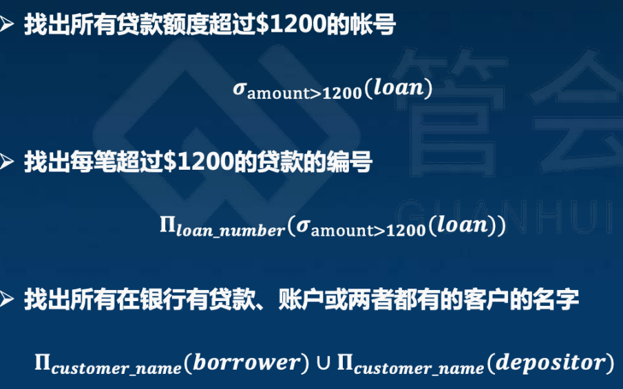
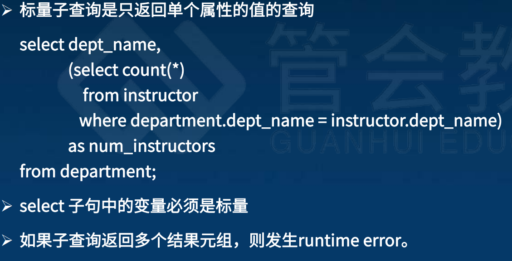
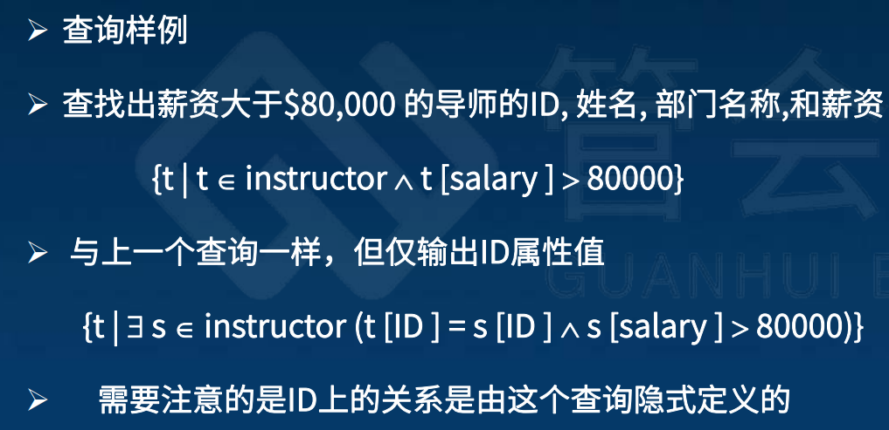

## 2 关系型数据库

### 关系模型介绍

关系数据库的结构

> - 1 基本结构：一般地，给定n个属性 D1, D2, …. Dn ，关系是D1 x D2 x … x Dn 的一个子集。一个关系是n元组(a1, a2, …, an， ai  Di)的集合
>   
>   - Ø 比如: • customer_name = {Jones, Smith, Curry, Lindsay, …}
>     • customer_street = {Main, North, Park, …}
>     • customer_city = {Harrison, Rye, Pittsfield, 然后 r = { (Jones, Main, Harrison),  (Smith, North, Rye),  (Curry, North, Rye),  (Lindsay, Park, Pittsfield) }
>     是以下关系的子集
>     customer_name x customer_street x customer_city
> 
> - 2 属性类型：
>   
>   - 每个属性在关系中都**有一个名称**
>   
>   - 每个属性的允许的值集称为**属性域**
>   
>   - 设置值必须是**原子的**;也是不可分割的
>     • 如. 如一个属性值已经是一个帐号时，不能再是一组帐号。
>   
>   - 如果一个**域的成员都是原子的，那么该域也是原子的**。
>   
>   - 特殊的空值是每一个域的一个成员。空值将会导致许多操作定义变得复杂。 我们将在我们的主要表达中忽略空值，稍后在考虑他们的影响。
> 
> - 3 关系模式
>   
>   - A1, A2, …, An 是属性
>   
>   - R = (A1, A2, …, An ) 是关系模式如:Customer_schema = (customer_name, customer_street, customer_city)
>   
>   - r(R) 表示r是R上的关系如: customer (Customer_schema)
> 
> - 4 关系实例：关系的当前值(关系实例)由表指定
>   
>   - r中的一个元素t是一个元组，在表中将被表达为一行
>     
>     
> 
> - 5 未定义顺序的关系表：元组的顺序是无关紧要的 (元组也许是以任意顺序存储的)
>   
>   - 比如: 未排序元组的用户信息关系表
> 
> - 6 数据库：数据库是多个关系的集合
>   
>   - 企业的信息被分为几部分，其中每个关系表中存储企业信息的一部分
>     
>     - account : 存储关于帐号的信息 
>     
>     - depositor : 存储客户拥有那些帐号的信息
>     
>     - customer : 存储关于客户的信息
>   
>   - 在一个关系集合中存储所有的信息，比如： bank(account_number, balance, customer_name, ..)，可以设计约束避免下面的问题：
>     
>     - 信息副本：不能表达如果两个客户有同一个帐号 
>     
>     - 空值：不能表达一个没有帐号的客户
> 
> - 7 码：K key，是属性的集合，R是表所有属性的集合，K是R的子集 
>   
>   - **超码**：如果 K 的值足以识别每个可能关系r(R)的唯一元组
>     
>     - 我们所说的可能的r是指在我们所建模的企业中可能存在的关系r
>     
>     - 如: {customer_name, customer_street} 和 {customer_name} 都是Customer的超码, 如果没有两个客户端从此你在相同的名字。现实生活中, 例如customer_id 将会替代customer_name作为客户的唯一定义,但是为了使示例更简单，我们省略了它，而是假设客户名是惟一的。
>   
>   - **候选码**：最小的超码，是候选码一定是超码，反过来不一定。如: {customer_name} 是Customer的候选码，因为它是一个超码，并且它的子集中都不是超码。
>   
>   - **主码**：作为确定关系中元组的主要方法而选择的**候选码**，又是隶属于候选码，应该选择其值从未或很少更改的属性。
>     
>     - 如： 邮箱地址是唯一的，但是也可以改变。用身份证号更好。
>   
>   - **外码**：关系模式可以具有与另一个关系的主码对应的属性。该属性称为外码.只有出现在引用关系的主码属性中的值才可能出现在引用关系的外码属性中。
>     
>     - 如：储户姓名和账户号属性分别是储户和账户的外码。
>       

代数操作（6+4+3）

> - 1 基础关系代数操作：
>   
>   - 查询语言是用户用来从数据库中请求获取信息的语言.
>   
>   - 查询语言分类：
>     
>     - 1 过程化语言;2 非过程化用语言
>     
>     - “纯”语言：1 关系代数；2 元组关系演算；3 域关系演算。“纯”语言来自经常使用的**基础查询语言**。
>   
>   - 过程化语言：过程化查询语言， 它包含一个运算集合，这些运算以一个或者两个关系为输入，产生一个新的关系作为结果
>     
>     - 六种基本运算
>       
>       
>       
>       - 选择运算：σ_p(r) = {t | t∈r  and p(t)}  ，选出所有的tuple（就是行），其满足谓词p。
>         
>         - p 可以用连词将多个谓词合并为一个较大谓词 (and),  (or),  (not)。每一个谓词为如下形式中的一种：属性 op 属性 or 常数，op可以为＞、＜、＝等等
>         
>         
>       
>       - 投影运算：π\_A,C(r) ，其中A和C是属性，r是关系名称。关系是一个集合，**所以所有重复行将被去除**。其实有DISTINCT的意思
>         
>         
>       
>       - 并运算：r∪s，取并集再去重，需要注意：columns个数和顺序相同
>         
>         - r和s必须是同元的，即属性数目必须相同
>         
>         - 对于任意i，r的第i个属性的域必须和s的第i个属性相同，r和s可以使用表达式计算出来的临时关系
>           
>           
>       
>       - 集合差运算：r - s  ，和并运算条件一致
>       
>       - 笛卡尔积运算： r x s，交叉乘在一起。如果r和s的属性中有相交，要重命名。
>       
>       - 复合运算：结合上面一起
>       
>       - 更名运算：将结果赋予新名字
>         
>         
>   
>   - 关系代数形式化定义：关系代数中基本表达式由如下之一构成：①数据库中的一个关系；②一个常量关系
> 
> - 2 附加关系代数操作：我们不能增加关系代数的表达能力，但却可以简化一些常用的查询。有4个：
>   
>   - 集合交运算：r∩s，可以用前面的 r-(r-s)代替，所以不是必须的
>   
>   - 自然连接运算 join：r⋈s，笛卡尔积的扩展，设r和s分别是模式R和S的关系，那么这个自然连接结果是R∪S上的关系，要求交集部分的属性是一样的，等于先笛卡尔积再选择
>     
>     
>   
>   - 除运算：r÷s，“对于所有的”短语操作，S必须是R的子集，R必须包含S，除出来的结果是R-S，每个R必须有S。其实相当于r和s对s进行了right join然后取出了都有s的r的属性，举例：求至少选择了C001和C003两门课程的学生学号
>     
>     
>     
>     
>     
>     
>   
>   - 赋值运算：计算时有中间结果，赋值操作(←)提供了一种方便的方式来表达复杂的查询
> 
> - 3 扩展关系代数操作：
>   
>   - 广义投影：在投影列表中使用算术函数对投影进行扩展
>     
>     
>   
>   - 聚合函数：聚合函数拿到一组数据然后返回一个单独的值作为结果。聚合结果没有名称，可以再取一个名字。可以被重写成之前的基本操作。
>     
>     - avg: 平均值
>     
>     - min: 最小值
>     
>     - max: 最大值
>     
>     - sum: 求和
>     
>     - count: 个数计算
>       
>       
>   
>   - 外连接：自然连接inner join、右连接⋉（保留右边信息）、全连接、左连接⋊

空值

> - 定义：它可以使一个元组有一个空值，表达为null。
>   
>   - Null代表不存在或者未知的。
>   
>   - 任何包含null的算术计算结果都是null。
>   
>   - 聚合函数可以简单地忽略空值(在SQL语句中)。
>   
>   - 对于去重的消除和分组，null被视为任何其他值，并且假定两个null是相同的（在SQL中)。
> 
> - 计算：
>   
>   - 和空值比较将返回特殊的值： unknown
>     • 如果false作为unknown, not (A < 5) 将等价于 A >= 5
>   
>   - 在布尔运算符中使用unknown（其实就是true or false）
>     
>      • OR: (unknown or true) = true,
>      (unknown or false) = unknown
>      (unknown or unknown) = unknown
>     • AND: (true and unknown) = unknown,
>      (false and unknown) = false,
>      (unknown and unknown) = unknown
>     • NOT: (not unknown) = unknown
>     • SQL “P is unknown” 等价于真，如果表达式 P 为unknown
>   
>   - 选择投影的结果如果为unknown时，为false

数据库的修改：

> - 数据库的修改涉及以下几个操作：删除、插入、更新。**所有的操作都可以使用赋值操作来表达**。
>   
>   - 删除：删除和查询的表达式很类似，不同的是查询要显示，而这里是删除，r ← r - E
>   
>   - 插入：r ← r ∪ E
>   
>   - 更新：r ← π\_F1,F2,...Fi(r)，需要利用广义投影

综合案例：

> 基础关系代数操作：
> 
> 
> 
> 
> 
> 附加关系操作：
> 
> 
> 
> 
> 
> 扩展关系操作：略
> 
> 修改：
> 
> 
> 
> 
> 
> 

### 关系数据库查询语言SQL

#### SQL基本情况

SQL查询语言概览

> - 来源：IBM Sequel 语言由 IBM San Jose Research Laboratory 作为 System R 项目的一部分被开发出来，重命名结构化查询语言 (SQL)。目前商业系统都支持SQL-92特性

数据定义语言(DDL)

> - 定义：SQL 数据定义语言 *(DDL)* 提供有关关系的信息，包括：
>   
>   - 关系模式
>   
>   - 每个属性的的取值类型
>   
>   - 完整性约束
>   
>   - 正如我们稍后将看到的，还有其他信息，如：每个关系维护的索引集合、每个关系的安全性和权限信息、每个关系在磁盘上的物理存储结构
> 
> - 1 数据基本类型，已了解
> 
> - 2 创建关系，一个SQL 关系是用 create table 命令定义的，已了解
> 
> - 3 创建关系中的完整性约束，如外码、主码
> 
> - 4 其他关系定义，比如多个属性变成主码、外码
> 
> - 5 关系更新：CRUD，删除属性时可能会有外键问题，所以有的数据库仅支持插入属性，不支持删除

查询的基本结构

> - 基本：SQL 的基本查询结构由三个子句构成，SQL 查询的结果是个关系。
>   
>   
> 
> - 1 select 子句：列出查询结果中所需的属性，对应于**关系代数-基础的投影运算**。
>   
>   - 不区分大小写
>   
>   - 允许重复，可以加DISTINCT；关键字 all 指定不删除重复项
>   
>   - 用\*代表所有的属性
>   
>   - 子句可以有+-x÷，相当于**广义投影**
> 
> - 2 where 子句：指定查询结果必须满足的条件，对应于**关系代数-基础**的**选择谓词**
> 
> - 3 from 子句：列出查询中涉及的关系，对应于**关系代数-基础**的笛卡尔积运算。
> 
> - 4 连接：对应于**关系代数-扩展中的自然连接运算**。
> 
> - 5 自然连接：只考虑那些在公共属性上具有相同值的元组，并且只保留每个公共列的一个副本，对应于**关系代数-附加中的自然连接运算**。

#### SQL运算操作

*该部分就是关系模型中在SQL中的应用*

附加的基本运算

> - 1 更名运算，AS，对应于**关系代数-基础**的**更名运算**，AS是可选
> 
> - 2 字符串运算，运算符 like 使用两个特殊的字符来描述模式
>   
>   - 百分号 (%). 匹配任意字符串
>   
>   - 下划线 (_). 匹配任一个字符
>   
>   - 使用反斜杠(\\)作为转义字符
>   
>   - SQL 支持很多字符串运算，使用 ||串联
> 
> - 3 元组的显示次序，可以为每个属性指定降序的desc或升序的asc；升序是默认排序。之前说了在关系模型中这个顺序无所谓。
> 
> - 4 where 子句谓词，包含 between 比较运算符
> 
> - 5 重复，在有重复的关系中, SQL 可以定义结果中每个元组出现的复本数，此时用笛卡尔积会维度爆炸（没有信息量）

集合运算

> - 集合运算 union, intersect, 和 except，**以上运算自动去除重复**
> 
> - 如果**想保留所有的重复**需要使用对应的多重集 union all, intersect all 和 except all
> 
> - 假设一个元组在关系 r 中出现 m 次，在关系 s 中出现 n 次，那么它：
>   
>   - 在 r union all s 中出现 m+n 次
>   
>   - 在r intersect all s 中出现 min(m,n) 次
>   
>   - 在 r except all s 中出现 max(0, m – n) 次

空值

> - 定义：元组的某些属性可能有一个空值，用 null 表示，表示未知值或值不存在，任何涉及null的算术表达式的结果都是null，谓词 is null 可用于检查空值
> 
> - 空值与三值逻辑
>   
>   - 任何和空值比较的返回结果都是空值
>   
>   - 三值逻辑使用真值 unknown，和之前的关系代数一样
>     
>     

聚合函数

> - 定义：聚集函数以值得集合（集或多重集）为输入，返回单个值
> 
> - 1 Group by：聚合函数之外的select子句中的属性必须出现在group by列表中，比如下面这个例子就不能放ID在SELECT中
> 
> - 2 Having 子句：**having子句中的谓词应用于组形成之后**，而where子句中的谓词应用于组形成之前
> 
> - 3 空值和聚集：
>   
>   - 除count(*)以外的所有聚合操作都忽略聚合属性上具有空值的元组
>   
>   - 如果集合只有空值怎么办，count结果为 0，其它聚集返回 null

#### 嵌套查询和数据库修改

嵌套子查询

> - 定义：SQL 提供了一套嵌套子程序查询的机制    
> 
> - 1 **集合的比较：some 子句**，至少一个成立
>   
>   查找工资高于生物系某些（至少一位）教师的教师姓名。
>   
>   
>   
>   
> 
> - 2 集合的比较：all 子句，所有都要成立
>   
>   
> 
> - 3 空关系测试
>   
>   - exists 结构在作为参数的子查询非空时返回 true。
>   
>   - exists r 等价 r 不等于 Ø
>   
>   - not exists r 等价 r = Ø
> 
> - 4 利用EXISTS的相关变量
>   
>   
> 
> - 5 NOT EXISTS
>   
>   
> 
> - 6 unique 重复元组的存在性测试，在空集上计算出真值
>   
>   
> 
> - 7 From子句的子查询，SQL 允许在 from 子句中使用子查询表达式。
>   
>   - from 子句嵌套的子查询不能使用来自其他关系的相关变量。除非用另一种写法: lateral 子句。下面例子用JOIN更好，但是为了说明，所以展示一下，用LATERAL可以把L1写在L2这个子查询中
>     
>     
> 
> - 8 With子句的子查询，提供了一种定义临时关系的方式，这种关系的定义只在 with 子句出现的查询中可用
>   
>   - 下面定义了一个max_budget关系表，只有value一个属性
>   
>   - 
> 
> - 9 标量子查询，大部分返回都是一个set或者tuple，但是也可以返回一个标量，比如一个数值
>   
>   - 可能返回的错误是一个运行时错误，因为运行时不知道返回多少，运行的时候才可能发现比如返回了多个
>   
>   - 

数据库的修改

> - 1 删除操作：delete from instructor
>   
>   - 问题:当我们从关系中删除元组时，平均工资会发生变化
>   
>   - SQL是只算1次，然后再一起删除
> 
> - 2 插入操作：insert into course，可以告诉位置
>   
>   - 如果插入的时候有个属性约束不能为空，插入空值就会有runtime error
>   
>   - select from where 语句中的任何结果插入到关系之前**都会被完全计算**
>     
>     - 否则像 insert into table1 select * from table1
> 
> - 3 更新操作：
>   
>   - CASE：如果2个更新操作同属性值，UPDATE的顺序比较重要，此时可以使用case语句来解决这个问题
>     
>     
>   
>   - 使用标量子查询的更新的案例：重新计算和更新所有学生的学分，对没有参与任何课程的同学的学分设置为空值。
>     
>     

### 高级关系型数据查询语言SQL

连接关系

> - 1 连接关系定义：连接表达式 获取两种关系并返回另一种关系作为结果。
>   
>   - 联接操作是笛卡尔乘积，它要求两个关系中的元组匹配（在某些条件下）。 同时指定联接结果中存在的属性
>   
>   - 联接操作通常用作from子句中的子查询表达式
> 
> - 2 连接的要素：
>   
>   - 连接操作（Join operations） 联接操作于两个关系，结果返回另一个关系。
>   
>   - 连接条件（Join condition） – 定义两种关系中的哪些元组是匹配的，哪些属性会出现在连接的结果中。
>   
>   - 连接类型（Join type） – 定义如何处理每个关系中与其他关系中的任何元组不匹配的元组（基于连接条件）。
> 
> - 3 外连接：联接操作的扩展，用于避免信息丢失。
>   
>   - 自然左外连接
>   
>   - 自然左外连接
>   
>   - 全外连接

视图

> - 定义：在某些情况下，不希望所有用户都看到整个逻辑模型（即存储在数据库中的所有实际关系。），视图提供了一种从**某些用户的视角隐藏某些数据**的机制。任何**不是逻辑模型的一部分，但作为虚关系对用户可见**的关系被称为视图（view）。
>   
>   - 如果一个人需要知道教师的名字和院系，而不需要知道工资。那么应该看到一种SQL中的关系描述：select ID, name, dept_name from instructor
> 
> - 1 视图定义：create view，计算是一种**懒加载**的模式，用到的时候才会计算，在PL 术语中被称为 “call by name” 或者 “lazy evaluation”
> 
> - 2 案例
>   
>   
> 
> - 3 使用其他视图定义视图
>   
>   - 如果在定义v1的表达式中使用v2，则视图关系v1被称为**直接依赖**于视图关系v2 。或者存在依赖路径，则其**依赖于**。如果依赖自身，则**递归**。
> 
> - 4 一种定义视图意义的方法是根据其他视图定义。
>   
>   - 只要视图定义不是递归的，这个循环就会终止
> 
> - 5 视图的更新
>   
>   - 要考虑原关系表的真实属性，那个里面其实有一个salary
>   
>   
> 
> - 6 视图的更新问题：大多数SQL 实现允许仅在简单的视图上更新
>   
>   

事务

> - 定义：事务是工作的单元
>   
>   - 是原子性事务
>   
>   - 与并发事务隔离
>   
>   - 事务隐式开始，以 commit work 或者 rollback work 结束
>   
>   - 但在大多数数据库中是默认的:每个SQL语句自动提交，可以关闭会话的自动提交（例如使用API）

## 3 数据库设计

### （上）数据库设计和E-R模型

元组关系演算（和关系模型很像）

> - 定义：是一种非过程查询语言，每一条查询用以下表达式表示： {t | P (t ) }
> 
> - 1 谓词演算公式：
>   
>   - 谓词演算公式
>   
>   - 比较运算符集
>   
>   - 连接符号集: 与  或  非
>   
>   - 蕴含符号 如果x是真的, 那么y是真的
>   
>   - 量词集合
>     
>     - 存在量词
>     
>     - 任意量词
>     
>     
> 
> - 2 表达式的安全性：有可能存在生成无限关系的元组演算表达式
>   
>   - 比如说， { t |否t属于r } 可以生成出无限关系如果关系r的定义域是无限的。为了防止出现此问题，我们将**允许的表达式集限制为安全表达式**。（比如where 1=1 or 其他条件就不安全）
> 
> - 3 任意量化：为了确保安全，下面需要注意的是如果没有对学生进行存在量化，则如果生物学部门未提供任何课程，以上查询将是不安全的。
>   
>   

定义域关系演算

> - 定义：是与元组关系演算等效的非过程查询语言，只是要把attribute列出来
>   
>   - 
> 
> - 表达式安全性：
> 
> - 任意量化

建模

> - 定义：数据库可以被建模成：实体和实体间的关系
> 
> - 1 实体集：一个实体集是由相同类型的具有相同属性的实体组成的
> 
> - 2 关系集合：关系 用来连接实体的，关系集是 n ≥ 2 个实体之间的数学关系，每个实体均取自实体集，**关系集同样拥有属性**
> 
> - 3 关系集的度：
>   
>   - 二元关系，涉及两个实体集（或度为2）。数据库系统中的大多数关系集都是二元的。
>   
>   - 超过两个实体集之间的关系很少。 大多数关系都是二元的，示例：学生在导师的指导下从事研究项目。
> 
> - 4 属性：实体由一组属性表示，这些属性是实体集所有成员拥有的描述性属性。
>   
>   - 定义域 –每个属性的值的集合
>   
>   - 属性类型
>     
>     - 简单和复合型属性
>     
>     - 单值和多值属性。示例:多值属性，如电话号码
>     
>     - 派生属性：可以从其他属性计算。示例：给定出生年月可以计算年龄
>     
>     - 复合属性：比如地址，详细地址的构成

约束

> - 1 映射基数约束：表示可以通过关系集与另一个实体**关联的实体数**。在描述二元关系集时最有用。对于二元关系集，映射基数必须为以下类型之一：
>   
>   - • 一对一
>   
>   - • 一对多
>   
>   - • 多对一
>   
>   - • 多对多
>   
>   - 注意：A和B中的某些元素可能未映射到另一组中的任何元素
> 
> - 2 码：实体集的**超码**是一个或多个属性的集合，其值唯一地确定每个实体；实体集的**候选码**是最小超码（可以有多个候选码，选出主码）
> 
> - 3 关系集的码：参与实体集的**主码**的组合形成关系集的**超码**。
>   
>   - 注意：这意味着一对实体集在特定关系集中**最多**可以具有一个关系。（因为两个分别1个主码，所以合在一起就最多1个）
>     
>     - 例如：如果我们希望跟踪学生与其教师之间的多个会议日期，则不能为每个会议假设一个关系。 我们可以使用多值属性
>   
>   - 在确定什么是候选码时，必须考虑关系集的映射基数
>   
>   - **如果有多个候选码，在选择主码时需要考虑关系集的语义**
> 
> - 4 冗余属性：比如实体教师中的属性dept_name是多余的，因为存在一个明确的关系inst_dept将教师与部门相关，该属性与关系中存在的信息重复，应从教师中删除该属性。但是，在某些情况下，转换回表时，可能需要重新引入该属性（后面会提到）

实体-联系图（E-R图）

> - 定义：
>   
>   - **矩形**代表实体集
>   
>   - **菱形**代表关系集，
>   
>   - **实体矩形内**的是属性，具有复合，多值和派生属性的实体用{电话号码}或年龄()
>   
>   - **下划线**表示主码属性
>   
>   - 关系集的属性**衍生出一个方框**
>   
>   - 注意：此处，我们对实体集和属性使用略有不同（简化）的表示法
>     
>     
> 
> - 1 关系的实体集不必不同：实体集的每次出现都在关系中扮演“角色”，比如课程和先修课程，标签“ course_id”和“ prereq_id”称为角色。
>   
>   - 
> 
> - 2 基数约束：我们通过在关系集和实体集之间绘制一条有向线（ → ），表示“一个”或无向线（－），表示“许多”来表示基数约束。
>   
>   - 比如：
> 
> - 3 实体集参与关系集
>   
>   - 完全参与（用双线表示）：实体集中的每个实体都参与关系集中的至少一个关系
>     
>     
>   
>   - 部分参与：某些实体可能不参与该关系集中的任何关系，例如：教师部分参与advisor关系
> 
> - 4 基数限制还可以**表达参与约束**
>   
>   - 有0或无穷多个关系参与advisor关系，多对一
>   
>   - 学生则仅有1个参与，而且仅仅有1个（1个学生多个老师）
>   
>   - 
> 
> - 5 三元关系的基数约束
>   
>   - 我们允许三元（或更大的度）关系中的**最多一个箭头表示基数约束**

### （下）数据库设计和E-R模型

弱实体集

> - 定义：**没有主码**的实体集称为弱实体集，弱实体集的存在依赖于**标识实体集**的存在，从标识实体集到弱实体集是**一对多关系**。弱实体集的**鉴别器**(或部分码)是区分弱实体集所有实体的属性集
>   
>   - section的主码 – (**course_id**, sec_id, semester, year
>   
>   - 注意：**强实体集的主码没有显式地存储在弱实体集中**，因为它在标识关系中是隐式的。如果course_id是显式存储的，那么section可以成为一个强实体，但是section和course之间的关系会被course和section共有的course_id属性定义的隐式关系所复制，关系的冗余就会发生
>   
>   - 
> 
> - 1 关系模式的简化：实体集和关系集可以统一的用关系模式来表示数据库的内容。符合实体-联系图的数据库可以由模式集合表示。对于每个实体集和关系集，都有一个唯一的模式，该模式被分配相应的实体集或关系集的名称。每个模式都有许多列(通常对应于属性)，它们具有唯一的名称。
> 
> - 2 表示具有简单属性的实体集：
>   
>   - 
> 
> - 3 表示关系集：多对多关系集表示为一个**模式**，其中包含两个参与实体集的主码的属性，以及关系集的任何描述性属性。
>   
>   - 
> 
> - 4 模式的冗余：可以通过在“多”侧添加一个**额外的属性**（包含“单”侧的主码）来表示在多侧总计的多对一和一对多关系集。
>   
>   - 例子: 不要为关系集inst_dept创建模式，而是将属性dept_name添加到实体集instructor产生的模式中
>   
>   - 对于一对一关系集，可以选择任一端作为“多”端，也就是说，可以将额外的属性添加到与两个实体集对应的表中
>   
>   - 如果参与在“多”端是部分的，那么用模式中对应于“多”端的额外属性替换模式可能会导致空值
>   
>   - 将弱实体集链接到其标识强实体集的关系集所对应的模式是冗余的。例子: section 模式 已经包含在sec_course 模式中出现的属性
> 
> - 5 复合属性与多值属性：通过为每个组件属性创建一个单独的属性，可以使复合属性展开，展开后的又叫做多值属性。注意展开后外码的影响！
>   
>   - 

设计问题

> - 1 实体集 vs. 关系集的使用：可能的准则是指定一个关系集来描述实体之间发生的动作。动作就是关系（类似谓词），属性就是实体
>   
>   - 二元关系与n元关系集：尽管可以用许多不同的二元关系集替换任何非二元关系（n元，对于n> 2），但n元关系集更清楚地表明多个实体参与了单个关系。
>   
>   - 关系属性的放置：比如：属性date作为advisor的属性或作为student的属性，开始指导的时间，如果有必要就放进去，而不是用实体集
> 
> - 2 二元vs. 非二元关系：使用二元关系可以更好地表示一些看起来是元的关系
>   
>   - 比如, 三元关系的父母将孩子与其父亲和母亲联系起来，最好用两个二元关系来代替，父亲和母亲。使用两个二元关系可以获取部分信息（例如，仅了解母亲）
>   
>   - 
>     
>     - 为E创建一个特殊的标识属性
>     
>     - 将R的任何属性添加到E
>     
>     - 对于R中的每个关系(ai , bi , ci)创建

实体-联系特征的扩展

> - 1 专业化，自上而下，属性继承
>   
>   - 
> 
> - 2 通用化：自下而上的设计过程 – 将共享相同功能的多个实体集组合为更高级别的实体集。ISA关系也称为超类-子类关系
>   
>   - 专业化和通用化是彼此的简单反转。它们以相同的方式在实体-联系图中表示。
>   
>   - 专业化和通用化可以互换使用
> 
> - 3 在专业化和通用化上设计约束：约束哪些实体可以成为给定较低级别实体集的成员。
>   
>   - 条件的定义：例子，所有65岁以上的客户都是高级公民实体集的成员； ISA的高级公民。• user-defined
>   
>   - 约束一个实体是否可以属于一个通用化中的一个以上的下层实体集
>     
>     - **不相交**：一个实体只能属于一个较低级别的实体集，在实体-联系图中通过将多个较低级别的实体集链接到同一个三角形来说明
>     
>     - **重叠**：一个实体可以属于多个下级实体集
>   
>   - 完整性约束--**指定上级实体集中的实体是否必须属于归纳中的至少一个下级实体集中**。
>     
>     - • 全部：实体必须属于较低级别的实体集之一
>     
>     - • 部分：实体不必属于较低级别的实体集之一
> 
> - 4 聚合：考虑一下我们之前看到的三元关系proj_guide，假设我们想通过项目指南记录对学生的评价
>   
>   - 
>   
>   - 通过**聚合消除这种冗余**
>     • 将关系视为抽象实体
>     • 允许关系之间的关系
>     • 将关系抽象为新实体

通过模式简化

> - 方法 1：为上级实体形成模式，为每个较低级别的实体集形成一个模式，包括较高级别的实体集的主码和本地属性
>   
>   - 
>   
>   - 缺点：**访问会比较慢**，获取有关employee的信息**需要访问两个关系**，一个关系对应于低级架构，一个关系对应于高级架构
> 
> - 方法 2：为具有所有本地和继承属性的每个实体集形成模式
>   
>   - 
>   
>   - 缺点：**有冗余**， name ， street和city可能会为students和employees同时多余地存储，
> 
> - 方法3：为了表示聚合，请创建一个包含以下内容的架构
>   
>   - • 聚合关系的主码
>     • 关联实体集的主码
>     • 任何描述性属性

设计决策（其实就是总结）

> 使用属性或实体集来表示对象。
> 现实概念是由实体集还是关系集最好地表达。
> 三元关系与一对二元关系的使用。
> 使用强或弱实体集。
> 专业化/通用化的使用–有助于设计的模块化
> 使用聚合–可以将聚合实体集视为一个单元，而无需担心其内部结构的细节。

UML

> - 定义：UML（Unified Modeling Language） 统一建模语言。UML具有许多组件，可以对整个软件系统的不同方面进行图形化建模。UML类图对应于实体-关系图，但有一些区别。
> 
> - 注意基数约束描述中位置的反转
> 
> - 通用化可以使用独立的合并或单独箭头不相交/重叠
> 
> - 
> 
> - 二元关系集在UML中仅通过画一条连接实体集的线来表示。关系集名称写在该行的附近
> 
> - 关系集中的实体集所扮演的角色也可以通过在与实体集相邻的行上写入角色名称来指定。
> 
> - 关系集名称可以替代地与关系集的属性一起写在框中，并且该框使用虚线连接到描述关系集的线

### 关系数据库设计(跳过)

#### 好的关系设计的特点

模式选择

> - 更大的模式
>   
>   - 结果可能会导致信息冗余（也不完全），产生不一致的风险
> 
> - 更小的模式
>   
>   - 函数依赖，存在一个映射可以A->B
>   
>   - 并不是所有的模式分解都是有益的
>   
>   - 有损分解 VS 无损分解（natural join在一起能获得原来的table）

函数依赖理论：设计目标

> - 目标：目标是设计一个理论满足以下需求：
>   
>   - 判断一个特定关系R的形式是否“good”
>   
>   - 如果一个关系R并非“good”，将其分解成一系列关系{R1, R2, ..., Rn
>     }使得 ：每一个关系都“good” ；分解是一个无损分解
>   
>   - 该理论基于:
>     
>     - 函数依赖（functional dependencies）
>     
>     - 多值依赖（multivalued dependencies）
> 
> - 1 函数依赖：
>   
>   - 合法关系集和的约束。
>   
>   - 要求特定属性集的值唯一确定另一组属性的值。
>   
>   - 函数依赖是码（key）的概念的泛化。
>   
>   - 
>   
>   - 我们以两种方式使用函数依赖
>     
>     - **判定关系的实例是否满足给定函数依赖集F**。注意：关系模式的特定实例可能满足函数依赖，即使函数依赖不适用于所有合法实例。比如恰好名字都不一样，就能对应身份证号了。
>     
>     - **说明合法关系集上的约束**，如果模式R上所有合法关系满足函数依赖集，称F在R上成立。
>   
>   - 有些函数依赖称为平凡的(trivial)，因为它们在所有关系中都满足。一般地，如果a属于b，则形如b->a的函数依赖是平凡的。
> 
> - 2 函数依赖的闭包：
>   
>   - 定义：给定关系R上成立的函数依赖集F，有可能会推断出某些其他的函数依赖也一定在该关系上成立。能够从给定F集合推导出的所有函数依赖的集合称为F集合的闭包(closure)。使用F+表示F集合的闭包。F+ 包含F中所有的函数依赖，是F的超集。
> 
> - 3 第一范式：一个域是**原子**的，如果该域的元素被认为是**不可分**的单元。
> 
> - 4 Boyce-Codd范式 (BCNF)
>   
>   - 
>   
>   - 保持依赖问题：表达数据库一致性约束的方式，如函数依赖，在每次数据库更新时检查这些约束的开销很大，除非函数依赖的检验仅需要考虑一个关系就可以完成。
> 
> - 第三范式：任意满足BCNF条件都满足3NF，3NF多了一个条件，反而进行了放宽
>   
>   - 

函数依赖的理论

> 

## 4 数据存储

### 存储和文件结构

#### 物理存储

物理存储介质

> - 考虑：
>   
>   - 访问数据的速度
>   
>   - 数据成本
>   
>   - 可靠性
>     
>     - 易丢失存储：当电源关闭时，会丢失内容
>     
>     - 不易丢失存储：即使电源关闭，内容也会持续存在；包括二级和三级存储器，以及批处理备份的主存储器
> 
> - 分类：
>   
>   
>   
>   - 1 高速缓存存储器：**最快最昂贵的存储介质**; 不稳定；由操作系统来管理
>   
>   - 2 主存储器：
>     • 快速访问(10秒到100纳秒;1纳秒= 109秒)
>     • 通常还是因为它太小（或太昂贵）而不能存储整个数据库
>     • 目前广泛使用的最大容量为几GB
>     • 容量增加了，而每个字节的成本却在稳定而迅速地下降(大约每2到3年下降2倍)
>     • 不稳定：如果发生电源故障或者系统崩溃，主存储器的中的内一般会丢失。
>   
>   - 3 快闪存储器： FLASH MEMORY
>     
>     • **电源故障发生时数据可被保存下来**
>     • 数据不能被直接覆盖，要想覆盖已经写过的快闪存储器，必须一次性擦除整个快闪存储器，然后它才可以再被写入一次。
>     • 支持**有限**的擦除次数，其范围从10000-1百万
>     • 必须对**整个内存库执行内存擦除**
>     • 读取速度大致与主存相同
>     • 但是**写很慢(只有几微秒)，擦除更慢**
>     • 广泛应用于嵌入式设备，如数码相机、手机和USB密钥
>   
>   - 4 磁盘存储器
>     
>     • 数据存储在旋转磁盘上, 根据磁头读写数据。
>     • 用于长期存储数据的主要介质；通常存储整个数据库。
>     • 为了能够访问到数据，必须将**数据从磁盘移到主存储器**，完成操作后，被修改的数据则必须写回磁盘。
>     • 访问速度比主存慢很多（稍后详细介绍）
>     
>     • 直接访问数据：可以以任何顺序读取磁盘上的数据，磁带只能顺序访问• 截至2010年，容量范围约为2TB
>     • 比主存储器/闪存大得多的容量和成本
>     • 随着技术的进步而不断快速增长(每2年增长2到3倍)
>     • **在电力故障和系统崩溃中数据可以被保留**
>     • 磁盘故障可以破坏数据，但这种情况很少见
>   
>   - 5 光盘存储
>     
>     • **数据非易丢性**，使用激光从旋转磁盘上光学读取数据
>     • 例：CD-ROM（640 MB）DVD（4.7至17 GB）蓝光磁盘（27 GB至54 GB）
>     
>     • **读写速度比磁盘慢**
>     • 自动点唱机系统，具有大量可移动磁盘，少量驱动器，以及自动加载/卸载可用于存储大量数据的磁盘的机制
>   
>   - 6 磁带存储
>     
>     • 不易丢失数据，**主要用于备份数据和归档数据**
>     • 顺序存储：比磁盘存取数据慢很多
>     • **具有非常大的容量**（可提供40到300GB的磁带）
>     • 磁带可以从驱动器中删除，存储成本比磁盘便宜得多，但驱动器是昂贵的
>     
>     • 自动磁带机用于容纳大量数据，不久的将来将达到几百TB (1 TB = 109 B) 甚至PB (1 PB = 1012 B)
> 
> - 存储层次结构
>   
>   - **基本存储**：最快的存储介质，但数据易失性(缓存，主存)
>   
>   - **辅助存储**：在层次结构的下一层，非易失性，中等速度的访问时间• 也被称作联机存储 • 如：闪存和磁盘
>   
>   - **第三级存储**：层次结构最低，数据不易丢，访问时间慢
>     • 也被称作脱机存储
>     • 如：磁带和自动光盘机

磁盘

> - 结构：
>   
>   - 读写头：非常靠近盘片表面，读取或写入磁性编码信息
>   
>   - 盘片的表面被逻辑地划分为磁道 (track)：典型硬盘上每个盘片的磁道超过50K至100K
>   
>   - 每个磁道被划分为扇区 (sector)
>     • 扇区是从磁盘读出和写入信息的最下单位
>     • 每个磁道的典型扇区：500到1000（内部磁道）到1000到2000（外部磁道）

## 5 数据查询

### 查询处理

查询步骤和代价

> - 基本步骤：语法解析与翻译、优化、评估执行
>   
>   
>   
>   - 解析和翻译：将查询转换为其内部形式， 然后将其翻译为关系代数。解析器检查语法，验证关系
>   
>   - 评估：查询执行引擎采用查询评估计划，执行该计划，然后返回查询的答案。因为一个操作可以用不同方式实现，所以需要评估计划。
>   
>   - 查询优化: 在所有等效的评估计划中，选择代价最低的一种。
> 
> - 查询代价度量：查询处理的代价可以通过该查询对各种资源的使用情况进行衡量，资源包括：磁盘存取、 CPU执行时间，或者网络通信时间
>   
>   - 通常，磁盘访问是最主要的代价：
>     
>     - 磁盘搜索次数 * 平均磁盘搜索代价
>     
>     - 读取的块数 * 平均块读取代价
>     
>     - 写入的块数 * 平均块写入代价

选择算法

> - 选择运算（文件扫描）：
>   
>   - 算法A1（线性搜索）：扫描每个文件块并测试所有记录，以查看它们是否满足选择条件。
>     
>     - 代价估算 = br 块传输 + 1 次搜索，br表示包含关系r的记录的块数r
>     
>     - 如果选择位于关键属性上，则可以停止查找记录，代价 = (br /2) 块传输 + 1 次搜索
>     
>     - 注意：由于数据不是连续存储的，因此二分搜索通常没有意义
> 
> - 选择运算（索引扫描）：选择条件必须在索引的搜索码上
>   
>   - A2 (主索引，等值比较)：检索满足相应相等条件的单个记录
>     
>     - 代价 = (hi + 1) * (tT + tS) （hi表示索引的高度）
>   
>   - A3 (主索引，码属性等值比较)：检索多个记录
>     
>     - 记录将在连续块上，假设 b 包含匹配记录的块数
>     
>     - 代价 = hi * (tT + tS) + tS + tT * b
> 
> - 选择运算（涉及比较的选择）
>   
>   - A5 (辅助索引, 等值比较) (关系按 A 排序)
>     
>     
>   
>   - A6 (主索引, 比较)
>     
>     
> 
> - 选择运算（复杂选择的实现）
>   
>   - A7（利用一个索引的合取选择）
>     
>     
>   
>   - A8 （使用复合索引进行合取选择）
>     
>     - 使用适当的复合（多码）索引（如果有）
>   
>   - A9 (通过标识符的交集进行合取选择）
>     
>     - • 需要带有记录指针的索引
>       • 为每个条件使用相应的索引，并获取所有获得的记录指针集的交集• 然后从文件中获取记录
>       • 如果某些条件没有适当的索引，请在内存中进行测试
>   
>   - A10 (通过标识符的并集进行析取选择

排序算法

> - 外部排序归并算法
>   
>   - 第一阶段：创建有序的运行，i 初始化为0，设M表示内存大小
>   
>   - 第二阶段：归并（n路归并），使用N块内存来缓冲输入运行，1块内存来缓冲输出。读取每个运行的第一个块到它的缓冲页
>   
>   

## 6  事务管理

### 事务与事务管理

事务

> - 定义：事务是访问并可能更新各种数据项的一个程序执行**单元**
> 
> - 四大特性要求：ACID
>   
>   - A 原子性要求：若在write(A)之后及write(B)之前发生故障，则数据库金额处于不一致状态，故障可能是软件或硬件导致的，系统应确保未完全执行的事务的更新不会反映在数据库中
>   
>   - C 一致性要求：在事务执行过程中，账户A和账户B的金额总数不可改变，在事务执行期间，数据库可能暂时不一致，事务成功完成后，数据库**必须**保持一致
>   
>   - I 隔离性要求：串行执行能确保隔离性要求，即先执行T1，再执行T2。然而，并发执行的多个事务能取得更好的性能，后续会说明
>   
>   - D 持久性要求：• 一旦用户注意到事务完成（例如：$50 已经转账），事务对数据库的更新必须是永久的，即使出现系统或硬件故障。
> 
> - 事务状态：
>   
>   - 1 活动的Active：初始状态；事务执行时处于这个状态
>   
>   - 2 部分提交Partially committed：在最后一条语句执行之后
>   
>   - 3 失败Failed：发现不能继续正常执行之后
>   
>   - 4 中止Aborted：事务回滚，撤销事务对数据库的改变，使数据库恢复到事务开始前的状态，中止后系统有两种选择： 重启事务（仅当没有内部逻辑错误时才能执行）；杀死该事务
>   
>   - 5 提交Committed：事务成功完成

调度（多个事务）

> - 定义：并发事务的指令按时间顺序执行形成的指令序列。
>   
>   - 一组事务的一个调度必须包含这些事务的所有指令
>   
>   - 必须保持各个事务内的指令顺序
>   
>   - 成功完成的事务以commit指令作为结尾
>   
>   - 未成功完成执行的事务将由一条中止指令作为最后一条语句
> 
> - 案例：T1 从A转账$50到B，T2 从A转账余额的10%到B
>   
>   - 1 先T1再T2，**串行调度**
>   
>   - 2 先T2再T1，**串行调度**
>   
>   - 3 T1先做一半、再到T2、再T1，非串行调度，但是和1可能结果一致，**并发调度**
> 
> - **调度的优先图**：顶点是事务名的有向图
>   
>   - 
> 
> - **可恢复调度**：若事务 Tj 读事务 Ti 先前写过的数据项，则 Ti 先于 Tj 提交
>   
>   - 

可串行化

> - 基本假设：每个事务都保持数据库的一致性，一组事务的串行执行也保持数据库的一致性，如果一个调度（可能是并发的）与一个串行调度等价，则它是可串行化的。
>   
>   - 不同形式的调度等价定义（冲突等价和观察等价）导致不同的可串行化概念：冲突可串行化、观察可串行化（视图等价）
> 
> - 1 **冲突可串行化**：
>   
>   - **冲突指令**：冲突是指两个指令的时间不可颠倒，因为颠倒之后产生的执行结果是不同的。
>   
>   - 定义：若调度 S 通过一系列非冲突指令的交换，转换成调度 S´ ，则称 S 与 S´ 冲突等价
>   
>   - 若调度 S 与一个串行调度冲突等价，则称**冲突可串行化**
>   
>   - 冲突可串行化：
>   
>   - 不是冲突可串行化的：
> 
> - 2 视图可串行化（其实就是不影响读的结果）
>   
>   - 定义：
>   
>   - **所有冲突可串行化调度也是视图可串行化的**
>     
>     - 盲写：没有读就写了
>     
>     
> 
> - 3 其他概念：一些调度与串行调度具有同样的结果，但它们不是冲突等价或视图等价的，需要分析除读写之外的其他操作，比如赋值
> 
> - 4 检测冲突可串行化：若调度是冲突可串行化的，当且仅当它的优先图是无环图
>   
>   - 存在时间复杂度为 n^2 阶的环检测算法，这里 n 是图中顶点个数
>   
>   - 如果优先图是无环的，则调度的串行化顺序可通过拓扑排序得到。
>   
>   - 注意：使用优先图检测冲突可串行化的方法**不能直接用于检测视图可串行化**
>     
>     

级联回滚

> - 定义：单个事务失败导致一系列事务回滚，会导致大量工作的取消
> 
> - **无级联回滚调度**：不会发生级联回滚的调度。对每一对事务 Ti 与 Tj , 若 Tj 读取 Ti 先前写过的数据项, 则 Ti 的提交操作必须出现在 Tj 的读操作之前。
>   
>   - 每个无级联回滚调度也**是可恢复的调度**。
>   
>   - 希望对调度加以限制，避免级联回滚发生。**并发性会很差，更像一个串行调度了！**

### 隔离级别

并发控制

> - 目标：通过并发控制机制，以确保可串行性。
>   
>   - 并发控制机制在允许的并发度和产生的开销之间进行权衡
>   
>   - 之前串行调度问题：一次只执行一个事务，也即串行调度，并发性很差。但是一定是可恢复的、是无级联回滚的
> 
> - 并发控制协议（vs检测可串行化）
>   
>   - 并发控制协议允许并发调度，但要确保调度是冲突/视图可串行化的，**并且可恢复、无级联**
>   
>   - 并发控制协议通常不会在创建之初检测优先图（而是在创建之前就确保不产生），相反，协议会尽量规避不可串行化的调度；**检测冲突可串行化有助于我们理解并发控制协议的正确性，但是实际操作不会真的检测，因为按照协议结果不会冲突**
> 
> - 弱一致性级别应用：
>   
>   - 定义：某些应用采用较弱级别的一致性，**允许出现不可串行化的调度**，这是精确性与性能的折中
>     
>     - 例如：计算所有帐户近似总余额的只读事务

SQL-92中的隔离级别（四个级别）

> - 四个级别（逐渐 放松）：
>   
>   - 1 可串行化Serializable — 通常保证可串行化调度
>   
>   - 2 可重复读Repeatable read — **只允许读取已提交数据**，而且在一个事务两次读取一个数据项期间，其他事务不得更新该数据。但该事务不要求其他事务可串行化，当一个事务在查找数据时，它可能找到一个已提交事务插入的数据，但可能找不到该事务插入的其他数据。
>   
>   - 3 已提交读Read committed — **只允许读取已提交数据，但不要求可重复读**。事务两次读取一个数据项，另一个事务可能更新了该数据并提交，将读到数据的不同值
>   
>   - 4 未提交读Read uncommitted — **允许读取未提交数据**
> 
> - 较弱级别的一致性对于提高系统性能是有帮助的
> 
> - 注意，一些数据库系统的默认设定不一定保证可串行化，例如Oracle和PostgreSQL默认的隔离级别是**快照隔离（不属于SQL标准）**

## 7 数据挖掘

### OLAP和数据仓库

决策支持系统

> - 基础分类：数据库应用包括：
>   
>   - 事务处理系统
>   
>   - 决策支持系统（Decision-support systems）：基于联机事务处理OLTP系统搜集的数据来获得更高级的信息，用于企业决策。
>     
>     - 决策支持系统有专业的工具和SQL拓展功能，简化了数据分析任务，有统计分析包、数据挖掘、数据仓库

数据分析和OLAP

> - 1 联机分析处理（OLAP）:数据交互分析，允许以在线方式以不同方式汇总和查看数据
>   
>   - 以维属性和度量属性建模的数据称为多维数据
>     
>     - 度量属性（Measure attributes），度量某种数值，例如，sales 关系的 number 属性
>     
>     - 维属性（Dimension attributes），定义在其上观察度量属性（或其聚合）的维度，例如，sales 关系的 item_name, color 和 size 属性
> 
> - 2 联机分析处理基本操作
>   
>   - 轴转pivoting：改变交叉表中所用的维属性
>   
>   - 切片slicing：从立方体单独切出一片
>     
>     - 有时称为切块（dicing），特别是在固定多个维度的值时。
>   
>   - 上卷rollup（聚合）：从细粒度数据到粗粒度数据的切换
>   
>   - 下钻drilldown（炸裂）：从粗粒度数据到细粒度数据的切换
> 
> - 3 交叉表：下面的表是交叉表（cross-tab），也称为透视表（pivot-table）
>   
>   - 一个维属性的值构成行标题，另一个维属性的值形成列标题，其它维属性列在顶部，单元格中是对应该单元格的元组在某度量属性的（聚合）值
>   
>   - 
> 
> - 4 数据立方体
>   
>   - 数据立方体是交叉表的多维推广
>   
>   - 可以具有n维，下面显示了3维数据立方体
>   
>   - 交叉表可视为数据立方体的二维视图
>   
>   - 
> 
> - 5 维层次
>   
>   - 维属性的层次结构：可以在不同维层次上来聚合数据
>   
>   - 例如，维度 DateTime 可用于按一天中的小时，日期，星期几，月份，季度或年份进行汇总
>   
>   - （综合）带维层次的交叉表，**交叉表可以很容易扩展以处理维层次**，可以在维层次上进行**下钻或上卷**
> 
> - 6 交叉表的关系表示：交叉表可表示为关系，用值 all 表示聚合，实际上是用 null 代替 all

OLAP实现

> - 3种实现方式：
>   
>   - 最早的OLAP系统用**内存中的多维数组存储数据立方体**，称为多维OLAP （MOLAP）系统。
>   
>   - 仅用**关系数据库特色**来实现OLAP称为关系OLAP（ROLAP）系统。
>   
>   - 在**内存中存储一些汇总**，在关系数据库中存储基本数据和其他汇总, 这样的混合系统称为混合OLAP（HOLAP）系统。
> 
> - 早期OLAP系统预先计算所有可能的聚合以便提供联机响应，这样做对空间和时间的需求很高，比如group by有2^n种组合。
> 
> - 只需预先计算某些聚合, 其他聚合可以在需要时从预先计算的聚合结果计算得到，比从原始数据开始计算廉价
> 
> - 计算多种聚合时有若干优化方法，可以从 (item-name, color, size) 上的聚合计算出 (item-name, color) 上的聚合；可以利用基本数据的一次排序来计算 (item-name, color, size), (item-name, color) 和 (item-name) 上的合计

数据仓库

> - 1 背景：
>   
>   - 大企业的决策者经常需要从多个数据源获得信息，非常麻烦和低效
>   
>   - 数据源通常只存储当前数据，而决策者需要历史数据。
>   
>   - 数据仓库是从多个数据源搜集来的，以一个统一模式存储的，位于单一场地的信息存储体（档案）。
>     
>     - 大大简化查询，允许研究历史趋势
>     
>     - 将决策支持查询负载从事务处理系统移出
>   
>   - 
> 
> - 2 设计问题
>   
>   - 何时及如何搜集数据?
>     
>     - ①源驱动：数据源连续地或周期性地（如: 利用夜间）传送新信息到数据仓库
>     
>     - ②目的地驱动：数据仓库周期性地向数据源请求新信息
>     
>     - 保持数据仓库与数据源完全同步过于昂贵，数据仓库里有些稍微过时的数据通常没问题，可以**周期性地从联机事务处理**（OLTP） 系统下载数据/更新
>   
>   - 用什么模式？模式集成：将各数据源的数据转换成统一模式后再存储
>   
>   - 数据转换和清理，例如，纠正错误（如拼写错误，压缩码错误），不同源的信息的合并与消除重复
>   
>   - 如何传播更新？仓库模式可以是来自数据源的物化视图
>   
>   - 汇总什么数据
>     
>     - 原始数据量可能太大以至不能联机存储
>     
>     - 只维护聚合值（汇总/分汇总）而非整个关系
>     
>     - 对原始数据的查询经常可以被查询优化器转换为利用聚合值的查询
> 
> - 3 数据仓库模式：，
>   
>   - 星型模式：维值通常用小整数编码并通过维表映射到完整值，多个事实表
>     
>     - 
>   
>   - 雪花模式：雪花模型是对星型模型的扩展。它对星型模型的维表进一步层次化，原有的各维表可能被扩展为小的事实表，形成一些局部的"层次"区域，这些被分解的表都连接到主维表而不是事实表。
>     
>     - 
>   
>   - 星座模型：也是星型模型的扩展。区别是星座模型中**存在多张事实表**，不同事实表之间**共享维表信息**，常用于数据关系更复杂的场景。其经常被称为星系模型。
>     
>     - 

### 数据挖掘

概述

> - 定义：数据挖掘是半自动地分析大型数据库以找出有用模式的过程
> 
> - 分类：
>   
>   - 预测性模式：分类、回归
>   
>   - 描述性模式：关联、聚类
>   
>   - 其他类型：协同过滤（重复聚类）、文本和视觉

分类回归（主要介绍了决策树，略，注意贝叶斯只能分类）

关联和聚类

> - 关联规则
>   
>   - 关联规则必须具有关联的个体总数（population），是全体实例（instances）的集合
>   
>   - 规则具有相应的支持度及置信度，我们一般只对具有足够高的**支持度**的关联规则感兴趣
>     
>     - **支持度**用来度量个体总数的多大比例的部分同时满足规则的前提和结论
>     
>     - **可信度**用来度量当前提为真时结论有多大可能为真。
>   
>   - 计算方法：
>     
>     - 朴素算法：考虑有关项的所有可能的集合,考虑有关项的所有可能的集合。利用频繁项集生成关联规则：频繁项集（Large itemsets）：具有足够高支持度的集合
>     
>     - 求频繁项集的apriori技术
>       
>       - 第一次扫描：计算所有只有1个项目的集合的支持度，删除具有低支持度的项
>       
>       - 第 i 次扫描 ：找出所有候选项集的支持度，当没有候选时停止
>   
>   - 其他类型的关联：与预期概率的偏离更有趣、序列关联/相关、与时态模式的偏离

## 8 自然语言处理与信息检索

### 基础知识

基础知识：自然语言概念

> - 语言是一种交流的方法，我们可以说，读和写。例如，我们认为，我们使用自然语言做决定和计划，确切地说是用词。然而，在这个AI时代，我们面临的一个大问题是，我们是否可以以类似的方式与计算机通信。换句话说，人类能用自然语言与计算机交流吗？开发 NLP 应用程序对我们来说是一个挑战，因为计算机需要结构化数据，但人类语言是非结构化的。
> 
> - 从这个意义上说，我们可以说自然语言处理（NLP）是计算机科学的子领域，尤其是人工智能（AI），它关注使计算机能够理解和处理人类语言。从技术上讲，NLP的主要任务是对计算机进行编程，从而可以分析和处理大量的自然语言数据

基础知识：NLP的发展

> - 1950年前：阿兰•图灵图灵测试，人和机器进行交流，如果人无法判断自己交流的对象是人还是机器，就说明这个机器具有智能的。
> 
> - 1950-1970：主流是基于规则形式语言理论。乔姆斯基，根据数学中的公理化方法研究自然语言，采用代数和集合论把形式语言定义为符号的序列。他试图使用有限的规则描述无限的语言现象，发现人类普遍的语言机制，建立所谓的普遍语法。
> 
> - 1970-至今：主流是基于统计的研究。代表的公司有谷歌、微软、IBM。20世纪70年代，弗里德里克•贾里尼克及其领导的IBM华生实验室将语音识别率从70%提升到90%。 1988年，IBM的彼得•布朗提出了基于统计的机器翻译方法。 2005年，Google机器翻译打败基于规则的Sys Tran。
> 
> - 2010年以后：机器学习逆袭。AlphaGo先后战胜李世石、柯洁等，掀起人工智能热潮。深度学习、人工神经网络成为热词。主要领域有语音识别、图像识别、机器翻译、自动驾驶、智能家居。

基础知识：几个术语的概念

> - 自然语言处理（NLP，Natural Language Processing）：通过算法、统计或常识专门处理语言的各种方法的学科。
> 
> - 自然语言理解 （NLU，Natural Language Understanding)：对某种自然语言的文本的真正理解。
> 
> - 计算语言学（Computational Linguistic）：从语言学的角度来分析、处理自然语言，试图以机器或计算机模拟人的语言能力。目前来看，计算机语言学和自然语言处理方向一致，两者可以看作同一事物的不同名称
> 
> - NLP = CL

基础知识：语言分析的层次

> 1. 形态分析（词汇分析）Morphologic
> 2. 句法分析 Syntax 
> 3. 语义分析 Semantic
> 4. 语用分析 Pragmatics
> 5. 篇章分析（文本分析）Discourse
> 6. 世界知识分析 World

### 词汇分析

词的构成

> - 词素：词是基于最小的语义单元-**词素**构成的，如played = play+ed，cats = cat+s，unfrendly = un+friend+ly
>   
>   - 词素可以分为两种：词干+词缀
>   
>   - 词缀又可以分为两种：前缀、后缀
> 
> - 变形：变形是同一个单词的不同形式，比如原形Lemma改变：knife-knives，也可以不加词缀：mouse-mice
>   
>   - 形态学过程可以形成新词：
>     
>     - 衍生=词干+词缀 friend+ly = friendly
>     
>     - 组合=词干+词干 rail+way = railway
> 
> - 有限状态机：使用有限状态自动机(Finite State Automata)来表示词的形成过程。状态：开始（start），结束（ end），中间（ intermediate）
>   
>   - 状态之间是可以转化的；我们可以把它看成识别字符串；下面我将举例描述下如何用FSA进行单词分析
>     
>     
>   
>   - 在了解了词的一般构成和分析之后，形态学分析的应用一般包括以下3个方面：词（token）、 词的原形（lemma）、词性（ part of speech）

分词

> - 定义：简单地讲，自动分词就是让计算机系统在文本中的词与词之间自动加上空格或其他边界标记。
>   
>   - 首先用正则表达式可以自己完成
>   
>   - 如果要利用已有工具，Python NLTK中的word_tokenize(),其实它也是正则表达式实现的。
> 
> - 分词主要实现以下几个功能：
>   • 将’分开 don’t -> don’t, they’ll -> they ‘ll;
>   • 将大部分标点当作单独的一个词;
>   • 将后一位是逗号或者引号的词分开;
>   • 单独出现在一行的句号分开

词形还原（stem 和 lemmatize，后者更好）

> - Stemming和 lemmatizing 不是完全相同的，stemming是去掉词缀,比如：
>   
>   playplay； replayed re-play-ed；computerizedcomput-er-ize-d
> 
> - 但是lemmatizing是找到原形，其实也就是基于变形或者衍生的不同，但是很多时候，这两种还原方式是一样的。
>   
>   

词性标记

> - 标记是以句子为单位的，而不是单词为单位
> 
> - 标记缩写：
>   • NNP 单数名词（Proper noun, singular）
>   • VBD 动词过去式（Verb, past tense）
>   • IN 介词或从属连词（Preposition or subordinating conjunction）
>   
>   • CC 并列连词（Coordinating conjunction）
>   • TO to

命名实体识别

> - 从非结构化文本中抽结构化信息，而人名、地名、组织机构名、时间和数字表达（包括时间、日期、货币量和百分数等）是结构化信息的关键内容
> 
> - 命名实体识别和分类（named entity recognition and classification, NERC）任务确切地讲，就是识别这些实体指称的**边界**和**类别**。下面是斯坦福和spaCy定义的命名实体的类别。

### 句法分析

句法分析的概念

> - 1 解析器的概念
>   
>   
>   
>   解析的主要内容包括：
>   • 报告语法错误。
>   • 从经常发生的错误中恢复，以便继续处理程序的其余部分。
>   • 创建解析树。
>   • 创建符号表。
>   • 生成中间表示（IR）。
> 
> - 2 派生的概念
>   
>   **为了得到输入字符串，我们需要一系列的产生式规则**。派生是一组产生式规则。在解析过程中，我们需要确定要替换的非终端，以及决定要替换的非终端的产生式规则。主要的派生方式有两种：
>   
>   - 最左端派生：在最左边的推导中，输入的句子形式从左到右被扫描和替换。
>   
>   - 最右端派生：在最左边的推导中，输入的句子形式从右到左被扫描和替换。
> 
> - 3 解析树的概念
>   
>   解析树可以定义为派生的图形描述。派生的起始符号用作解析树的根。在每个解析树中，叶节点是终端，内部节点是非终端。解析树的一个属性是可以按顺序遍历将生成原始输入字符串
> 
> - 4 语法的概念
>   
>   语法对于描述格式良好的程序的句法结构是非常必要和重要的。在文学意义上，它们表示自然语言中会话的句法规则。自从英语、印地语等自然语言诞生以来，语言学就一直试图定义语法。
>   
>   形式语言理论也适用于计算机科学领域，主要应用于编程语言和数据结构。例如，在C语言中，精确的语法规则说明了函数是如何由列表和声明构成的。语法根据解析类型可以被分为两种： 
>   
>   - **短语结构或成分结构语法**
>   
>   - **依存语法**

短语结构/成分结构语法（组成，树的枝）

> - 定义：短语结构语法是由Noam Chomsky提出的一种**基于成分关系**的语法。这就是为什么它也被称为成分语法。它与依存语法相反。
> 
> - 基本要点：成分语法和成分关系的基本要点。
>   
>   - 所有相关的框架都从成分关系的角度来看待句子结构。
>   
>   - 构成关系来源于拉丁语和希腊语的主谓划分。
>   
>   - 从名词短语NP和动词短语VP两个方面来理解基本从句结构，NP和VP后面可以进一步分解。
>     
>     

依存语法（依存，图的边）

> - 定义：它与结构语法相反，是建立在依存关系基础上的。它是由Lucien Tesnier提出的。依存语法（DG）由于缺乏短语节点而与成分语法相反。
> 
> - 基本要点：依存语法和依存关系的基本点。
>   
>   - 在DG中，语言单位（即词）通过有向连接相互连接。
>   
>   - 动词成为从句结构的中心。
>   
>   - 每一个其他的句法单位都与动词有直接联系。这些语法单位被称为依存项。
>     
>     

### 语义分析

语义角色标注

> - SRL（semantic role labeling）--根据一组预先定义的关系来识别和标注句子中语义谓词的角色， (比如, “who” did “what” to “whom”)
> 
> - 语义谓词，论元结构的两种形式：
>   
>   - 基于成分的，更关注短语（Constituent-based (i.e., phrase or span)）
>     例如: [ Marry ]A0  [ borrowed ]V <u> [ a book ]A1</u>  <u>[ from John ]A2</u> [ last week ]AM-TMP
>   
>   - 基于依存的，更关注词（Dependency-based）
>     例如: [ Marry ]A0  [ borrowed ]V<u>  a [ book ]A1</u>  <u>from [ John]A2</u>  last [ week ]AM-TMP
> 
> - 论元的概念：在语言学中，论元就是指一个句子中带有名词性的词。比如，Children like sweets.这是一个two-place predication,也就是含有两个论元（argument），即CHILDREN,SWEET。典型的语义论元包括主体、病人、工具等，也包括位置、时间、方式、原因等附加语。
> 
> - 四个子任务：
>   
>   - 谓词标识（make）
>   
>   - 谓词消歧（make.02）到底是哪个意思
>   
>   - 论元标识（例如，someone）有哪几个argument，这里有3个
>   
>   - 论元分类（someone是谓词make的A0）
>     
>     

指代消解

> - 定义：指代消解是找出文本中名词短语所指代的真实世界中的事物。
>   
>   - 注意：不只是代词能够指代其他事物，所有格和其他名词性短语也可以。甚至还存在大量嵌套的指代。
>   
>   - 如：这里• his, he 指代 Barack Obama
> 
> - 应用：
>   
>   - 全文理解：完整的文章中有大量的指代
>   
>   - 机器翻译：土耳其语不区分男他和女她，翻译到英文的时候必须做指代消解。
>   
>   - 文本摘要：使用代词会使行文更加自然
>   
>   - 信息提取和QA系统：比如搜索“谁娶了Claudia Ross”，得到“He married Claudia Ross in 1971”，则系统必须消解“He”是谁。

情感分析

> - 定义：情感分析是用来识别文本的情绪。
>   
>   - 它也被用来识别情感没有明确表达的地方。很多公司正在使用情绪分析，识别在线客户的意见和情绪。它将帮助公司了解客户对产品和服务的看法。企业可以通过情感分析从客户的帖子中判断自己的整体声誉。这样，我们可以说，除了确定简单的极性之外，情感分析还可以理解上下文中的情绪，以帮助我们更好地理解所表达的观点背后的含义。
> 
> - 情感分类：
>   
>   - 情绪（emotion）：有一定原因引发的同步反应。例如悲伤（sadness），快乐（joy）
>   
>   - 心情（mood）：没有明显原因引发的长期低强度的主观感受变化。例如忧郁（gloomy），倦怠（listless）
>   
>   - 人际立场（interpersonal stance）：对他人的特定反应。例如疏远（distant），冷漠（cold）
>   
>   - <u>**态度（attitude）：对特定人或事物的带有主观色彩的偏好或倾向。喜欢（like），讨厌（hate）**</u>
>   
>   - 个性特质（personal traits）：相对稳定的个性倾向和行为趋势。例如焦虑（nervous），渴望（anxious）
> 
> - 我们所叙述的情感分析是基于态度的。内容包括：
>   
>   - （1）态度的持有者（source）
>   
>   - （2）态度的目标（aspect）
>   
>   - （3）态度的类型：一系列类型如喜欢（like），讨厌（hate），珍视（value），渴望（desire）等；或着简单的加权极性如积极（positive），消极（negative）和中性（neutral）并可用具体的权重修饰
>   
>   - （4）态度的范围：某句话/全文
> 
> - 因此情感分析的目标可以分为一下几种：
>   
>   - 初级：文章的整体感情是积极/消极的？
>   
>   - 进阶：对文章的态度从1-5打分
>   
>   - 高级：检测态度的目标，持有者和类

单词的向量化

> - 定义：word2vec是word embedding（词向量）的一种浅层神经网络训练方法。通俗的讲就是把一个词变成一个词向量。
>   
>   - 首先我们来设计一个任务，给定一个句子中的一个单词（input word），然后随机取一个这个单词上下文的单词。对于词表中的每个单词，我们随机挑一个“附近的词”，计算每个词的概率。当我们提到“附近”的时候，实际上是这个算法中的窗口大小。
> 
> - 举例：从句子”The quick brown fox jumps over the lazy dog.”中提取出来用来训练网络模型的单词对。
>   
>   - 在这个例子中，窗口大小设置为2，蓝色的单词表示输入。
>   
>   - 首先我们得从我们的训练文本里构建一个词典，我们假设词典大小是10000个不一样的单词。输入是某个单词，比如“ants”，在字典里会有一个one-hot 的向量对应（只有一个维度为1的向量）输出是概率，可以转化为one-hot 的向量
>     
>     
>   
>   - 这个模型的隐藏层实际上就像是一个查询字典。隐藏层的输出实际上就是输入单词的词向量
>     
>     

### 信息检索

信息检索

> - 定义：
>   
>   - 信息检索(IR)系统所用数据模型比数据库系统简单
>   
>   - 基于用户输入（如关键词或文档样例）来查找相关文档
>   
>   - 可用于带有描述性关键词的非文本数据（如照片）
>   
>   - 网页搜索引擎就是信息检索系统的一个实例
> 
> - 与数据库系统的区别：
>   
>   - （1） IR系统不处理事务更新（如并发控制与恢复）
>   
>   - （2） 数据库系统处理结构化数据, 具有定义数据组织的模式
>   
>   - （3） IR系统需要处理某些数据库系统通常不讨论的查询问题：
>     
>     - 根据关键词的**模糊搜索**
>     
>     - 根据**相关度估计**的检索结果排名
> 
> - **关键词搜索**：
>   
>   - 定义：在全文本(full text)检索中, 文档中的所有单词都视为关键词，用术语词项(term)来指文档中的词。IR系统利用关键词和逻辑连接词**and**, or, not来形成查询表达式，and 是隐含的，无需显式说明
>   
>   - 相关性排名基于下列因素：
>     
>     - （1）词项频率Term frequency：关键词在文档中的出现频率
>     
>     - （2）逆文档频率Inverse document frequency：关键词在多少文档中出现，如果越少就给关键词越多重要度
>     
>     - （3）指向文档的超链接Hyperlinks to documents：指向文档的链接越多，文档越重要

相关度排名

> - 1 利用词项的相关度排名：
>   
>   - TF-IDF（词项频率-逆文档频率）排名
>     
>     - n (d) = 文档 d 中词项的数目
>     
>     - n(d, t) = 词项 t 在文档 d 中的出现数目
>     
>     - n(t) = 包含词项 t 的文档数目
>       
>       
>   
>   - 多数系统对上述模型进行了改进：
>     
>     - 出现在标题、作者列表、节标题等等中的词应给予较高的重要度
>     
>     - 在文档中首次出现很晚的词应给予较低的重要度
>     
>     - 删除极其常见的词，如 “a”、“an”、“the”、“it” 等，它们的IDF很低，称为停止词
>     
>     - 接近度：若查询中的多个词项在文档中紧靠在一起出现，该文档具有比它们远远分开出现时更高的重要度。
> 
> - 2 基于相关度的检索：检索与给定文档相似的文档
>   
>   - 共同词项：相关度可以根据共同词项来定义，例如，在A中找出k个具有最高TF (d, t) / n (t)的词项, 并用这些词项查询其他文档。
>   
>   - 向量空间模型：定义一个n-维空间, 其中n是文档集合中出现的词项总数
>     
>     - 文档d的向量；余弦相似度
>   
>   - 相关反馈：相似度可用来精化关键词查询结果，用户从被关键词查询返回的文档中选择一些最相关的文档, 系统再找出与这些文档相似的其他文档。
> 
> - 3 利用超链接的相关度
>   
>   - 问题：如果只考虑基于词项的相关度（TF-IDF）与一个查询的关键词相关的网页数目可能是巨大的，容易造成“搜索引擎作弊（spamming）”例如一个旅游网站可在其网页中加入许多词“travel”的出现，从而使其网页针对关键词travel的排位很高
>   
>   - 大多数时候人们喜欢访问热门站点的网页，可以采用的几种方法
>     
>     - （1） 使用指向一个页面的超链接来度量其威望（热门度），使用连接到网页的网页数量度量威望（一人一票）但是，外部超链接常指向某网站的根网页, 网站内部网页可能被错误的认为是不热门的
>     
>     - （2） 针对网站进行威望度量，而非针对每个网页但是“站点”概念难以定义，URL 前缀如sjtu.edu.cn包含威望不同的涉及多个主题的网页
>   
>   - 改进方法：
>     
>     - PageRank 威望度的传递，当利用网页的超链接来计算威望时，对来自本身具有高威望的网站/页的链接赋予较大权重（基于Google搜索引擎的排名方法 PageRank）（1）循环定义（2）建立并求解联立线性方程组。此思想来自社交网络理论：**定义人的威望**
>     
>     - HITS算法：基于链接中心hub和权威页authority的排名
>       • 链接中心：包含许多指向某主题相关网页的链接的网页
>       • 权威页：包含某主题的实际信息的网页
>       
>       - 基于所指向的authorities的威望来计算每个网页的链接中心威望，基于指向它的hub的威望来计算每个网页的权威页威望。
>       
>       - 像以前一样，威望的定义是循环的，并且是由线性联立方程组定义的，使用权威页威望对查询结果进行排序。
> 
> - 4 文档索引
>   
>   - 倒排索引可以记录：
>     • 关键词在文档中的位置：以允许基于接近度的排位
>     • 关键词的TF和DF：以允许基于TF-IDF的排位
>   
>   - and运算：找出包含所有K1, K2, ..., Kn的文档
>     • 交集：S1∩S2∩…∩Sn
>   
>   - or运算：至少包含一个K1, K2, …, Kn的文档
>     • 并集：S1∪S2∪…∪Sn
>   
>   - 保持每个Si是有序的以允许通过归并实现高效的交集/并集运算，
>     “not” 也能通过归并有序列表高效实现。
> 
> - 5 检索效果的质量
>   
>   - IR系统通过使用只支持近似检索的索引结构来节省空间，导致：
>     • 误弃(false negative或false drop)：某些相关文档未被检索到
>     • 误选(false positive) – 某些不相关文档可能被检索到
>   
>   - 对许多应用来说，一个好的索引应该**不允许任何误弃，但是可以允许一些误选**。
>   
>   - IR系统的性能指标：
>     
>     - 查准率(precision)：检索到的文档中与查询相关的文档所占百分比
>     
>     - 查全率(recall)：与查询相关的文档中被检索出来的百分比
>   
>   - 查全率与查准率的权衡：可通过检索许多文档（调低相关度）来增加查全率，但是会取得许多不相关文档，从而降低查准率。
>   
>   - 检索有效性的度量：
>     • 将查全率作为取得的文档数目的函数来度量；
>     • 查准率作为查全率的函数来度量，等价地，也是取得的文档数目的函数。• 例如“查全率为50%时查准率为75%，查全率为75%时查准率为60%
>   
>   - 如何定义哪些文档实际上是相关的，哪些不是？可以尝试在手动标注的数据集上进行验证。

Web信息检索

> - Web爬虫
>   
>   - 定义：网络爬虫Web crawlers是定位和收集Web上的信息的程序
>     
>     - 从一个种子文档集合开始，沿着已知文档中存在的超文本链接递归地找到其他文档
>     
>     - 取得的文档交给一个索引系统，索引后可以丢弃，或保存为缓存副本
>   
>   - 过程：
>     
>     - 爬遍整个Web耗时，搜索引擎通常只覆盖Web的一部分，而非全部。
>     
>     - 爬虫是由多台机器上的多个进程并行进行的。
>     
>     - 索引系统也运行在多个机器上
> 
> - 网页排名之外
>   
>   - 原本被设计为寻找与一个查询请求相关联的文本文档
>   
>   - **信息抽取系统将文本形式的信息转换成结构化形式**：
>     • 从文本房产广告中抽取房屋属性（大小, 地址, 卧室个数等）
>     • 从一篇文章中抽取主题和人名
>   
>   - 用关系或XML来存储抽取的结构数据，系统寻找数据间的关联来回答查询
>   
>   - 问答系统试图对用户提出的问题提供直接的答案。

目录和分类

> - 1 图书馆将相关文档存储在一起以便利浏览，用户不仅可以看到所要的文档, 还可看到相关的文档。因此，分类系统将逻辑上相关的文档组织在一起以便于浏览。
>   
>   - 组织是层次式的：分类层次
>   
>   - 图书馆系统的一个分类层次：
>     
>     
> 
> - 2 分类DAG：在信息检索系统中，文档可以保存到分类层次中的不同位置上，因为文档储存的物理位置并不重要。分类层次是个有向无圈图 (DAG)。
>   
>   - 图书馆信息检索系统的分类DAG如图
>     
>     
> 
> - 3 Web目录就是网页的分类目录，例如 Yahoo! 目录，Open Directory项目Ø
>   
>   - 组织一个目录结构需要面临的任务：
>     （1） 目录层次应该是怎样的？
>     （2） 给定一个文档，确定哪些目录节点是与该文档相关的类别Ø 解决方法经常是手动的，或基于词项相似性将文档分类到分类层次中。

## 9 知识图谱

### 什么是知识图谱

概念

> - 基于图的数据结构
>   
>   - 实体、属性和关系
>   
>   - 节点是实体
>   
>   - 节点会被一些属性标注
>   
>   - 两个节点之间的边代表关系
>     
>     

为什么使用知识图谱：

> - 原因：
>   
>   - 许多AI任务的关键要素
>   
>   - 从数据到人类语义的桥梁
>   
>   - 在图形分析上已经有数十年的研究
>   
>   - 知识图谱可用来更好地查询复杂的关联信息，从语义层面理解用户意图，改进搜索质量
> 
> - 以下是一些知识图谱的产品：
>   
>   - Google Knowledge Graph
>     • Google Knowledge Vault
>     • Amazon Product Graph
>     • Facebook Graph API
>     • IBM Watson
>     • Microsoft Satori
>     • Project Hanover/Literome
>     • LinkedIn Knowledge Graph

知识图谱的来源

> 来源于有信息的地方：
> • 结构化文本 : Wikipedia Infoboxes, tables, databases, social nets
> • 非结构化文本 : WWW, news, social media, reference articles
> • 图片
> • 视频 : YouTube, video feeds

知识表达的选择

> - 1 RDF（Resource Description Framework）：大多数知识图谱都是用RDF三元组来表示的，RDF是一种处理元数据的应用。（元数据是指描述数据的数据或者说是描述信息的信息）
>   
>   - 例如: 书的内容是书的数据，作者的名字、出版社、地址是书的元数据
>   
>   - **RDF的基本构造**：陈述(或者叫做声明，statement)了一个资源-资源具有的属性(attribute)-属性值(value) (即，subject-predicate/relation-object)的三元组。每一个被描述的资源拥有一个统一资源标识符(URI)
>   
>   - RDF的**两种断言表达方式**：ABox (assertions) versus TBox (terminology)：
>     
>     - Tbox是关于概念术语的断言 ，Abox是关于个体的断言
>     
>     - Tbox声明概念和角色间的包含关系，而Abox是关于个体的实例断言集合，断言包括声明个体是某概念的实例，以及个体之间的二元关系。
>     
>     - 例如：Abox -> A is an instance of B / John is a Person
>       Tbox -> All Students are Persons / There are two types of Persons: Students and Teachers
> 
> - 2 OWL（Web Ontology Language）：
>   
>   - RDF是领域无关的,只能表示二元谓词（连接两个客体的谓词就叫二元谓词)。
>   
>   - 不足以支持web上的复杂应用，因此W3C又发展了Web本体语言(OWL)，
>   
>   - OWL是RDF的扩展，有相同的语法结构，可以定义词汇之间的关系，类与类的关系，属性与属性之间的关系等等
> 
> - 3 语义网络 Semantic Web
>   
>   - 通过提升描述信息的语义本体以及规范化程度来支持更加方便迅速和智能化的信息集成、聚合与融合。
>   
>   - 被标注的数据可以为自动化的一些操作提供关键的资源。
>   
>   - 但是这一点也是它的**弱点所在**，对于大量的不标准的语义表达，很难标注。
> 
> - 4 文本中的信息抽取：从没有标注的文本中抽取出结构化的知识
>   
>   - 面对的主要挑战有：
>     
>     - • 分块Chunking
>     
>     - • 多义词/词义消歧polysemy/word sense disambiguation
>     
>     - • 实体共指entity coreference
>     
>     - • 关系抽取relational extraction
>   
>   - 举例：解析 "猴子喜欢吃香蕉。"
>     POS Tagging == "猴子/NR 喜欢/VV 吃/VV 香蕉/NN 。/PU"
>     Chunking == "(NP 猴子)(VP 喜欢吃香蕉)"

面对的主要问题

> - 如何定义实体、属性、关系，针对以上三个问题，主要从两个方面进行研究：
>   （1）知识抽取：（对非结构化的文本）
>   ① 什么是实体：命名实体识别，实体共指
>   ② 什么是属性: 命名实体识别
>   ③ 什么是关系： 关系抽取，语义角色标注
>   （2）知识图谱的构造：（已有的知识图谱上增加边和点）
>   ① 什么是实体：实体链接，实体消歧
>   ② 什么是属性: 协作分类
>   ③ 什么是关系： 链接预测

### 文本中的知识抽取

什么是知识抽取

> - 知识抽取就是将非结构化的，有歧义的大量文本转化为结构化的精确可操作的并且试用于特定任务的知识
>   
>   - 知识的抽取需要运用到自然语言处理（NLP）技术，我们可以得到分词和词性标注，并给命名实体做标识比如人和地名
>   
>   - 借助这些中间产物进而得到
>   
>   
> 
> - 更详细的信息抽取的过程分为三步，前两步之前已经介绍了：
>   
>   - 第一步是句子层面的信息处理，可以用NLP的处理技术：句法分析中的依赖解析（Dependency Parsing），词性标记（POS tagging），命名实体识别（Named Entity Recognition）
>   
>   - 第二步是从大量的文本中查找跟识别出的信息相关的知识，使用语义分析中的指代消解（Coreference Resolution）
>   
>   - （重点）第三步是基于前两步的信息的抽取：转化为实体属性和关系。用到的技术有实体消歧（Entity Resolution），实体链接（Entity Linking）和关系抽取（Relation Extraction）
>     
>     

实体链接

> - 背景：互联网网页，如新闻、博客等内容里涉及大量实体。实体链接到相应的知识库词条上，为读者提供更详尽的背景材料。这种做法实际上将互联网网页与实体之间建立了链接关系，因此被称为实体链接。手工建立实体链接关系非常费力，因此如何让计算机自动实现实体链接，成为知识图谱得到大规模应用的重要技术前提。
> 
> - 实体链接的主要任务有两个：
>   • 实体识别（Entity Recognition）
>   • 实体消歧（Entity Resolution）
> 
> - 目的：实体识别旨在从文本中发现命名实体，最典型的包括人名、地名、机构名等三类实体。近年来，人们开始尝试识别更丰富的实体类型，如电影名、产品名，等等。此外，由于知识图谱不仅涉及实体，还有大量概念（concept），因此也有研究者提出对这些概念进行识别。实体链接并不局限于文本与实体之间，如下图所示，还可以包括图像、社交媒体等数据与实体之间的关联。

关系抽取

> - 定义：从互联网网页文本中抽取实体关系。关系抽取是一种典型的信息抽取任务
>   
>   - 模板抽取：典型的开放信息抽取方法采用自举（bootstrapping）的思想，按照“模板生成实例抽取”的流程不断迭代直至收敛。
>     
>     - 比如： X是Y的首都， 可以抽取出(中国，首都，北京)、(美国，首都，华盛顿)等三元组实例 • 根据以上三元组实例可以发现更多的匹配模板，如“Y的首都是X”、“X是Y的政治中心”等等 （一开始人定义模板，后面发现更多模板）
>   
>   - 关系分类：还可以将所有关系看做分类标签，把关系抽取转换为对实体对的关系分类问题。
> 
> - 模板生成实例抽取：通过反复迭代不断抽取新的实例与模板。这种方法直观有效，但也面临很多挑战性问题，如在扩展过程中**很容易引入噪音实例与模板**，**出现语义漂移**现象，降低抽取准确率
>   
>   - 如何对这些自动发现的关系进行聚类规约是一个挑战性问题。
>     • 例如，我们通过句法分析，可以从文本中发现“华为”与“深圳”的如下关系：(华为，总部位于，深圳)、(华为，总部设置于，深圳)、以及(华为，将其总部建于，深圳)。
>     
>     • 上述发现的“总部位于”、“总部设置于”以及“将其总部建于”等三个关系实际上是同一种关系
> 
> - 关系分类：
>   
>   - 定义：将所有关系看做分类标签，把关系抽取转换为对实体对的关系分类问题。这种关系抽取方案的主要挑战在于缺乏标注语料，或者可以采用**远程监督**
>   
>   - 远程监督distant supervision：与自举思想面临的挑战类似，远程监督方法（认为一个句子包含苹果公司和乔布斯，就会有创始人的关系）会引入大量噪音训练样例，严重损害模型准确率。例如，对于(苹果，创始人，乔布斯)我们可以从文本中匹配以下四个句子
>     
>     
> 
> - 总结：关系抽取是知识图谱构建的核心技术，决定了知识图谱中知识的规模和质量。关系抽取是知识图谱研究的热点问题，还有很多挑战性问题需要解决：•从高噪音的互联网数据中抽取关系的鲁棒性，扩大抽取关系的类型与抽取知识的覆盖面，等等

### 知识图谱的应用

知识推理

> - 定义：推理能力是人类智能的重要特征，能够从已有知识中发现隐含知识。推理往往需要相关规则的支持，例如从“妻子的父亲”推理出“岳父”，从出生日期和当前时间推理出年龄，等等。
> 
> - 问题：这些规则可以通过人们手动总结构建，但往往费时费力。很难穷举复杂关系图谱中的所有推理规则。因此，很多人研究如何自动挖掘相关推理规则或模式。目前主要依赖关系之间的同现情况，利用关联挖掘技术来自动发现推理规则
> 
> - 做法：实体关系之间存在丰富的同现信息
>   
>   - 知识推理可以用于发现实体间新的关系。例如，根据“父亲+父亲=>祖父”的推理规则，如果两实体间存在“父亲+父亲”的关系路径，我们就可以推理它们之间存在“祖父”的关系。
>     
>     

知识表示    

> - 最近，伴随着深度学习和表示学习的革命性发展，研究者也开始探索面向知识图谱的表示学习方案。
> 
> - 基本思想是：将知识图谱中的实体和关系的语义信息用低维向量表示。其中，最简单有效的模型是最近提出的TransE：
>   
>   - TransE基于实体和关系的分布式向量表示，将每个三元组实例（head，relation，tail）中的关系relation看做从实体head到实体tail的翻译，通过不断调整h、r和t（head、relation和tail的向量），使（h + r） 尽可能与 t 相等，即 h + r = t。该优化目标如下图所示。
>     
>     

实际应用的系统

> ConceptNet：人手工构建，众包项目
> 
> 
> 
> 比如在conceptnet中搜索knowledge这个单词，会出现很多相关的知识
> 
> 
> 
> NELL：它的目标就是在挖掘网页上的非结构文本，用自动的方法来构建知识图谱。（CMU大学推动），计算置信度加入知识库上
> 
> 
> 
> Knowledge vault：它的目标就是在挖掘网页上的非结构文本，用自动的方法来构建知识图谱，Google做的，是其背后的搜索引擎，人和机器都加入
> 
> 
> 
> Open IE：它的目标就是在挖掘网页上的非结构文本，用自动的方法来构建知识图谱。比较简单粗暴，找到句子中的谓语动词，然后做知识图谱。
> 
> 
