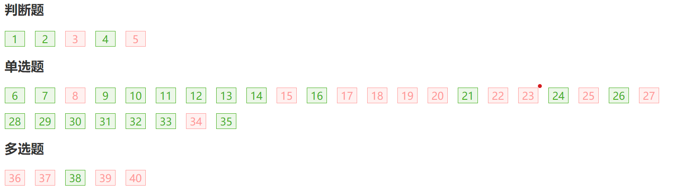

综合卷1

1 坏账问题
2 平均回款天数：突出平均，是期末加期初算出周转率，再360除以其
3 随机数边界值 都是闭区间
4 营业利润和营业外收入
5 股利发放的盈余公积
6 成本法权益法借贷：向投资者分配现金股利后，盈余公积减少，留存收益总额也减少。
7 折旧算成本还是费用
8 无形资产怎么算
9 Python是跨平台的
10 list([i for i in range(5)]) 迭代器执行一次就清空了
11 PyInstaller可以转成可执行文件
12 词汇分析语义分析知识图谱
13 文件无法进行二进制搜索，因为无序
14 混合云是非核心应用迁移到公有云，部分核心应用迁移到私有云，关键业务继续使用传统架构
15 企业出售无形资产的净收入，会计上应确认为资产处置损益
16 成本法核算时，当被投资企业宣告分派现金股利，借：应收股利，贷：投资收益
17 持续经营和会计分期是会计基本假设。企业会计核算的基础是权责发生制，而不是收付实现制
18 资产减值准备是一项费用，导致利润减少
19 罚款收入属于营业外收入，不影响企业营业利润。商品销售收入、劳务收入、固定资产出租收入都属于营业收入，会影响营业利润。
20 在长期股权投资中，投资企业直接拥有被投资单位18%的表决权资本，另外被投资单位的生产经营需要依赖投资企业的技术资料，则该项长期股权投资的会计核算应采用。本题属于对被投资单位有重大影响，应该采用权益法

卷A 第二部分
中央银行货币政策的中介指标
FCFE FCFF
VUCA
只要有新的信息输入就可以对先验概率进行更新，并不要求大量数据。即使只有一个观察结果，也可以使用贝叶斯推理来更新先验概率，从而得到后验概率，并根据后验概率做出决策。当然，随着观测数据的增加，后验概率会逐渐趋于稳定，对于后续的推理和决策也会更加可靠。
M2为广义货币量，反映现实购买力加上潜在购买力
K-means算法是聚类算法，EM算法用于参数推断的基础算法。虽然K-means算法和EM算法都是迭代算法，但是它们的目标和方法不同。
SCRUM历史
设计思维的正确步骤为：第一步：同理心，第二步：需求定义，第三步：创意构思，第四步：原型实现，第五步：测试
不存在套利机会时，(R(A)-Rm)/beta(A) = (R(B)-Rm)/beta(B)
债券价值的计算，所需要的折现率是市场利率或投资人要求的必要报酬率。
FCFF=息税前利润-调整的所得税+折旧+摊销-营运资金的增加+长期经营性负债的增加-长期经营性资产的增加-资本性支出=500-90+20-50+15-55=340万元。
FCFE=净利润+折旧+摊销-营运资金的增加+长期经营性负债的增加-长期经营性资产的增加-资本性支出+新增付息债务-债务本金的偿=500+20-50-15-80=375万元。
信任路径的再定义能力是区块链的应用价值
一个分布式系统的全局工作状态称为一个副本
PBFT算法相关论文最初发表于1999年
虚拟货币一般来说账目是公开透明的，而身份是隐匿的。
实现存证+定序服务功能：只用到不可篡改、不可仿冒、不可抵赖、不可乱序四层+M310
隐私保护的“不可能三角”：去中心化程度、隐私保护、性能不可兼得
在交易后业务处理的区块链解决方案中，隐私保护诉求防范的是其他证券公司，因为证券公司只掌握单边申报和交易记录，需防范其他证券公司获取己方的明文数据
最不利于发挥流水方式并行加速优势的场景是工序间工作负载太不均衡
“区块链完备的解决方案”是数字化水平和治理的去中心化程度都已经不低
在贝叶斯统计推中，实时迭代更新意味
对于一个特定的应用场景，我们可以使用大量和该场景相关的文本来训练词嵌入模型，得到更适合该场景的词嵌入。这样的词嵌入模型可以更好地编码该场景中的词语语义信息，提高模型的性能。但是，如果我们没有足够的数据或计算资源来训练自己的词嵌入模型，或者我们的应用场景与已经训练好的通用词嵌入模型相似，我们也可以使用别人已经训练好的通用词嵌入模型。
Scrum最早诞生于上世纪50年代
资本市场线上的投资组合优于风险资产的有效前沿
证券市场线用贝塔值作为风险衡量，如果证券价格被低估，那么证券应该在证券市场线上方
高方差是指模型预测结果本身的分散程度，欠拟合和过拟合都可能带来高方差，增加训练样本数和减少模型复杂度可以降低欠拟合和过拟合
在一个特定的模型中，选择不同的超参数也类似于选择不同的模型
K-均值模型中，以下方法可以帮助获得全局最优：尝试不同的质心初始化；增加迭代的次数；尝试不同集群数量K
在监督学习前使用聚类算法可以在不同的集群上应用监督学习分别训练不同的模型；可以将聚类算法得出的类别作为监督学习新的输入特征
瀑布式开发在计划阶段需要完成：明确目标、梳理需求

卷B 1
remove方法
a[::-1] ·

## 大数据技术原理及应用

### 综合测试A

**判断题**

17 事务是访问并可能更新各种数据项的一个程序执行单元 ×

18 用户可以对OLAP数据执行数据输入或编辑任务 ×

19 AlphaGo先后战胜李世石、柯洁等，说明机器已经全面超越人类 ×

■20 知识抽取就是将结构化的，有歧义的大量文本转化为结构化的精确可操作的并且试用于特定任务的知识 ×

■21 在查询过程中选择执行计划时，为每个操作独立选择最优算法可以取得整体最佳的结果 ×

22 万得平台社区提供金融圈实时交流平台，包括万得市场、量化交易平台、中介债券报价及Wind大学等 √

**单选题**

■50 语言分析的层次不包括    D

- A词汇分析
- B句法分析
- C语义分析
- D结构分析

51 以下哪项用来排序 A

- AORDER BY
- BORDERED BY
- CGROUP BY
- DGROUPED BY

52 关于彭博终端说法不妥当的是 D

- A是一套计算机软件，也是金融资讯的代名词
- B用户可以直接使用终端进行交流
- C为专业人士提供实时金融市场数据和相关服务
- D仅能通过出售的彭博终端访问服务应用

■53 两组非过程查询语言是指 B

- A定义域关系验算和元素关系验算
- B定义域关系验算和元组关系验算
- C定点关系验算和元素关系验算
- D定点关系验算和元组关系验算

■54 在进行选择查询时，关于文件扫描方法的描述不正确的是 B

- A其本质是线性搜索
- B可以进行二进制搜索
- C需要扫描每个文件块并测试所有记录
- D如果选择位于关键属性上，则可以停止查找记录

55 关于OLAP的特性,下面正确的是: (1)快速性 (2)可分析性 (3)多维性 (4)信息性 (5)共享性 D

- A(1) (2) (3)
- B(2) (3) (4)
- C(1) (2) (3) (4)
- D(1) (2) (3) (4) (5)

56 重复：OWL是RDF的扩张

■57 混合云架构不包括 A

- A所有IT系统架构在云端
- B非核心应用迁移到公有云
- C部分核心应用迁移到私有云
- D关键业务继续使用传统架构

■58 在数据查询时需要面对复杂选择，下列哪一个无法实现合取选择 B

- A利用一个索引的合取选择
- B通过标识符的并集进行合取选择
- C使用复合索引进行合取选择
- D通过标识符的交集进行合取选择

59 事务（Transaction）是一个 C

- A程序
- B进程
- C操作序列
- D完整性规则

■60 OLAP的操作涉及计算一个或多个维度的所有数据关系 A

- A上卷
- B下钻
- C切块
- D转轴

61 以下不能作为命名实体识别的类的是:1 Organization 2 Person 3 Time 4 Date D

- A1
- B3和4
- C4
- D都可以

■62 实体-关系都完成之后，知识图谱已经成型，但要真正大幅度使用还是有问题，因为自然语言具有复杂性、多意性和模糊性的多重特点。__是将文本中提到的实体与其知识库中相应的实体链接起来的任务，是解决实体间存在的歧义性问题。

- A实体链接
- B实体消歧
- C关系抽取
- D指代消解

63 在SELECT语句中，使用何种关键字可以屏蔽重复行     

- ATOP
- BALL
- CUNION
- DDISTINCT

64 供应链金融领域主要用到的大数据技术是 A

- A知识图谱
- B区块链
- C分布式系统
- D数据标注

65 不属于知识图谱中的元数据的是 D

- A作者的名字
- B书籍的出版社地址
- C书的价格
- D书的内容

66 创建数据库用以下哪一项 D

- Acreate mytest
- Bcreate table mytest
- Cdatabase mytest
- Dcreate database mytest

■67 下列哪个不属于金融云服务的特点 C

- A快速交付
- B拓展性强
- C无需租借服务器
- D低运维成本

68 重复：金融机构最常使用的大数据应用场景中，大数据技术参与度最低基金定投

**多选题**

■106 DML提供的命令包括 ABCD

- A查询信息
- B插入元组
- C删除元组
- D修改元组

■107 属性闭包的用途有哪些 ACD

- A判断是否为超码
- B判断是否为候选码
- C计算 F的闭包
- D检查函数依赖

■108 对何种索引项进行删除操作时，可能存在索引不必做任何修改的情况 BCD

- A稠密索引
- B稀疏索引
- C单级索引
- D多级索引
  
  答案解析：稠密索引在删除时会引起索引修改

■109 以下哪些信息可以用于估计查询计划的代价 ABC

- A关系的统计信息
- B每次执行采取的不同算法
- C产生的中间结果
- D数据的物理存储条件

110 有哪些实现隔离级别的方法 ABCD

- A锁
- B时间戳
- C多版本
- D快照隔离

111 下列何种算法可以帮助我们做数值的预测(Prediction) BD

- AApriori
- B决策树
- C朴素贝叶斯
- D线性回归
  
  答案解析：决策树和线性回归可以做回归问题

■112 属于语义角色标注子任务的是 ABCD

- A谓词标识
- B谓词消歧
- C论元标识
- D论元分类

113 关于关系抽取的描述正确的是 ABCD

- A关系抽取是知识图谱构建的核心技术
- B关系抽取决定了知识图谱中知识的规模和质量
- C从高噪音的互联网数据中抽取关系的鲁棒性是关系抽取的挑战性问题
- D扩大抽取关系的类型与抽取知识的覆盖面是关系抽取的挑战性问题

■114 Oracle数据库包括 AB

- A物理存储结构
- B逻辑存储结构
- C系统全局区
- D后台进程

115 人工智能如何助力金融大数据应用？ ABCD

- A海量非结构化数据自动采集
- B数据自动标签归类
- C提高算法模型精度
- D数据实时监控和可视化呈现

116 互联网金融中精准营销的主要应用目标包括 ABC

- A寻找目标客户
- B针对具体客户提供个性化方案
- C缩短业务流程
- D客户信息整合验证

117 寻找股票投资策略需要考虑的有 ABCD

- A公司财务状况
- B公司经营管理情况
- C相关技术指标
- D法律法规

118 unfriendly的词缀 AC

- Aun
- Bfriend
- Cly
- Dend

■119 属于形态学分析的应用的是 AB

- A词性
- B词的原形
- C句型
- D句义

■120 如果R = (A, B, C, G, H, I), F={A->B, A->C, CG->H, CG->I, B->H}则在F+里的是 BCD

- A C->H
- B AG->I
- C CG->HI
- D AG->H
  
  答案解析：传递律：A->B 和 B->H；增补律A->C 和 G, 从而AG->CG，然后传递律CG->I；增补律CG->I 从而CG->CGI, 增补律CG->H 从而CGI->HI, 然后传递律

### 单元测试

**判断题**

1 实例指的是某一特定时刻存储在数据库中的真实内容，而模式定义了数据的逻辑结构 √

2 属性值不一定是原子的，也就是可分割的 ×

■3 元组关系演算是一种过程查询语言 ×

4 对大多数操作系统的替换策略，建议使用由查询优化器提供提示替换策略的混合策略 √

■5 选择运算对θ连接运算具有分配律    ×

**单选题**

6 提供数据库定义、数据操纵、数据控制和数据库维护功能的软件称为  C

- AOS
- BDS
- CDBMS
- DDBS

7 数据的抽象视图不包括哪些层级 C

- A物理层

- B逻辑层

- C应用层

- D视图层
  
  解析：数据库抽象为物理层、逻辑层、视图层

■8 关系数据库的基本数据结构是 D

- A树
- B图
- C索引
- D关系

■9 哪个不是附加关系代数操作     D

- A集合交运算
- B自然连接运算
- C除运算
- D投影运算

10 哪个是SQL不支持的类型 C

- ACHAR
- BVARCHAR
- CCURR
- DINT

11 like '_Dar%' 不能匹配以下哪个字符串 A

- ADdars

- BdDar

- CDars

- DDar
  
  解析：
  
  - \_表示只能匹配单个字符,不能多也不能少,就是一个字符.
  
  - %表示任何字符出现任意次数(可以是0次)

■12 下列哪一个不是在描述表达式{t | P(t)}的安全性 A

- A可以生成无限关系的元组演算表达式
- B确保表达式安全性的表达式集
- C防止生成出无限关系
- D元组t的每个分量都出现在P的关系、元组或者常量之中

13 学生在导师的指导下从事研究项目，关系project guide是几元关系 C

- A1
- B2
- C3
- D4

14 实体集参与关系集的方式 C

- A完全参与
- B部分参与
- C以上均有可能
- D以上均不是

■15 实体集和关系集的关系模式说法不正确的是 B

- A实体集和关系集可以统一的用关系模式来表示数据库的内容
- B每个实体集和关系集，模式不唯一
- C符合实体-关系图的数据库可以由模式集合表示
- D每个关系模式都有许多列（通常对应于属性），它们具有唯一的名称

16 最快最昂贵的存储介质是 B

- A主存储器

- B高速缓存存储器

- C磁带存储

- D磁盘存储
  
  解析：*高速缓冲存储器*（Cache）其原始意义是指存取速度比一般随机存取记忆体（RAM）来得快的一种RAM

■17 如今RAID被用于更高的可靠性和带宽。“I”的含义是 C

- A经济
- B高效
- C独立
- D可靠

■18 关于稠密索引和稀疏索引的说法不正确的是 A

- A稠密索引插入和删除时的维护开销小
- B稀疏索引所占空间较小
- C稀疏索引定位记录的速度更慢
- D两者可以结合使用

■19 使用索引的搜索算法称为索引扫描，其不包括 A

- A线性搜索
- B主索引等值比较
- C码属性等值比较
- D非码属性等值比较

■20 假设students有2000条记录，100块磁盘，假设teachers有5000条记录，200块磁盘，使用嵌套循环运算计算students与teachers的自然连接时， 如果较小的关系students完全适合内存，代价为多少次块传输？ C

- A500
- B400
- C300
- D200

21 对任给关系r1、r2 和r3，要执行这三个关系的自然连接运算，如何执行？ D

- A先执行r1⋈r2
- B先执行r2⋈r3
- C如果r2⋈r3很大，先执行r2⋈r3
- D如果r2⋈r3很小，先执行r2⋈r3

22 事务（Transaction）是一个 C

- A程序
- B进程
- C操作序列
- D完整性规则

■23 可以使用优先图检测冲突可串行化。若调度是冲突可串行化的，当且仅当它的优先图是 C

- A有环图
- B无环图
- C有向图
- D无向图

■24 使用一个属性的固定值查看交叉表（单维）的过程为 C

- A切片
- B切块
- C转轴
- D切片和切块

25 以下哪项关于决策树的说法是错误的 C

- A冗余属性不会对决策树的准确率造成不利的影响
- B子树可能在决策树中重复多次
- C决策树算法对于噪声的干扰非常敏感
- D寻找最佳决策树是NP完全问题

26 让计算机系统在文本中的词与词之间自动加上空格或其他边界标记 A

- A分词
- B分句
- C词性标注
- D词形还原

■27 利用词项的相关度排名的改进措施不包括 B

- A出现在标题、作者列表、节标题等等中的词应给予较高的重要度
- B在文档中首次出现并且出现位置比较靠后的词应给予较高的重要度
- C删除极其常见的词，如 “a”、“an”、“the”、“it” 等，它们的IDF很低，称为停止词
- D若查询中的多个词项在文档中紧靠在一起出现，该文档具有比它们远远分开出现时更高的重要度

28 OWL是RDF的扩张， 可以定义_关系：（1） 词汇与词汇之间的关系 （2） 类与类之间的关系 （3）属性与属性之间的关系 D

- A（1）（2）
- B（1）（3）
- C（2）（3）
- D（1）（2）（3）

29 在关系抽取当中，通过反复迭代不断抽取新的实例与模板。这种方法直观有效，但也面临很多挑战性问题，以下不正确的是 D

- A在扩展过程中很容易引入噪音实例与模板
- B出现语义漂移现象
- C降低抽取准确率
- D降低抽取召回率

30 向数据表中插入数据用哪一项 B

- ASELECT
- BINSERT
- CUPDATE
- DDELETE

31 MySQL中，建立数据库用 D

- ACREATE TABLE
- BCREATE TRIGGER
- CCREATE INDEX
- DCREATE DATABASE

32 金融机构最常使用的大数据应用场景中，大数据技术参与度最低的是 C

- A反欺诈
- B精准营销
- C基金定投
- D交易预警

33 根据驾驶者的行车数据，发现其行车频率较低，保险企业应该如何为他制定保费？B     

- A收取较高的费用
- B收取较低的费用
- C所有人收取相同的费用
- D不能确定

■34 在彭博终端输入指令{VOD LN <F8 Equity> <GO>}的含义是 A

- A寻找在LN市场上上市的VOD股票股权信息

- B寻找在VOD市场上上市的LN股票股权信息

- C寻找在VOD市场上上市的LN股票优先股信息

- D寻找在LN市场上上市的VOD股票优先股信息
  
  解析：Ln是地点，equity是股权信息

35 在万得咨询金融终端使用F9五部看股，哪一项是其中一部 C

- A交易数据
- B重要股东
- C财务数据
- D新闻公告

**多选题**

■36 下列四项中，属于文件系统储存数据弊端的有 ABC

- A数据冗余

- B数据孤立

- C数据访问困难

- D数据一致
  
  解析：数据一致性不是文件系统储存数据的弊端

■37 DDL提供的命令包括 ABC

- A定义数据模式
- B定义删除关系模式
- C定义修改关系模式
- D查询信息

■38 在专业化/通用化上设计约束包括 ABCD

- A约束哪些实体可以成为给定较低级别实体集的成员
- B完整性约束
- C约束一个实体是否可以属于一个通用化中的一个以上的下层实体集
- D指定上级实体集中的实体是否必须属于归纳中的至少一个下级实体集中

■39 磁盘系统中采用并行主要的目的包括：AC

- A负载平衡多个小的存取操作
- B降低存取操作的吞吐量
- C并行执行大的存取操作
- D增加大的存取操作的反应时间

■40 去除重复运算可以通过什么技术实现 AC

- A排序
- B查询
- C散列
- D索引
