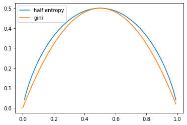
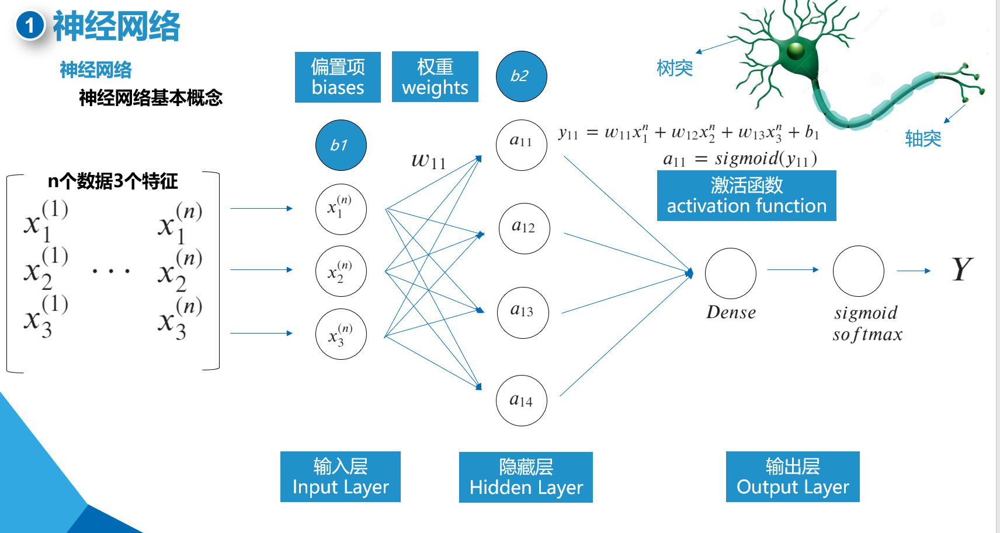
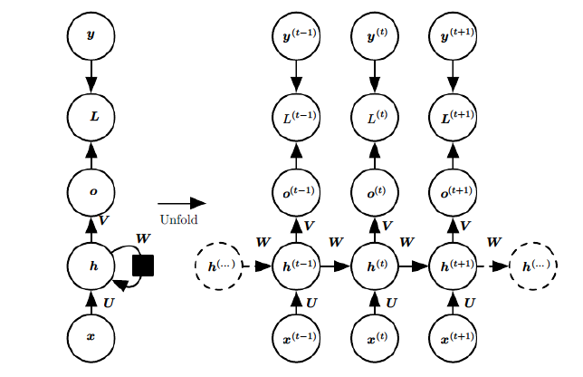

# 《机器学习原理及应用》答疑材料


- 时间：9月26日 19:00
- 答疑人：李一繁

# 机器学习


```python
import numpy as np
import pandas as pd
import matplotlib.pyplot as plt
```

## 决策树

我的理解：决策树利用信息论来更科学的写if else

### 熵的计算

entropy = $-\sum_{i=1}^np_ilogp_i$  

- 选择：总共有三类，概率（频率）分别是0、0.5、0.5, 计算熵的结果是：
- 选项：负无穷	1	-1	正无穷
- 答案：1
- 解析：-(0\*LOG2(0,2)+0.5\*LOG2(0.5,2)+0.5\*LOG2(0.5,2))=1


```python
- (0 * np.log2(1e12) + 0.5 * np.log2(0.5) + 0.5 * np.log2(0.5))
```


    1.0


### 熵和基尼系数

- 判断：熵因为要做“对数”计算，计算复杂性比基尼系数略为增加（）。
- 答案：对
- 解析：基尼系数是二次计算，比log更加简单，总体表现也近似，可以作为熵的近似替代

entropy = $-\sum_{i=1}^np_ilogp_i$  
gini = $1 - \sum_{k=1}^Kp_k^2$


```python
x_arr = np.arange(0, 1, 0.01)
entropy =  - (np.log2(x_arr) * x_arr + np.log2(1 - x_arr) * (1 - x_arr)) / 2
gini =  1 - (x_arr ** 2 + (1 - x_arr) ** 2)
```

    C:\Users\lyf\AppData\Local\Temp/ipykernel_19988/1135140476.py:2: RuntimeWarning: divide by zero encountered in log2
      entropy =  - (np.log2(x_arr) * x_arr + np.log2(1 - x_arr) * (1 - x_arr)) / 2
    C:\Users\lyf\AppData\Local\Temp/ipykernel_19988/1135140476.py:2: RuntimeWarning: invalid value encountered in multiply
      entropy =  - (np.log2(x_arr) * x_arr + np.log2(1 - x_arr) * (1 - x_arr)) / 2
    


```python
plt.plot(x_arr, entropy, label='half entropy')
plt.plot(x_arr, gini, label='gini')
plt.legend()
```


    <matplotlib.legend.Legend at 0x24aaec34b80>


    

    


### 决策树指标

- 判断：Python scikit-learn 包里的决策树模型，可以选择“gini”（基尼）, 或者“entropy”（熵）作为分叉计算的方法，默认是“gini”（）。
- 答案：对
- 解析：熟悉包的使用


```python
from sklearn import tree
```


```python
# sklearn中的决策树有分割的配置，默认是best
clf = tree.DecisionTreeClassifier(criterion='gini')
```

- splitter : {"best", "random"}, default="best"
    The strategy used to choose the split at each node. Supported
    strategies are "best" to choose the best split and "random" to choose
    the best random split.

### 决策树随机数

- 选择： Python scikit-learn 包里的决策树模型，random_state 为了在拟合过程中获得确定性行为，random_state必须固定为：
- 选项： 0	1	一个确定的整数	任意浮点数
- 答案：一个确定的整数
- 解析：对所有有随机性的算法，sklearn都是这样设定随机数的


```python
from sklearn import tree
```


```python
# 需要注意的是如果splitter设置为Best，其随机数就没有意义，因为会每次找最大的信息增益特征
# 并且需要将最大特征数设置的少于建模的特征数，比如原本10个特征，现在随机选出5个后再计算信息增益
clf = tree.DecisionTreeClassifier(splitter='best',
                                  random_state=0,
                                  max_features=10)
```

- random_state : int, RandomState instance or None, default=None
    Controls the randomness of the estimator. The features are always
    randomly permuted at each split, even if ``splitter`` is set to
    ``"best"``. When ``max_features < n_features``, the algorithm will
    select ``max_features`` at random at each split before finding the best
    split among them. But the best found split may vary across different
    runs, even if ``max_features=n_features``. That is the case, if the
    improvement of the criterion is identical for several splits and one
    split has to be selected at random. To obtain a deterministic behaviour
    during fitting, ``random_state`` has to be fixed to an integer.
    See :term:`Glossary <random_state>` for details.
- max_features : int, float or {"auto", "sqrt", "log2"}, default=None
    The number of features to consider when looking for the best split:

        - If int, then consider `max_features` features at each split.
        - If float, then `max_features` is a fraction and
          `int(max_features * n_features)` features are considered at each
          split.
        - If "auto", then `max_features=sqrt(n_features)`.
        - If "sqrt", then `max_features=sqrt(n_features)`.
        - If "log2", then `max_features=log2(n_features)`.
        - If None, then `max_features=n_features`.

### 决策树分叉

- 判断：选择决策数节点的分叉特征时，先计算各个分支的基尼系数，然后加权使得总的基尼系数，使得基尼系数最低特征作为分叉特征（）。
- 答案：对
- 解析：分叉后基尼系数越低，意味着选择它来分叉获得的信息量越大，也即你找到了关键变量


```python
from sklearn import tree
from sklearn.datasets import load_iris
```


```python
iris = load_iris()
# sklearn中的决策树有分割的配置，默认是best
clf = tree.DecisionTreeClassifier(criterion='gini',
                                  splitter='best')
clf.fit(iris.data, iris.target)
```


    DecisionTreeClassifier()


- sepal length (cm)：花萼长度(厘米)
- sepal width (cm)：花萼宽度(厘米)
- petal length (cm)：花瓣长度(厘米)
- petal width (cm)：花瓣宽度(厘米)


```python
iris.target_names
```


    array(['setosa', 'versicolor', 'virginica'], dtype='<U10')


```python
plt.figure(figsize=(12,8))
tree.plot_tree(clf,
               max_depth=2,
               feature_names=iris.feature_names,
               class_names=iris.target_names,
               filled=True, 
               rounded=True)
plt.show()
```


    

    


### 决策树和回归树

- 选择：关于波士顿房价数据集，以下哪些是正确的：（）。
- 选项：
    - A 预测目标是房价，可以用决策树来进行分类	
    - B 预测目标是房价，可以用回归树来进行预测	
    - C 有些特征是不连续的，不能计算方差，需要在回归树中剔除	
    - D 有些特征是不连续的，不能计算方差，需要用到基尼系数或者熵来分叉
- 答案：B
- 解析：决定使用回归还是决策树和标签有关，和特征无关


```python
from sklearn import tree
from sklearn.datasets import load_boston
```


```python
boston = load_boston()
reg = tree.DecisionTreeRegressor(criterion='mse',
                                  splitter='best')
reg.fit(boston.data, boston.target)
```


    DecisionTreeRegressor()


```python
plt.figure(figsize=(12,8))
# 回归树使用value作为label了
tree.plot_tree(reg,
               max_depth=2,
               feature_names=boston.feature_names,
               filled=True, 
               rounded=True)
plt.show()
```


    

    


## 集成学习

### 基学习器

- 判断：Gradient boosting提升算法使用残差训练每个后续模型，在这些模型集合中，每个模型都比较强
- 答案：错
- 解析：模型可以弱


### bagging和boosting

- 选择：关于 随机森林（Random Forest） 和 梯度提升树（Gradient Boosting Trees）：（）。
- 选项：
    - A 随机森林中的各个子树是相互独立的	
    - B 梯度提升树各个子树是相互独立的	
    - C 对于任何数据，梯度提升树的预测效果总是优于随机森林	
- 答案：A
- 解析：bagging方法是独立，boosting是串行的，有的数据集可能随机森林更好

## 广义线性回归

### 线性回归求解

- 判断：线性回归模型用均方误差最小化和用最大似然估计得到的参数在独立正态分布的假设下是相同的（）。
- 答案：对
- 解析：两个求解结果相同，可以参考：均方误差与极大似然估计 - 天长水远的文章 - 知乎 https://zhuanlan.zhihu.com/p/559700942

### 逻辑回归求解

- 选择：逻辑回归模型是通过
- 选项：
    - A 把类似于非线性回归的一个非线性方程式，用 sigmod 函数变换成类似于概率的数值，根据概率来做分类判断。	
    - B 把类似于线性回归的一个线性方程式，用 Logit 函数变换成类似于概率的数值，根据概率来做分类判断。	
    - C 把类似于线性回归的一个线性方程式，用 sigmod 函数变换成类似于概率的数值，根据概率来做回归分析。	
    - D 把类似于线性回归的一个线性方程式，用 sigmod 函数变换成类似于概率的数值，根据概率来做分类判断。
- 答案：D
- 解析：逻辑回归是分类而不是回归，logit函数是odds比率


### 逻辑回归多分类

- 多选：如下哪些陈述是对的：
- 选项：
    - A 逻辑回归模型可以通过多个二分类做多余二类的分类问题	
    - B 逻辑回归中的分割边界是线性的	
    - C 朴素高斯贝叶斯模型各特征之间的相关性为0，它的分割边界是线性的	
    - D 逻辑回归中的sigma的函数是一个非线性函数，它的分割边界是非线性的
- 答案：A/B
- 解析：线性分割！ One-VS-Rest二分类


## 聚类问题

### 聚类分析

- 选择：通过聚类分析可以进行（）。
- 选项：通常分析	分类分析	异常探测	通常探测
- 答案：异常探测
- 解析：找出特殊的群体

### 聚类过程

- 选择：K-means用来解决这个问题的方法也叫做期望最大化算法 (Expectation-Maximization， EM)，（）。
- 选项：
    - A E-step计算每个簇的质心, M-step是将数据点分配给最近的集群	
    - B E-step是初始化质心, M-step是计算数据点和所有质心之间的平均距离	
    - C E-step是将数据点分配给最近的集群, M-step计算每个簇的质心	
    - D E-step是将数据点分配给最近的集群, M-step是计算数据点和所有质心之间的平均距离
- 答案：C
- 解析：了解其过程


- 上图a表达了初始的数据集，假设k=2。
- 在图b中，我们随机选择了两个k类所对应的类别质心，即图中的红色质心和蓝色质心，然后分别求样本中所有点到这两个质心的距离，并标记每个样本的类别为和该样本距离最小的质心的类别
- 如图c所示，经过计算样本和红色质心和蓝色质心的距离，我们得到了所有样本点的第一轮迭代后的类别。此时我们对我们当前标记为红色和蓝色的点分别求其新的质心
- 如图d所示，新的红色质心和蓝色质心的位置已经发生了变动
- 图e和图f重复了我们在图c和图d的过程，即将所有点的类别标记为距离最近的质心的类别并求新的质心。最终我们得到的两个类别如图f。

参考：刘建平-K-Means聚类算法原理 https://www.cnblogs.com/pinard/p/6164214.html

### 集群交易

- 选择：投资者可以利用聚类分析来发展一种集群交易方法, 可以达到的目的不包括:（）。
- 选项：集中投资	分散投资	减小下行损失	在不增加总风险的情况下进行风险较高的交易
- 答案：集中投资
- 解析：肯定是为了避免集中投资

# 深度学习

## 基础神经网络

### 基础结构

- 多选：人工神经网络图示往往用圆圈和线来表示，其中：（）。
- 选项：
    - A 圆圈代表节点，线代表连接	
    - B 圆圈代表连接，线代表向量	
    - C 圆圈代表神经单元，线代表权重	
    - D 圆圈代表卷积运算，线代表线性运算
- 答案：A/C
- 解析：基础



### 激活函数

- 多选：关于激活函数在多层神经网络叠加后的效果：（）。
- 选项：
    - A 线性激活函数将输出线性激活，多层叠加以后可以组合成非线性函数		
    - B RELU激活函数是线性函数，线性叠加以后还是线性的	
    - C RELU激活函数多层叠加以后可以组合成复杂的非线性函数
    - D 线性激活函数将输出线性激活-不管添加了多少隐藏层，线性叠加以后还是线性的
- 答案：C/D
- 解析：基础


### 反向传播

- 多选：反向传播计算的效率高是因为:（）。
- 选项：
    - A 在根据链式法则和反向传播方式计算导数时，后面层计算出的导数，都会被前面一层计算导数时用上	
    - B 每部分的计算都是乘法和求和，都可以换成向量和矩阵计算，也就是可以并行计算	
    - C 反向传播时计算的 a 和 z 被正向传播时不同训练样本反复使用, 避免了重复计算	
    - D 常用的激活函数像sigmoid, tanh, 以及RELU, 它们的导数都很简单 
- 答案：A/B/D
- 解析：基础


## 卷积神经网络

### 特征图

- 选择：一个特征图输入到一卷积层，卷积层用了N个卷积核，总共会输出（）。
- 选项：N个特征图	N\*N个特征图	N/2个特征图	N\*2个特征图
- 答案：N个特征图
- 解析：N个特征图


## 循环神经网络

### RNN

- 判断：循环神经网络（Recurrent Neural Network , RNN）是一种试图对依赖时间或序列的行为（如语言、股票价格、电力需求等）进行建模的神经网络（）。
- 答案：对
- 解析：常识



### LSTM

- 选择：一个特征图输入到一卷积层，卷积层用了N个卷积核，总共会输出（）。
- 选项：
    - 遗忘门、输入门、输出门	
    - 记忆门、信息门、舍弃门	
    - 长期门、短期门、循环门	
    - 开关门、决定门、通过门
- 答案：遗忘门、输入门、输出门
- 解析：记忆


参考：LSTM模型与前向反向传播算法  https://www.cnblogs.com/pinard/p/6519110.html

# 资料推荐

- 刘建平pinard：https://github.com/ljpzzz/machinelearning
- 个人B站：AFAN的费曼生活 https://www.bilibili.com/video/BV1B44y1P7Je/
